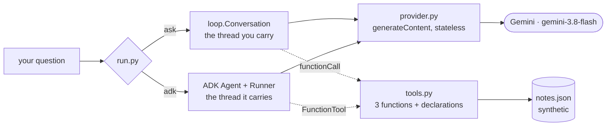

> **Yesterday:** P00 Foundry closed — a key read by code you wrote, two files that turn a floor into
> a pin, and a driver whose exit status is the verdict.
> **Today:** the first project. One question goes out to a model and one answer comes back, with
> nothing between your code and the wire, and the conversation is a list you carry yourself.
> **Tomorrow:** the same loop grown a second pass, because the model is offered tools and asking for
> one is not an answer.

## §1 The scene

Think of a correspondent who is thorough, quick, and completely without memory. They read every
letter carefully and answer it well. Then the desk is cleared — your letter, their reply, the whole
exchange — and the next time you write they begin from nothing at all.

You can hold a real conversation with such a person, and there is only one way to do it. You keep
the file: your letters and their replies, in order, and every time you write you attach the entire
correspondence. They read it, see where the exchange had got to, and answer the new page at the end.
It works. It also means the envelope gets thicker every time, that your file is the only copy in
existence, and that anything you forget to put in it never happened.

Today you build that correspondence by hand. You address the envelope — one exact model name,
written down once in one file, because *care of the sorting office* delivers to whoever holds that
job this month. You put the credential on the outside of the envelope where the sorting office reads
it, and not in the address where every clerk between here and there copies it into a log. You write
the body, you post it, and you find the words in the reply, three levels down, where the format
actually puts them.

Then you do the thing the day was chosen for: you throw one reply in the bin instead of the folder,
and you watch what happens. Nothing happens. The next letter goes out with two of your own pages in
a row and no answer between them, it is accepted, and something perfectly reasonable comes back. No
error, no warning, no red anywhere — and an assistant that has never once been shown a word it said.
That is the shape of the failures this curriculum is really about, and this is the smallest honest
example of one.

## §2 The map

Two sections, and the split is between the parts of one letter and the file of letters. The first
section is a single turn: what has to be decided before anything can be sent, and what comes back.
The second is the thread: where it lives, who is holding it, and what it costs to lose one page.

### 1 · What a turn is made of

*The mental model: an envelope you address yourself. The name of the correspondent, the credential
on the outside, the pages inside — and nothing about any of it is remembered once the reply is
posted.*

| Part | Title | What it answers | Level |
| --- | --- | --- | --- |
| [1.1](parts/01-what-a-turn-is-made-of/1.1-the-name-you-say-every-time.md) | The name you say every time | Where does the string naming your model come from, and what changes it without changing your code? | foundation |
| [1.2](parts/01-what-a-turn-is-made-of/1.2-the-key-in-this-projects-own-hands.md) | The key in this project's own hands | Why does this project carry its own copy of a file P00 already wrote? | foundation |
| [1.3](parts/01-what-a-turn-is-made-of/1.3-one-letter-one-reply.md) | One letter, one reply | What is actually in one request, and where in the reply are the words? | working |

### 2 · The thread you carry

*The mental model: the file of carbon copies. It is the memory, it is in your process, and every
letter you send carries all of it.*

| Part | Title | What it answers | Level |
| --- | --- | --- | --- |
| [2.1](parts/02-the-thread-you-carry/2.1-the-list-that-is-the-memory.md) | The list that is the memory | Where does the conversation live, and what does the provider know about it? | working |
| [2.2](parts/02-the-thread-you-carry/2.2-the-reply-you-never-filed.md) | The reply you never filed | What breaks when the model's own turn is never appended — and why does nothing go red? | production |

## §3 Setup — run this

This is the first project, so the folder has a scaffold before it has any of today's code. The eight
files below are this project's frame: they are listed here rather than taught, because none of them
is today's subject and every one of them has to exist before the first command runs. The five files
the parts teach are in §4.

**The toolchain and the folder.** Nothing new to install, and nothing new to add: `uv` has owned
every environment since day 1, and today this project has **no third-party dependency at all**:

```bash
mkdir -p projects/01-ask-desk/ask_desk/util projects/01-ask-desk/ask_desk/data
cd projects/01-ask-desk
uv python pin 3.12.12         # writes .python-version
uv lock                       # writes uv.lock — nothing to resolve yet, and that is the point
uv sync --frozen              # builds .venv from the lockfile exactly
cp .env.example .env          # then edit .env so GOOGLE_API_KEY=<your key>
```

**`projects/01-ask-desk/pyproject.toml`** — what was asked for, and today the answer is *nothing*.
The title of this day says "no framework", and it is meant literally: every file day 4 prints
imports only the standard library and this project's own modules, so there is no package to install
and none to pin. `google-adk` arrives on day 6, added by `uv add "google-adk==2.8.0"`, which is the
day the first code that imports it is written; the version was chosen today by this project's
freshness check and is recorded in `PACKAGES.md`. Pinning a dependency before anything needs it
would put a package in the lockfile that no line of code can justify:

```toml
[project]
name = "ask-desk"
version = "0.1.0"
requires-python = ">=3.12"
dependencies = []
```

**`projects/01-ask-desk/.python-version`** — which interpreter, written by `uv python pin`:

```text
3.12.12
```

**`projects/01-ask-desk/.gitignore`** — the rule before the file it names exists, which is day 2's
whole argument carried into this project:

```text
# projects/01-ask-desk/.gitignore
# The rule comes first. This file exists before any file it names does.

# Secrets. Never committed — not once, not "just to test the pipeline".
.env
.env.*
!.env.example
*.key
*.pem
service-account.json

# Written by uv from uv.lock. Rebuildable, so never committed and never copied.
.venv/
__pycache__/
*.pyc
```

**`projects/01-ask-desk/.env.example`** — committed, and it is the list of key names this project
reads. `keys.names_this_project_reads()` reads it rather than keeping a second list:

```text
# .env.example
# Every key this project reads, with no value after any "=".
# Copy to .env and fill it in:  cp .env.example .env

GOOGLE_API_KEY=
```

**`projects/01-ask-desk/README.md`** — the stranger's entry point, for somebody who has this folder
and nothing else:

````markdown
# Ask Desk

An internal IT ask desk that answers questions from a synthetic knowledge base — built twice, by
hand and then with Google ADK, so the framework version is understood rather than copied.

## What this system does

You ask it a question. It searches a small knowledge base, reads the notes it finds, checks a
service's status if that is relevant, and answers from what it found — or says plainly that the
notes do not cover it. It never guesses.

## What you need installed

`uv`, and a free Google AI Studio API key. Nothing else — no database, no Docker, no cloud project.
Full steps in `SETUP.md`.

## The four commands

```bash
uv run --frozen python run.py check                     # the gate
uv run --frozen python run.py plan "Is the VPN down?"   # the request, without sending it
uv run --frozen python run.py ask  "Is the VPN down?"   # the hand-rolled desk
uv run --frozen python run.py adk  "Is the VPN down?"   # the same desk, as an ADK agent
```

## The architecture



Both paths reach the same three tools and the same synthetic data. The difference is who holds the
conversation, and that difference is the whole curriculum of days 1 to 4.

## Where the teaching is

`days/01-ask-desk/day-04-.../LESSON.md` onwards, in the authoring repository. Each day's hub links
its parts. If you have only this folder, `PRIMER.md` carries everything borrowed from elsewhere.

## What is deliberately not built 🅿️

- **No MCP boundary.** The tools read `notes.json` directly. That is a problem, and P02 is about it.
- **No second agent.** One agent is a function; two is an architecture, and that is P03.
- **No retry or backoff.** A 429 fails the run honestly rather than being smoothed over. Honest
  backoff is P05.
- **No Interactions API.** This project uses the stateless `generateContent` endpoint on purpose;
  `PROJECT.md` says why.
````

The `adk` command and the three tools in that diagram are days 5 to 7. The README describes the
finished project, as a README should; today's driver carries `check`, `plan` and `ask`.

**`projects/01-ask-desk/PROJECT.md`** — the brief and the triad:

````markdown
# P01 · Ask Desk

**What it is.** An internal IT ask desk that answers questions from a synthetic knowledge base, at
$0, built twice — once by hand with the standard library and no framework, then again with Google
ADK — so that the second version is understood rather than merely copied.

**Days.** 7 · **Deploy tier.** D1 (`api_server`, `/healthz`, run locally) · **Depends on nothing.**

## Triad

| Leg | This project |
| --- | --- |
| **Tools** | `search_notes(query, limit)` · `fetch_note(note_id)` · `check_service_status(service)` |
| **MCP boundary** | *none — leg 2 arrives in P02.* The tools read this project's own synthetic JSON directly, and day 1 of P02 is about why that is a problem worth solving. |
| **Cast** | one agent. Two is an architecture, and that is P03. |

## Borrowed concepts — taught deeply elsewhere, recapped here

| Concept | Recap in | Deep version (optional reading) |
| --- | --- | --- |
| Reading a key, and the three states of one | `PRIMER.md` §1 | `days/00-foundry/day-03-keys-pinning-refusing-check/parts/01-the-key/1.2-three-states-and-the-one-you-cannot-check.md` |
| A floor is not a pin | `PRIMER.md` §2 | `days/00-foundry/day-03-keys-pinning-refusing-check/parts/02-the-pin-and-the-refusal/2.1-a-floor-is-not-a-pin.md` |
| The exit status is the verdict | `PRIMER.md` §3 | `days/00-foundry/day-03-keys-pinning-refusing-check/parts/02-the-pin-and-the-refusal/2.2-the-check-that-could-not-refuse.md` |

**New here:** the stateless request/response turn · the conversation you carry yourself · JSON
function declarations · the tool-result turn · a bound on provider calls · ADK `Agent`, `Runner`
and `SessionService` · `FunctionTool` and what it derives from a plain function.

## Why this project uses `generateContent` and not the Interactions API

The provider recommends a newer, stateful Interactions API for new development, and says in the
same sentence that `generateContent` "remains fully supported" — checked 2026-09-09 at
`https://ai.google.dev/gemini-api/docs/migrate-to-interactions`. This project deliberately uses the
older, **stateless** endpoint, because the stateless one is the version in which the agent loop is
your own code: you hold the conversation, you resend it, and you can watch what happens when you
do not. The stateful API does that part for you, which is excellent for shipping and useless for
learning it.

Build first, compare after. The comparison is owed, and
`docs/adr/ADR-0004-generatecontent-by-hand-and-unpublished-limits.md` records that it has not been
scheduled yet.

**Done when.** `python run.py check` is green on a bare machine; the hand-rolled desk and the ADK
desk answer the same question the same way; and the first eval goes red on purpose.
````

**`projects/01-ask-desk/PRIMER.md`** — the three borrowed ideas, self-contained. This is the file
that makes every pointer in this project a pair rather than a dead end:

````markdown
# Primer — P01 Ask Desk

Three ideas this project uses and does not teach. Each section is self-contained: you can build and
understand this project having read only this page, and the pointer at the end of each is for depth
rather than for sufficiency.

## §1 Reading a key, and the three ways one can be wrong

Nothing loads a `.env` file for you — not Python, not `uv run`, not the shell. A running program
has an *environment*: name-to-string pairs the operating system gave it at startup, which Python
exposes as `os.environ`. A `.env` file is inert until some code opens it, and in this project that
code is `ask_desk/util/keys.py`.

Two places can hold the same name, so precedence has to be decided once: **the process environment
wins, the file is the fallback.** That is the right way round because every deployment target
injects secrets as environment variables and none of them write a `.env` for you; letting the file
win would make your laptop behave unlike everywhere the code actually runs.

A key can be wrong three ways, and only two are decidable here. **Absent** — nobody set it; Python
gives `None`. **Present and empty** — somebody tried and failed; Python gives `''`, and this is the
more dangerous case because it is usually a CI secret that was never populated. Those two need
different sentences said back, which is why `require` tests `is None` and `not value.strip()`
separately rather than writing `if not os.environ.get(...)` — that one condition is true for both
and its error message has to lie to one of them. The third way is **present, non-empty and not
accepted by the provider**, and nothing running on your machine can decide it: a credential is
valid because a server holding the other half says so. Only a request settles it.

Deeper: `days/00-foundry/day-03-keys-pinning-refusing-check/parts/01-the-key/1.2-three-states-and-the-one-you-cannot-check.md`

## §2 A floor is not a pin

`platformdirs>=4.11.8` and `requires-python = ">=3.12"` do not name a version. They say what is
*too old* and hand the choice to whichever machine resolves them, on whichever day. That is correct
for a library — a library that pinned exactly would be uninstallable beside anything else — and it
is never sufficient for an application, which is deployed rather than imported.

Three files answer three different questions, and only the last two make two machines agree.
`pyproject.toml` records what you **asked for**, and is allowed to be a range. `uv.lock` records
what the asking **produced** — exact versions and hashes, for packages you never named. And
`.python-version` records **which interpreter**, because `requires-python` is a floor like any
other. The test of whether you have pinned anything is not whether a version number appears
somewhere; it is whether handing this folder to somebody next March gets them what you have.

The same idea reaches models. `gemini-flash-latest` is documented as hot-swapped on every release,
so it is a floor wearing a version's clothes. `ask_desk/util/models.py` refuses it by name.

Deeper: `days/00-foundry/day-03-keys-pinning-refusing-check/parts/02-the-pin-and-the-refusal/2.1-a-floor-is-not-a-pin.md`

## §3 The exit status is the verdict

A check has two audiences and only one of them can be fooled. A person reads the terminal; every
other consumer — a commit hook, a pipeline step, a `done` command — reads exactly one number, the
process's **exit status**. Zero means success. Everything printed is decoration.

So a check that prints `RED`, counts the problems, and then exits `0` is green everywhere it
matters, and it looks *more* convincing than a working one because all the human-readable parts are
correct. The line that makes the difference is `sys.exit(main(sys.argv))`: `main` returns the
verdict as an integer, and without that wrapper Python discards it and exits 0.

There is a second way to build a check that cannot refuse, and it needs no bug. If you invoke a
check through a tool that **repairs** what is being checked, the repair happens first. `uv run`
updates the lockfile before running your command, so a lockfile-drift check invoked that way always
passes — accurately, about a state its own invocation created. `uv run --frozen` is the fix, which
is why every command in this project's documents carries it.

Deeper: `days/00-foundry/day-03-keys-pinning-refusing-check/parts/02-the-pin-and-the-refusal/2.2-the-check-that-could-not-refuse.md`
````

**`projects/01-ask-desk/SETUP.md`** — every command from a bare machine to a green check, with no
step referring to another project:

````markdown
# Setup — P01 Ask Desk

Every command from a bare machine to a green check. No step refers to another project.
This is a listing, not a lesson: day 1 explains the parts that matter.

Verified on this machine on 2026-09-09 — uv 0.12.3, CPython 3.12.12, git 2.54.0.windows.1.

## 1 · The toolchain

```bash
# uv owns every environment. One binary, installed once, outside any project.
# Windows (PowerShell):  irm https://astral.sh/uv/install.ps1 | iex
# macOS / Linux:         curl -LsSf https://astral.sh/uv/install.sh | sh
uv --version              # expect 0.12.3 or newer
```

## 2 · The project

```bash
cd projects/01-ask-desk
uv python pin 3.12.12     # writes .python-version; requires-python is a floor, not a pin
uv sync --frozen          # builds .venv from uv.lock exactly, resolving nothing
```

## 3 · The key

You need one free Google AI Studio API key. Create it at `https://aistudio.google.com/apikey`
and put it in a `.env` that is never committed:

```bash
cp .env.example .env
# then edit .env so the line reads GOOGLE_API_KEY=<your key>
```

`.env` is already covered by this project's `.gitignore`. `.env.example` is committed and holds
the *names* with no values after the `=`.

There is no `GOOGLE_GENAI_USE_VERTEXAI` line and there should not be: the AI Studio path is
configured by `GOOGLE_API_KEY` alone. Checked against `https://adk.dev/agents/models/google-gemini/`
on 2026-09-09.

## 4 · The check

```bash
uv run --frozen python run.py check
echo $?                   # 0 green, 1 red, 2 you typed the command wrong
```

Five checks, all of which must be green: `keys`, `interpreter`, `pins`, `lock`, `model`.

`--frozen` is not optional. Without it `uv run` updates the lockfile before your command starts,
and the `lock` check then reports on a repository the invocation just repaired.

## 5 · Running the desk

```bash
uv run --frozen python run.py plan "Is the VPN down?"   # prints the request, sends nothing
uv run --frozen python run.py ask  "Is the VPN down?"   # the hand-rolled desk  (days 1-2)
uv run --frozen python run.py adk  "Is the VPN down?"   # the ADK agent        (days 3-4)
```

`plan` needs no key and no network. The other two need a working key.

## What you do not need

No database, no Docker, no cloud project, no billing account, and no MCP server — the data
boundary arrives in P02. All data in this project is synthetic and lives in
`ask_desk/data/notes.json`.
````

Then the day's own five files, in reading order — `ask_desk/util/models.py`,
`ask_desk/util/keys.py`, `ask_desk/provider.py`, `ask_desk/loop.py`, `run.py` — and the commands
that exercise them:

```bash
cd projects/01-ask-desk
uv run --frozen python run.py check                     # part 2.1 — five green
uv run --frozen python run.py plan "Is the VPN down?"   # part 1.3 — no key, no network
uv run --frozen python run.py ask  "Is the VPN down?"   # part 2.1 — needs a working key
```

## §4 Files this day prints

Thirteen files, all of them this project's own, and this is every line the project holds at the end
of day 4. Nothing here is imported from anywhere above `projects/01-ask-desk/`, and nothing is
carried over from P00 — `keys.py` is this project's own copy and part 1.2 is about why.

Two of them are printed as the day-4 version of a file that grows later, which is stated in the part
that prints them: `provider.py` gains two functions on day 5, and `loop.py` gains a bound and a tool
branch on the same day.

| File | Printed by |
| --- | --- |
| `projects/01-ask-desk/pyproject.toml` | hub §3, scaffold listing |
| `projects/01-ask-desk/.python-version` | hub §3, scaffold listing |
| `projects/01-ask-desk/.gitignore` | hub §3, scaffold listing |
| `projects/01-ask-desk/.env.example` | hub §3, scaffold listing |
| `projects/01-ask-desk/README.md` | hub §3, scaffold listing |
| `projects/01-ask-desk/PROJECT.md` | hub §3, scaffold listing |
| `projects/01-ask-desk/PRIMER.md` | hub §3, scaffold listing |
| `projects/01-ask-desk/SETUP.md` | hub §3, scaffold listing |
| `projects/01-ask-desk/ask_desk/util/models.py` | part 1.1, whole |
| `projects/01-ask-desk/ask_desk/util/keys.py` | part 1.2, whole, at recap depth |
| `projects/01-ask-desk/ask_desk/provider.py` | part 1.3, whole, as day 4 leaves it |
| `projects/01-ask-desk/ask_desk/loop.py` | part 2.1, whole, as day 4 leaves it |
| `projects/01-ask-desk/run.py` | part 2.1, whole |

## §5 Build brief

| File | What it must do |
| --- | --- |
| `ask_desk/util/models.py` | `TODO(me)`: type it. Before running anything, predict which of `gemini-flash-latest` and `gemini-3.7-flash` gets which of the two refusal messages, and say why the alias check has to come first. |
| `ask_desk/util/keys.py` | `TODO(me)`: type it — this project's own copy, at `ask_desk/util/`. Then say what a reader who had only `projects/01-ask-desk/` would see if this file imported from anywhere above it, and which command in this day would have told them. |
| `ask_desk/provider.py` | `TODO(me)`: type it as far as `text_of`. Before running `plan`, write down the top-level keys you expect in the body and where in the URL the model ID will appear. Then run it and check both. |
| `ask_desk/loop.py` | `TODO(me)`: type it. Predict how many items `contents` holds when the *third* question of a conversation is sent, then prove your answer with `next_request` and no network. |
| `run.py` | `TODO(me)`: type it. Predict which of the five checks will be red on your machine before the first run, then run it and see whether you were right. |
| the failure rep | `TODO(me)`: run part 2.2's comparison command and confirm the two role lists. Then break `model` on purpose: set `ANSWERING` to `gemini-flash-latest`, run the check, read the message, and put it back. |
| the honest gap | `TODO(me)`: with a real key in `.env`, ask two questions in one process against a `Conversation()` and again against a `Conversation(remember=False)`, and write down what differs in the two second answers. Nothing in this day answers that for you, because nothing here could observe it. |

## §6 The check that must be able to fail

```text
cd projects/01-ask-desk
uv run --frozen python run.py check    # five checks: keys, interpreter, pins, lock, model
echo $?                                # 0 green, 1 red, 2 you typed it wrong
uv lock --check                        # the lockfile still answers pyproject
cd ../.. && python p.py depth 4        # this day against the plan §5 contract
```

**How to make it go red on purpose — three ways, and then the one that cannot.**

The first is the model. Set `models.ANSWERING` to `"gemini-flash-latest"` and `model` goes red with
the alias message: an alias is hot-swapped on every release, so it is not a pin. Set it to
`"gemini-3.7-flash"` instead and it goes red with the other message — not in this project's
registry, here is where to read the real ID. Two wrong values, two different sentences, which is the
whole argument of part 1.1.

The second is the key. Empty the value in `.env` and `keys` goes red saying *present with an empty
value*, which is a different sentence from *not set* and points at a different fix.

The third is the pin, and today it needs setting up, because `dependencies` is empty and `pins` is
therefore green about nothing — there is no floor in the file because there is nothing in the file.
Give it something to object to: edit `pyproject.toml` by hand so `dependencies` reads
`["platformdirs>=4.11.8"]`, run the check, and watch **two** go red at once — `pins`, because `>=`
is a floor and not a pin, and `lock`, because `uv.lock` no longer answers `pyproject.toml` and
`uv lock --check` says so in `uv`'s own words. Put the empty list back and both return to green.
That pairing is worth seeing once: the two checks fail for different reasons and one edit trips
both.

**And then the one that cannot.** Set `remember=False` on a `Conversation` and run two questions
through it. Nothing goes red. The check stays green, the request is well formed, the reply parses,
and the desk exits `0` — because every check in `run.py` is about configuration and none of them is
about the thread. That is part 2.2, and the honest conclusion is that this project does not yet have
a check that can catch its own worst bug. The test that would is named in that part: assert the roles
alternate across two turns. Writing it is not today's work, and knowing it is missing is.

For the document itself: delete a `## In production` heading from any part and run
`python p.py depth 4`; it names the file and the missing section.

## §7 Request budget

**One provider request per question, and zero for everything else.**

The cast is one agent, so the per-turn count across the whole cast is the same as the count for the
one agent: today `Conversation.ask` makes exactly **one** call to `generateContent` and returns the
first reply, because with no tools on offer there is nothing to go round for. `Conversation.turns`
records them and `Conversation.request_count` reports the number, so this is a fact you can read off
a run rather than a claim in a document.

Everything else in the day is free. `run.py check` contacts nothing — all five checks are local, by
design, so the gate works on a machine with no network. `run.py plan` builds the request and prints
it without sending it, which is why every request in this day's documents could be shown without a
key. Part 2.2's comparison, the whole demonstration of the day's failure, makes **zero** requests.

Day 5 changes this number and it is the first thing that day says: once the model can ask for a
tool, one question is several calls, and the count stops being one and starts being *bounded by
something you wrote*.

**The provider's ceiling is a `TODO(me)`, and that is deliberate.** The rate-limit page no longer
publishes a request-per-minute, token-per-minute or request-per-day figure for any model. From
`https://ai.google.dev/gemini-api/docs/rate-limits`, checked 2026-09-09, verbatim:

> Rate limits depend on a variety of factors (such as your usage tier) and can be viewed in Google
> AI Studio. As your tier and account status change over time, your rate limits will automatically
> update.

and, on the same page:

> Specified rate limits are not guaranteed and actual capacity may vary.

So: `TODO(me)`: open Google AI Studio with your own key and read your own tier's limits off it.
There is no number this document could print without inventing one, and an invented ceiling is worse
than a stated absence — you would plan against it. The decision is recorded in
`docs/adr/ADR-0004-generatecontent-by-hand-and-unpublished-limits.md`.

## §8 Traps

- **A `-latest` alias is not a pin.** The provider documents it as hot-swapped with every release,
  so a byte-identical repository can reach two different models a week apart. It looks more like a
  version than a bare family name does, which is exactly why it gets through review.
- **An unset model is not an error, it is an old model.** The framework's built-in default is
  `gemini-3.5-flash` — Stable, and the provider's own "legacy Flash model". An agent with no model
  set answers every question, slightly worse, forever, and nothing says so.
- **A model string typed at the call site is not written down.** Three call sites is three places to
  edit and two of them will be found.
- **`import keys` is P00's arrangement, not this project's.** Here the reader lives at
  `ask_desk/util/keys.py` and is imported as `from ask_desk.util import keys`. A snippet copied from
  two days ago fails with `ModuleNotFoundError` at the first command a stranger types.
- **The key goes in a header, never in the query string.** A key in a URL is in the server's access
  log, in your shell history, and in every proxy in between — none of which are secret stores.
- **A rejected key is `400 INVALID_ARGUMENT` here, and the documentation says `401`.** Code that
  branches on `401` to mean *bad credentials* misses it entirely and retries a request that can
  never succeed.
- **The reply's words are three levels down.** `candidates[0]["content"]["parts"]`, and only the
  parts that have a `text` key. `response["text"]` does not exist, `parts[0]["text"]` truncates a
  multi-part answer, and from day 5 it raises on a part that is a tool call.
- **A response with no candidates is a real outcome, not a bug.** `response["candidates"][0]` meets
  it with an `IndexError` that names nothing; `first_candidate` meets it with a sentence.
- **`= []` as a dataclass default is refused by Python**, and the reason is the bug: one list shared
  by every instance, so two conversations end up in each other's memory. `field(default_factory=list)`.
- **`next_request` must not append.** Inspecting a request that mutates the conversation makes
  `plan` and `ask` disagree, and the disagreement appears only on the second question.
- **File the model's turn exactly as it arrived**, not rebuilt from its text. The reconstruction
  drops every part that is not text, which on day 5 is the tool call itself.
- **The forgetting bug produces no error.** Well-formed request, legal role values, a reply that
  parses, exit `0`. The first turn of every conversation is identical either way, so any test that
  asks one question passes.
- **`green  pins` today means nothing was checked.** `dependencies` is empty, so the check passes
  over an empty list. A green check over an empty collection is not evidence; the only way to know
  it works is to give it something to refuse.
- **`uv run` updates the lockfile before your command starts.** A `lock` check invoked without
  `--frozen` reports on a repository its own invocation just repaired. Every command in this project
  carries `--frozen` for that reason.
- **`echo $?` is not optional.** Day 3's whole argument was that the screen is decoration and the
  status is the verdict, and the habit it was arguing for is typing the second command.

## §9 Verified today

| What | Where it was checked | Date | What it confirmed |
| --- | --- | --- | --- |
| `generateContent` is supported and no longer recommended | `https://ai.google.dev/gemini-api/docs/migrate-to-interactions` | 2026-09-09 | verbatim: "While `generateContent` remains fully supported, we recommend the Interactions API for all new development." — the basis of ADR-0004 and of part 1.3's honest paragraph |
| The endpoint template | `https://ai.google.dev/api/generate-content` | 2026-09-09 | `https://generativelanguage.googleapis.com/v1beta/{model=models/*}:generateContent` — the model ID is in the URL, not in the body |
| What may produce a turn | `https://ai.google.dev/api/generate-content`, `Content.role` | 2026-09-09 | verbatim: "The producer of the content. Must be either 'user' or 'model'." The page constrains the value and says nothing about turns alternating — part 2.2 says so rather than picking a side |
| `gemini-3.8-flash` status and description | `https://ai.google.dev/gemini-api/docs/models` (page last updated 2026-09-04) | 2026-09-09 | badged **Stable**; verbatim "Our most intelligent Flash model, engineered for long-horizon software engineering, autonomous agents, and complex enterprise workflows." — this project's pin |
| `gemini-3.5-flash` status and description | same page | 2026-09-09 | badged **Stable**; verbatim "Our legacy Flash model, providing baseline speed and foundational performance for routine, high-throughput workloads." — what an unset model gets |
| What a `-latest` alias promises | same page | 2026-09-09 | verbatim: "This alias will get hot-swapped with every new release of a specific model variation." |
| The framework's built-in default model | `https://adk.dev/api-reference/python/google-adk.html` | 2026-09-09 | verbatim: "`DEFAULT_MODEL : ClassVar[str] = 'gemini-3.5-flash'`" and "The built-in default is `gemini-3.5-flash`." |
| No free-tier rate limit is published | `https://ai.google.dev/gemini-api/docs/rate-limits` | 2026-09-09 | verbatim, twice: limits "can be viewed in Google AI Studio" and "Specified rate limits are not guaranteed and actual capacity may vary." No RPM, TPM or RPD figure for any model — §7 states a `TODO(me)` instead |
| The documented status for a bad key | `https://ai.google.dev/gemini-api/docs/api-errors` | 2026-09-09 | `authentication` · 401 Unauthorized · "The API key is missing, invalid, or expired." — which disagrees with what this machine observes |
| The observed status for a bad key | `uv run --frozen python run.py ask "Is the VPN down?"` with the synthetic key | 2026-09-09 | `the provider refused this request: HTTP 400: 'API key not valid. Please pass a valid API key.'`, exit `1` — 400, not 401 |
| The AI Studio path takes one variable | `https://adk.dev/agents/models/google-gemini/` | 2026-09-09 | `GOOGLE_API_KEY="PASTE_YOUR_GEMINI_API_KEY_HERE"`. `GOOGLE_GENAI_USE_VERTEXAI` does not appear on the page, so no day writes it |
| `google-adk` version and interpreter floor | `https://pypi.org/pypi/google-adk/json` | 2026-09-09 | 2.8.0, uploaded 2026-08-26T23:26:17Z, `requires_python >=3.10`. Chosen today by this project's freshness check and recorded in `PACKAGES.md`; **not** added to `pyproject.toml` today, because no file day 4 prints imports it. Day 6 runs `uv add "google-adk==2.8.0"` |
| The project is green with no dependency at all | `uv run --frozen python run.py check` with `dependencies = []` | 2026-09-09 | five green, `0 problem(s)`, exit `0`, and `run.py plan` still builds the request — "no framework" is literal, not a figure of speech |
| The registry refuses an alias and an unregistered ID | `uv run --frozen python -c "..."` against `ask_desk.util.models` | 2026-09-09 | two different `UnpinnedModel` messages, then a returned value on `gemini-3.8-flash` — part 1.1 |
| The request a question would send | `uv run --frozen python run.py plan "Is the VPN down?"` | 2026-09-09 | the URL carries `gemini-3.8-flash`, the body carries `contents` and `system_instruction` and no `tools` key, and no credential appears anywhere — part 1.3 |
| Every path `keys.py` computes is inside this project | `uv run --frozen python -c "from ask_desk.util import keys; ..."` | 2026-09-09 | `PROJECT_ROOT` is `projects/01-ask-desk`, `ENV_FILE` is that plus `.env`, and `names_this_project_reads()` is `['GOOGLE_API_KEY']`, read from the committed example file — part 1.2 |
| P00's spelling does not resolve here | `uv run --frozen python -c "import keys"` inside `projects/01-ask-desk` | 2026-09-09 | `ModuleNotFoundError: No module named 'keys'`, exit `1` — the failure the independence rule exists to prevent, part 1.2 |
| `require` refuses by name, naming this project's own file | `uv run --frozen python -c "from ask_desk.util import keys; keys.require('NOT_A_REAL_NAME')"` | 2026-09-09 | `MissingKey` naming `NOT_A_REAL_NAME`, this project's `.env` by absolute path, and `.env.example` as the list of names — part 1.2 |
| The gate is green on this project | `uv run --frozen python run.py check` | 2026-09-09 | five green — `keys`, `interpreter`, `pins`, `lock`, `model` — `0 problem(s)`, exit `0` — part 2.1 |
| Dropping the reply changes the next request | `uv run --frozen python -c "..."` comparing `Conversation()` with `Conversation(remember=False)` | 2026-09-09 | filed: 3 contents, roles `['user', 'model', 'user']`; dropped: 2 contents, roles `['user', 'user']`. The model reply in that command is a synthetic stand-in written in the command and is labelled as one — part 2.2 |
| uv, Python and git versions | `uv --version`, `python --version`, `git --version` | 2026-09-09 | uv 0.12.3, CPython 3.12.12 inside the project, git 2.54.0.windows.1 — re-observed, not assumed |

## §10 Ledger & commit

**`docs/PROGRESS.md`:**

```text
| 4 | 2026-09-09 | AG-01 | 5 | <hash> | yes |
```

**`docs/GLOSSARY.md`** — the terms this day defined for the first time:

```text
| Stateless | Of a server: it keeps nothing between one request and the next. There is no session to attach to and no identifier to quote back, so every request must carry everything its answer depends on. | day 4 part 1.3 | request/response, no server-side state |
| Turn | One piece of a conversation together with who produced it — a `role` of `user` or `model`, and the parts that make it up. Your question is a turn; the reply is a turn. | day 4 part 1.3 | a message, a `Content` |
| Candidate | One complete alternative answer in a provider's reply. The response carries a list of them, and this project ever asks for one; the words are inside its `content.parts`, not at the top level. | day 4 part 1.3 | a completion, a choice |
| Model alias | A model name that stands in for whichever model currently holds a role rather than for a model — `-latest`, documented as hot-swapped on every release. A floor wearing a version's clothes. | day 4 part 1.1 | a moving name, `-latest` |
| Conversation | The ordered list of turns, and in a stateless system the only copy of it. Here it is `Conversation.contents`, an ordinary Python list in your own process, resent in full on every request. | day 4 part 2.1 | the thread, the transcript, history |
| System instruction | Standing orders sent beside the conversation rather than inside it — what the agent is for and what it may answer from. Not a turn, because nobody said it in the exchange, and resent on every request because the provider remembers nothing. | day 4 part 2.1 | the system prompt |
```

**`projects/01-ask-desk/PACKAGES.md`** — this project's own pin ledger, and today is where it gets
written, because the plan §10 runs the freshness check **at the start of a project** rather than on
every day. Each project pins independently (plan §9), so every row below lives in the project's own
file and not in the authoring repository's. Four sections, and the last two are as important as the
first:

- **The freshness check**, dated 2026-09-09 — the plan §10's four questions with the answers this
  project actually got, including the fact that P00 used no framework so there is no previous pin to
  compare against, and that P01 has no MCP boundary to re-check.
- **Pins** — Python 3.12.12 in `.python-version`, uv 0.12.3, and google-adk 2.8.0 recorded as the
  version this project will use. That last row's *Why* column says what day 4 does not do: the
  package is **added to `pyproject.toml` on day 6**, when the first code that imports it is written.
  Days 4 and 5 are standard library only and `dependencies = []`.
- **Model pins** — `gemini-3.8-flash` as the desk's one brain, with the status and description read
  off the models page today; and, recorded so the choice is visible rather than implied,
  `gemini-3.5-flash` and `gemini-flash-latest` as **rejected**, each with its reason — the framework
  default that is the provider's own legacy model, and the alias documented as hot-swapped.
- **Rate limits** — deliberately not recorded, with the two verbatim lines from the rate-limits page
  and the standing `TODO(me)` naming Google AI Studio as the only place the number lives.

**`docs/PINS.md`** — nothing to add, and the ledger's own header is what decides it: it records the
*authoring* repository's toolchain, and "every project pins independently in its own `PACKAGES.md`".
`google-adk 2.8.0` is P01's pin, observed today, and it belongs in the file above. Recording it in
both places would create two rows that can later disagree, and a reader would have no way to tell
which one is current. The authoring repository does not depend on `google-adk` and never will.

**`docs/SOURCES.md`** — nothing to add. This day cites provider and framework documentation pages
and one package index entry; none of them is a record with a resolvable identifier of the accepted
forms, and all of them are dated by URL in §9, which is what that table is for. This is the same
call days 1, 2 and 3 made.

**Commit:**

```text
day 04: P01 Ask Desk · 1 — The loop by hand: think, act, observe, no framework — closes AG-01
```
