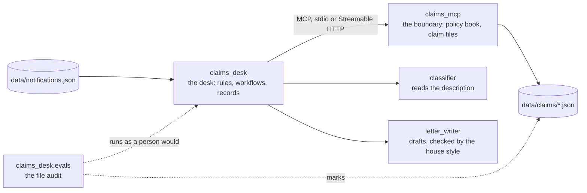

## One-line answer

Two documents are written last because they describe a finished system: a `README.md` for someone
who has this folder and nothing else, in six sections including what is deliberately not built and
what its author would change, and a `CODEMAP.md` that is generated rather than typed — every file in
the tree beside the day that prints it, which is the proof that the tree *was* printed.

## The idea

The card on the kit is written last, and it is written for the branch manager, not for head office.

That is a harder document than it looks, because the person who writes it knows everything and the
person who reads it knows nothing, and every sentence that assumes something the reader does not
have is a sentence they cannot act on. So the card has a fixed shape: what this is, what you need,
the commands in order, a drawing of how the pieces connect, where to learn more, and — the section
that is usually missing — what this kit deliberately does not do, so the branch does not spend a
morning looking for a feature that was never packed. And one more section that this project adds:
what the author would change, written after twenty days rather than before them, because the
person who just built a thing knows where it bends, and that knowledge is worth more to the next
builder than any of the sections above it.

The second document is a different kind of thing. `CODEMAP.md` is not written; it is produced by a
command that reads the twenty day hubs and lists every file each one claims to print. It is the
**completeness proof**: if a file is in the tree and not in this list, no day printed it, and a
reader who typed the project from the days does not have it. That is the rule this whole
curriculum runs on — code is never referenced, only printed — made into a table that can be diffed
against the tree. The `.gitignore` gains one line today for the same reason: `data/claims/` holds
what a run produced, and a clone that carried it would carry decisions no day printed either.

The rule for both files is the one every part of this day has kept: **written for a machine that
has nothing.** The README's commands were the ones part 4.1's clone ran; the CODEMAP was generated
against the tree part 4.1's clone received.

## The mechanism

The whole file, at `README.md`:

````markdown
# Claims Intake Desk

A first-notice-of-loss desk for a synthetic insurer. Notifications arrive as free text with a policy
number, a description and sometimes a photograph reference. The desk classifies the loss, checks the
policy was on risk on the date of loss, decides whether the claim can be fast-tracked, and writes
either a fast-track decision or a deficiency letter naming exactly the one thing that is missing.

Every policy, notification, handbook rule and letter in this repository is invented. No real
insurer, policyholder or loss appears anywhere in it.

## What you need installed

- `uv` 0.12.3 or later — it installs the interpreter this desk pins (CPython 3.12.12) and every
  package in `uv.lock`. Nothing else is installed by hand.
- `git`.
- Docker with Compose, only for `./run up`. Everything else runs without it.

A model key is **not** needed to run, test or evaluate this desk: every agent has a scripted stand-in
that announces itself as `scripted/…` in every transcript. The name of the key the real desk would
read is in `.env.example`; `SETUP.md` says where a free one comes from.

## The four commands

```bash
uv sync --locked          # the environment, exactly as locked
cp .env.example .env      # then put a value after the `=`, or any non-empty string for the stand-ins
./run check               # ruff, 292 tests, and the day-0 machine check — seconds
./run eval                # the file audit: the whole desk, marked against its answer key — a minute
```

And the two that keep running until you stop them:

```bash
./run serve               # the desk as a service on http://127.0.0.1:8080 — GET /healthz, POST /queue
./run up                  # compose: the boundary beside the desk, on a private network
```

On Windows PowerShell, where `./run` is not executable, every command is `python run <name>`.

## The architecture



The desk never opens a file: every policy and every claim file is behind the boundary, and the
boundary never calls a model. The two agents are the only things that read a sentence a caller
spoke, and neither of them can reach a tool.

## Where the teaching starts

This repository was built by hand, one day at a time, from twenty day documents. Each day has a hub
that orients, parts that teach one idea each with the real code and the real failure, and a
checklist that is the definition of done. Start at `day-00-machine-and-repository/LESSON.md` in the
curriculum this project was typed from; `CODEMAP.md` in this folder says which day prints each file.

## What is deliberately not built 🅿️

- **A real model.** The stand-ins replay a fixed script. Every transcript in the teaching says so.
  The pinned model IDs are in `claims_desk/models.py`; the calls are wired and never made.
- **Authentication on the boundary.** It binds loopback on a machine and a private network in
  compose, and that is the whole of its access control.
- **A pager.** `claims_desk/alerts.py` decides what would wake a person; nothing sends it.
- **A model judge.** The letter rubric is code. The row a program cannot read is written down and
  not run.
- **Kubernetes, blue/green, cost guards.** This desk ships at the floor tier: a stateless container,
  compose with the boundary as a sidecar, and a pipeline that runs both gates.

## What I would change if I wrote this again

- **A connection per boundary call.** Ninety-eight per cent of a queue's wall time is launching
  Python subprocesses. The boundary would be a URL from day 4 and the desk would hold one client.
- **The claim reference on every log line.** The audit attributes tool calls to claims by the order
  their spans close, which is only right because the queue is sequential. One field would remove
  the assumption.
- **The answer key in its own file**, written by a second person for a sample of the cases, so the
  audit measures correctness rather than agreement with whoever wrote the rules.
- **The evaluation extra in its own dependency group.** Fifty-two packages arrive for one word-overlap
  judge, and today every one of them is in the image.
````

**Line by line:**

- **Six sections, in the order a stranger needs them**, and a seventh this project adds. What it
  does, in four sentences and with the word *synthetic* in the fifth, because a reader who finds
  policy numbers and addresses in `data/` needs to be told on line eight that none of them is real.
- `uv` 0.12.3 or later — **the one tool, and what it brings with it.** The interpreter is not on
  the list because uv installs it from the pin file; that is the whole of day 0's argument, stated
  as a fact for a reader who will never read day 0.
- **"A model key is not needed."** The most important sentence in the file for a stranger, because
  every other README in this domain begins with *get an API key*, and this one's transcripts are
  reproducible without one. Where a real key would go is `.env.example`; where it comes from is
  `SETUP.md`, which day 0 printed.
- `uv sync --locked` — **the first command, with the flag.** The README's commands are the cold
  clone's commands; part 4.1 ran exactly these four and the transcripts there are what a reader
  should expect. `292 tests` and `a minute` are the numbers that clone printed.
- **The Mermaid diagram** — one drawing, and it draws the two rules the project runs on: the only
  arrow into a file goes through the boundary, and the only arrows into a model go from the desk.
  The audit is dotted because it is not part of the desk; it runs it.
- **"Where the teaching starts"** — the pointer to `day-00-…/LESSON.md` is a pointer into *this
  project's* days, which live beside it, and `CODEMAP.md` is what joins each file to its day.
- **"What is deliberately not built"** — five things, each with the reason and the file that would
  change. The boundary's missing authentication is on this list because part 2.1 made a decision
  about it, and a decision that is not written down is a decision the next reader will reverse by
  accident.
- **"What I would change"** — four bullets, and every one is a number from a day of this project:
  ninety-eight per cent from day 17, the sequential assumption from day 18, the answer key from
  day 18's review comment, the fifty-two packages from day 18 and part 4.1's download list. The
  hub's `TODO(me)` asks for yours.

The completeness proof, generated. From the curriculum folder that holds this project's days:

```bash
python p.py codemap 01            # print it
python p.py codemap 01 --write    # write it into the project — the learner's command, on the learner's tree
```

**Line by line:**

- `python p.py codemap 01` — **the authoring tool, reading the twenty hubs' `files_printed`
  lists**, from the curriculum folder and not from the project: it knows what the days claim, and
  nothing about the tree.
- `--write` — **the one time the authoring tool touches the learner's tree**, and it writes this one
  file. Run from the project folder, by the person who owns it.

The whole file, at `CODEMAP.md`, as the command produced it today:

````markdown
# CODEMAP — Claims Intake Desk

> **Do not edit this file by hand.** Regenerate it with `python p.py codemap 01 --write`.

Every file in this project, and the day document that prints it **in full**.
A file with no day is a Completeness Rule violation and fails the gate.

```
.dockerignore                         day-19-ship
.env.example                          day-00-machine-and-repository
.github/workflows/check.yml           day-19-ship
.gitignore                            day-00-machine-and-repository
.python-version                       day-00-machine-and-repository
CODEMAP.md                            day-19-ship
Dockerfile                            day-19-ship
PACKAGES.md                           day-00-machine-and-repository
PROJECT.md                            day-00-machine-and-repository
README.md                             day-19-ship
SETUP.md                              day-00-machine-and-repository
check.py                              day-00-machine-and-repository
claims_desk/__init__.py               day-01-skeleton-and-kit
claims_desk/__main__.py               day-06-tool-that-must-refuse
claims_desk/agents/classifier.py      day-07-first-agent
claims_desk/agents/letter_writer.py   day-09-cast
claims_desk/alerts.py                 day-17-observability
claims_desk/boundary.py               day-04-boundary-part-two
claims_desk/desk.py                   day-06-tool-that-must-refuse
claims_desk/desk.py                   day-07-first-agent
claims_desk/domain.py                 day-02-domain-and-its-data
claims_desk/evals.py                  day-18-evals
claims_desk/evalset/__init__.py       day-18-evals
claims_desk/evalset/agent.py          day-18-evals
claims_desk/hooks.py                  day-11-callbacks-plugins
claims_desk/models.py                 day-01-skeleton-and-kit
claims_desk/recall.py                 day-12-memory-retrieval
claims_desk/record.py                 day-14-decision-record
claims_desk/reliability.py            day-15-reliability
claims_desk/schemas.py                day-13-structured-output
claims_desk/scripted.py               day-07-first-agent
claims_desk/security.py               day-16-security-privilege
claims_desk/serve.py                  day-19-ship
claims_desk/sessions.py               day-08-sessions-and-state
claims_desk/store.py                  day-02-domain-and-its-data
claims_desk/util/__init__.py          day-01-skeleton-and-kit
claims_desk/util/backoff.py           day-01-skeleton-and-kit
claims_desk/util/budget.py            day-01-skeleton-and-kit
claims_desk/util/keys.py              day-01-skeleton-and-kit
claims_desk/util/logging.py           day-01-skeleton-and-kit
claims_desk/util/trace.py             day-17-observability
claims_desk/workflow.py               day-10-workflow-runtime
claims_mcp/__init__.py                day-03-boundary-part-one
claims_mcp/__main__.py                day-03-boundary-part-one
claims_mcp/__main__.py                day-04-boundary-part-two
claims_mcp/server.py                  day-03-boundary-part-one
claims_mcp/server.py                  day-04-boundary-part-two
claims_mcp/server.py                  day-05-tools
claims_mcp/tools.py                   day-05-tools
compose.yaml                          day-19-ship
data/evalset/classifier.evalset.json  day-18-evals
data/evalset/test_config.json         day-18-evals
data/handbook.md                      day-12-memory-retrieval
data/handbook_questions.json          day-12-memory-retrieval
data/notifications.json               day-02-domain-and-its-data
data/policies.json                    day-02-domain-and-its-data
pyproject.toml                        day-01-skeleton-and-kit
run                                   day-01-skeleton-and-kit
tests/test_agent.py                   day-07-first-agent
tests/test_boundary.py                day-03-boundary-part-one
tests/test_cast.py                    day-09-cast
tests/test_desk.py                    day-06-tool-that-must-refuse
tests/test_domain.py                  day-02-domain-and-its-data
tests/test_evals.py                   day-18-evals
tests/test_hooks.py                   day-11-callbacks-plugins
tests/test_kit.py                     day-01-skeleton-and-kit
tests/test_observability.py           day-17-observability
tests/test_recall.py                  day-12-memory-retrieval
tests/test_record.py                  day-14-decision-record
tests/test_reliability.py             day-15-reliability
tests/test_schemas.py                 day-13-structured-output
tests/test_security.py                day-16-security-privilege
tests/test_sessions.py                day-08-sessions-and-state
tests/test_ship.py                    day-19-ship
tests/test_tools.py                   day-05-tools
tests/test_transports.py              day-04-boundary-part-two
tests/test_workflow.py                day-10-workflow-runtime
```
````

**Line by line:**

- **Seventy-seven rows for seventy-two distinct files** — the five extra are files printed whole
  more than once: `desk.py` on days 6 and 7, `claims_mcp/__main__.py` on days 3 and 4, `server.py`
  on days 3, 4 and 5. Each later print replaced the earlier one whole, and the map keeps both rows
  because both days did print it. Part 4.1's clone counted seventy-four tracked files: the
  seventy-two here, plus `uv.lock`, which is generated and not printed, and `.dockerignore`'s
  neighbour `CODEMAP.md` itself was not yet in that tree.
- `CODEMAP.md day-19-ship` — **the map lists itself**, because this part prints it, and a map that
  omitted itself would be one file short of the tree.
- **Every file the clone received is on this list, and every file on this list is a day.** That is
  the sentence the Completeness Rule reduces to, and the reason the map is generated: a hand-typed
  list is a second thing that can be wrong, in the direction nobody checks.
- **What the map cannot see** is a change to a file that was never printed as a diff — the debts
  day 18's ledger note recorded in days 11, 13, 14, 15 and 17. Each of those files *is* on this
  list, under the day that printed it whole; the map proves the whole print exists and says nothing
  about whether every later change was. That is the honest limit of a table of files.

One line for a clone that carries no decisions. **A marked diff against the `.gitignore` day 0
part 2.2 printed, as day 18 part 3.2 left it:**

```diff
 # The framework's evaluation history, written beside the agent by `adk eval`. A run's result is a
 # fact about one machine on one day, and it goes in a report, never in the tree.
 .adk/
+
+# What a run leaves behind. A claim file is a decision made on one machine on one day; it belongs
+# in a report or an audit, never in a clone.
+data/claims/
```

**Line by line:**

- `data/claims/` — **the same path `.dockerignore` excludes and the audit clears.** Three places,
  one rule: a decided claim is output. Until today nothing stopped a `git add -A` from committing
  twelve claim files, and a clone that received them would fail the audit's first run in a way
  nobody could explain — `record_decision` treating a stale file as an earlier identical write,
  which day 15 made it do on purpose.

## When it breaks

Type the CODEMAP by hand — which is what everybody does the first time, because it is a list and
lists look easy — and forget one line:

```diff
 claims_desk/security.py               day-16-security-privilege
-claims_desk/serve.py                  day-19-ship
 claims_desk/sessions.py               day-08-sessions-and-state
```

Nothing fails. The file is in the tree, the tests import it, the clone runs it. The map says the
tree has seventy-one files and the tree has seventy-two, and the seventy-second is a file a reader
typing the project from the days would build from — nothing, because the map is where they would
have looked. The list is exactly as reliable as the last person who edited it, which is the
property the generated version exists to remove: `python p.py codemap 01 --write` produces the
whole thing from the hubs, and a hub that forgot `serve.py` in its `files_printed` fails the
authoring gate before the map is ever generated.

For the README the failure is quieter still. The number `292` in *the four commands* is the number
part 4.1's clone printed; the day somebody adds a test and does not touch the README, it is wrong,
and no test reads it. That is the difference between the two documents: one is generated and the
other is prose, and prose about a system is stale the day after it is true. The smallest fix is not
to put numbers in prose — or, if the number earns its place, to have the test that produces it
read the README too.

## In production

**What a senior writes instead.** A README whose command block is executed by the pipeline — the
same four lines, run from the document, so the document is a test — and a `CODEMAP` regenerated
and diffed on every push, with a red build when the tree and the map disagree. And the *not built*
list kept as issues rather than bullets, each with the day it would take and the reason it has not
been taken, so that the next person does not re-derive the decision.

**What degrades at scale.** A README is read by every new person once and by nobody after, so it
rots at exactly the rate the team grows. Forty projects with a README each — the shape of this
curriculum — is forty documents whose first command is right on the day it was written. The map
does not rot, because it is not written; that is the argument for generating everything that can be
generated, and the reason the plan says the map is the proof and the README is the entry.

**The review comment.** *"`README.md` says the boundary has no authentication and lists it under
*not built*. `compose.yaml` publishes the desk's port to the host. The README does not say that
`POST /queue` on that port runs the whole queue with the desk's key. If the boundary's missing
authentication is worth a bullet, so is that."*

**The interview question.** *"You are handed a repository with a README and a file list. What is
the first thing you check about each, and which one do you trust more?"*

## Check yourself

- **Run:** `python p.py codemap 01` from the curriculum folder and count the rows; then `git
  ls-files | wc -l` in your project and account for the difference.
- **Run:** `python p.py codemap 01 --write` in your project, and `git diff --stat` to see the one
  file it wrote.
- **Say out loud:** why is the map generated and the README written? Name one thing each can be
  wrong about that the other cannot.
- **Say out loud:** the map lists `claims_desk/desk.py` twice. Say why that is right, and what it
  would mean if it listed it once.
- **`TODO(me)`:** the hub's rep — *what I would change*, in your words, after your twenty days.
- **`TODO(me)`:** the review comment. Add the `POST /queue` bullet, or unpublish the port, and make
  the README agree with `compose.yaml` either way.

---

**Next:** [What the tests hold](../05-holding-it/5.1-what-the-tests-hold.md)
