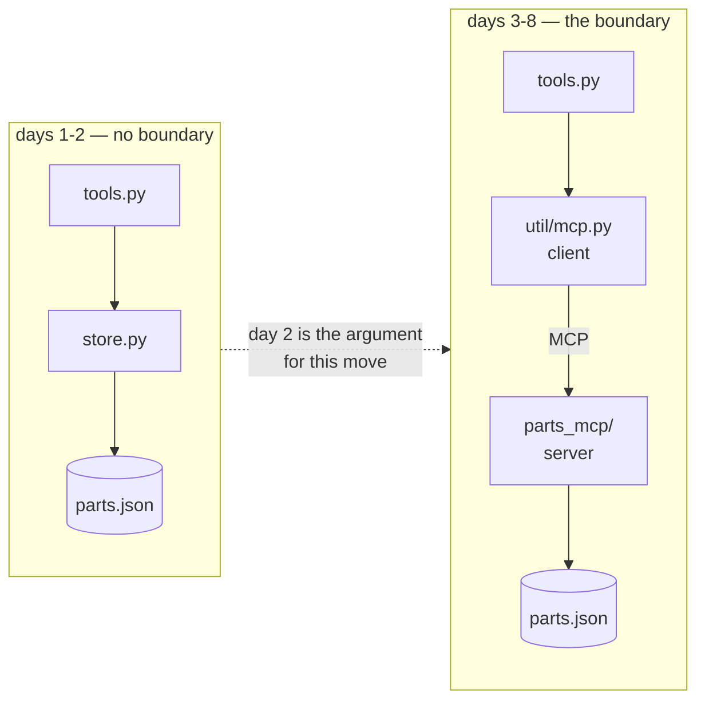

> **Yesterday:** P01 Ask Desk shipped at tier D1 — an agent behind `api_server`, a `/healthz` that
> answers without calling a model, and the first eval that goes red on purpose.
> **Today:** a second project starts from an empty folder, and the first thing it does is fit out its
> own toolwall: four utility files, two of which you have used before and two of which are new here.
> **Tomorrow:** why the data goes behind a boundary — the shop's stock book, two people writing in it
> at once, and the count that comes out different every time you run it.

## §1 The scene

A fitter takes the lease on the unit at the end of a row. The unit is empty: a bench, a bare wall,
power. Across the road is a shop that has been open for twenty years, with a wall of tools and an
owner who would lend you anything you asked for. The new fitter buys their own set anyway, and it
costs most of what they had — because a spanner you have to walk across the road to borrow is not a
spanner you have, it is a spanner you have access to, on the days that shop is open, while that owner
still likes you, and as long as it is not already in somebody else's hand.

That is today. This is the second of forty folders, each of which has to stand up on its own, and the
first sitting of any of them is the one where it buys its own tools. Four small files go on the wall.
Two of them you have used before, in the shop across the road: the one that says which model may be
called, and the one that reads a secret out of a file and refuses by name when it is not there. They
are typed again here, whole, because the rule this curriculum runs on is that every line a project
needs is printed inside that project's own documents — and the rule has a price, stated openly in the
plan, of roughly four hundred lines typed forty times.

The other two are new, and they are the reason today is not just copying. One is a torque wrench: a
counter that clicks and refuses rather than a dial somebody is supposed to be watching, because every
day of this curriculum so far has stated a request budget in a paragraph and a paragraph is not a
control. The other is the trap under the drain: a writer that removes credentials from every line it
writes, so that the twenty call sites nobody has written yet are allowed to be careless. Both come
with a shadow board — the outline painted behind the tool — which here is a test file, so that a
missing or blunted tool is visible at a glance rather than at an audit.

Nothing calls a model today. No provider request is made by any command in this sitting, and the
project's gate is green on a machine with no working key, which is a property worth noticing rather
than a coincidence.

## §2 The map

Two sections, and the split is exactly the plan's two depths. The first section is what this project
**owes itself** — why the copies exist, and the two files that are copies, walked at recap depth
against the failure each line prevents. The second is the two tools that are **new here**, walked at
full depth because no earlier day in the plan owns them.

### 1 · What a project owes itself

*The mental model: a new shop fitting out its own toolwall. Everything on it was bought rather than
borrowed, the labels under the outlines are this shop's own, and the bill is known.*

| Part | Title | What it answers | Level |
| --- | --- | --- | --- |
| [1.1](parts/01-what-a-project-owes-itself/1.1-the-four-hundred-lines-you-type-again.md) | The four hundred lines you type again | Why does this project retype files P01 already has, what does that cost, and what does it buy? | foundation |
| [1.2](parts/01-what-a-project-owes-itself/1.2-the-two-you-have-met-before.md) | The two you have met before | What do the registry and the key reader promise, and why is this project's model pin its own decision? | working |

### 2 · The two that are new

*The mental model: the two tools this shop did not own before — the one that clicks and stops, and
the trap that catches what somebody was going to pour down the drain.*

| Part | Title | What it answers | Level |
| --- | --- | --- | --- |
| [2.1](parts/02-the-two-that-are-new/2.1-a-budget-that-refuses.md) | A budget that refuses | What may one question cost, what may one run cost, and why is the ceiling checked before the counter moves? | working |
| [2.2](parts/02-the-two-that-are-new/2.2-redaction-at-the-writer.md) | Redaction at the writer | Why does the logger remove secrets rather than the call sites, and what goes red when it stops? | production |

## §3 Setup — run this

This is a new project, so the folder has a frame before it has any of today's code. The eight files
below are that frame. They are **listed here rather than taught**: none of them is today's subject,
every one of them has to exist before the first command runs, and the four files the parts teach are
in §4.

**The toolchain and the folder.** Two dependencies, both pinned exactly, both chosen by this
project's own freshness check on 2026-09-10 and recorded in its `PACKAGES.md`:

```bash
mkdir -p projects/02-parts-counter/parts_counter/util projects/02-parts-counter/parts_counter/data
mkdir -p projects/02-parts-counter/tests
cd projects/02-parts-counter
touch parts_counter/__init__.py parts_counter/util/__init__.py
uv python pin 3.12.12                 # writes .python-version
uv add "google-adk==2.8.0"            # this project's own pin, not P01's
uv add --dev "pytest==9.1.1"          # a dev dependency: run.py check runs the kit's tests
uv sync --frozen                      # builds .venv from uv.lock exactly
cp .env.example .env                  # then edit .env so GOOGLE_API_KEY=<your key>
```

Both `__init__.py` files are empty, and they are what make `parts_counter` a package so that
`from parts_counter.util import keys` resolves from the project root and from nowhere above it.

**`projects/02-parts-counter/pyproject.toml`** — what was asked for, and both answers are exact. The
dev group is new in this project: P01's gate had five checks and none of them ran a test, so it had
nothing to install pytest for:

```toml
[project]
name = "parts-counter"
version = "0.1.0"
requires-python = ">=3.12"
dependencies = [
    "google-adk==2.8.0",
]

[dependency-groups]
dev = [
    "pytest==9.1.1",
]
```

**`projects/02-parts-counter/.python-version`** — which interpreter, written by `uv python pin`.
`requires-python = ">=3.12"` above is a floor and names no interpreter; this file names one:

```text
3.12.12
```

**`projects/02-parts-counter/.gitignore`** — the rule before the file it names exists, which is P00
day 2's whole argument carried into this project:

```text
# projects/02-parts-counter/.gitignore
# The rule comes first. This file exists before any file it names does.

# Secrets. Never committed — not once, not "just to test the pipeline".
.env
.env.*
!.env.example
*.key
*.pem
service-account.json

# Written by uv from uv.lock. Rebuildable, so never committed and never copied.
.venv/
__pycache__/
*.pyc
```

**`projects/02-parts-counter/.env.example`** — committed, and it is the list of key names this
project reads. `keys.names_this_project_reads()` reads this file rather than keeping a second list:

```text
# .env.example
# Every key this project reads, with no value after any "=".
# Copy to .env and fill it in:  cp .env.example .env

GOOGLE_API_KEY=
```

**`projects/02-parts-counter/README.md`** — the stranger's entry point, for somebody who has this
folder and nothing else:

````markdown
# Parts Counter

A workshop parts counter — find a part, read its stock, say which bin it is in, change the count —
built to argue for a data boundary rather than to assume one.

## What this system does

You ask it about a part. It finds it, tells you how many are on hand and whether that is below the
reorder point, and says which bin to walk to. It can also change the count, which is the operation
that makes the rest of this project necessary.

## What you need installed

`uv`, and a free Google AI Studio API key. Nothing else. Full steps in `SETUP.md`.

## The commands

```bash
uv run --frozen python run.py check          # the gate: config, pins, registry, tests
uv run --frozen python run.py parts filter   # find parts, straight through the tools
uv run --frozen python run.py race           # what a store with no boundary does under two writers
```

## The architecture



The left-hand shape works. Day 2 is about what it costs — `run.py race` issues twenty parts from two
threads and loses count of some of them, while a reader crashes on a half-written file.

## Where the teaching is

`days/02-parts-counter/day-11-.../LESSON.md` onwards, in the authoring repository. If you have only
this folder, `PRIMER.md` carries everything borrowed from elsewhere.

## What is deliberately not built 🅿️

- **No retry or backoff.** A 429 fails the run honestly rather than being smoothed over. Honest
  backoff is P05, and a retry loop written before you have watched a quota run out hides the thing
  it should surface.
- **No second agent.** One agent is a function; two is an architecture, and that is P03.
- **No boundary yet, on days 1 and 2.** That absence is the subject, not an oversight.
````

**`projects/02-parts-counter/PROJECT.md`** — the brief, the triad, and the honest statement of what
this project recaps rather than teaches:

````markdown
# P02 · Parts Counter

**What it is.** A workshop parts counter — find a part, read its stock, say which bin it is in, and
change the count — built first with its data reachable straight off the filesystem, and then moved
behind an MCP boundary, so the boundary is something you were argued into rather than told about.

**Days.** 8 · **Deploy tier.** D2 (stateless container, secrets injected not baked) ·
**Depends on nothing.**

## Triad

| Leg | This project |
| --- | --- |
| **Tools** | `find_part(query)` · `stock_level(part_no)` · `bin_location(part_no)` · `adjust_stock(part_no, delta)` |
| **MCP boundary** | `parts_mcp/` — owns the inventory. **This is the project that teaches it**, from day 3. Days 1 and 2 deliberately have no boundary, and day 2 is the demonstration of what that costs. |
| **Cast** | one agent. Two is an architecture, and that is P03. |

## Borrowed concepts — taught deeply elsewhere, recapped here

| Concept | Recap in | Deep version (optional reading) |
| --- | --- | --- |
| A floor is not a pin, and `-latest` is a floor | `PRIMER.md` §1 | `days/00-foundry/day-03-keys-pinning-refusing-check/parts/02-the-pin-and-the-refusal/2.1-a-floor-is-not-a-pin.md` |
| The exit status is the verdict | `PRIMER.md` §2 | `days/00-foundry/day-03-keys-pinning-refusing-check/parts/02-the-pin-and-the-refusal/2.2-the-check-that-could-not-refuse.md` |
| Reading a key, and the three states of one | `PRIMER.md` §3 | `days/00-foundry/day-03-keys-pinning-refusing-check/parts/01-the-key/1.2-three-states-and-the-one-you-cannot-check.md` |
| A tool declaration is derived from the function | `PRIMER.md` §4 | `days/01-ask-desk/day-07-functiontool-what-adk-does/parts/01-what-the-wrapper-reads/1.2-the-type-hints-are-the-schema.md` |
| The framework's bound is not your bound | `PRIMER.md` §5 | `days/01-ask-desk/day-07-functiontool-what-adk-does/parts/02-what-it-reads-that-you-did-not-mean-to-write/2.2-what-it-did-and-what-it-did-not.md` |

**New here:** a request budget that refuses rather than warns · structured logging with redaction at
the writer · the MCP boundary — the stateless core, lifecycle, transports, resources and the client
side · a data layer that survives two writers.

**Deliberately not built yet 🅿️.** Honest 429 backoff. This project's calls fail on a 429 rather
than retrying, and that is recorded rather than hidden: retry policy is P05's subject, and a retry
loop written before you have watched a quota run out is a retry loop that hides the thing it should
surface.

**Done when.** `python run.py check` is green on a bare machine; the inventory is reachable only
through `parts_mcp`; and `python run.py race` — the concurrent-write demonstration from day 2 —
stops losing parts once the boundary owns the file.
````

**`projects/02-parts-counter/PRIMER.md`** — five borrowed ideas, self-contained. This is the file that
makes every pointer in this project a pair rather than a dead end, and it is why a reader who has only
this folder is not stranded by a link into a project they do not have:

````markdown
# Primer — P02 Parts Counter

Five ideas this project uses and does not teach. Each section is self-contained: you can build and
understand this project having read only this page. The pointer at the end of each is for depth, not
for sufficiency.

## §1 A floor is not a pin

`platformdirs>=4.11.8` and `requires-python = ">=3.12"` name no version. They say what is *too old*
and hand the choice to whichever machine resolves them, on whichever day. That is right for a
library, which must install beside other people's constraints, and never enough for an application,
which is deployed rather than imported.

Three files answer three questions. `pyproject.toml` records what you **asked for** and may be a
range. `uv.lock` records what the asking **produced** — exact versions and hashes, including
packages you never named. `.python-version` records **which interpreter**. The test of whether you
have pinned anything: hand this folder to somebody next March and ask whether they get what you
have.

The same idea reaches models. `gemini-flash-latest` is documented as hot-swapped on every release,
so it is a floor wearing a version's clothes. `parts_counter/util/models.py` refuses it by name.

Deeper: `days/00-foundry/day-03-keys-pinning-refusing-check/parts/02-the-pin-and-the-refusal/2.1-a-floor-is-not-a-pin.md`

## §2 The exit status is the verdict

A check has two audiences and only one can be fooled. A person reads the terminal; a commit hook, a
pipeline step and a `done` command read one number, the process's **exit status**. Zero means
success and everything printed is decoration. A check that prints `RED`, counts the problems and
exits `0` is green everywhere it matters, and it looks *more* convincing than a working one because
every human-readable part is correct. The line that makes the difference is
`sys.exit(main(sys.argv))`.

There is a second way to build a check that cannot refuse, and it needs no bug: invoke it through a
tool that **repairs** what is being checked. `uv run` updates the lockfile before running your
command, so a lockfile-drift check invoked that way always passes — accurately, about a state its
own invocation created. `uv run --frozen` is why every command in this project's documents carries
that flag.

Deeper: `days/00-foundry/day-03-keys-pinning-refusing-check/parts/02-the-pin-and-the-refusal/2.2-the-check-that-could-not-refuse.md`

## §3 Reading a key, and the three states of one

Nothing loads a `.env` file for you — not Python, not `uv run`, not the shell. A running program has
an *environment*: name-to-string pairs the operating system gave it at start-up, exposed as
`os.environ`. The file is inert until code opens it, and here that code is
`parts_counter/util/keys.py`. **The process environment wins and the file is the fallback**, because
every deployment target injects secrets as variables and none of them writes a `.env`.

A key can be wrong three ways and only two are decidable locally. **Absent** — Python gives `None`.
**Present and empty** — usually a CI secret that was never populated; Python gives `''`. Those need
different sentences said back, which is why `require` tests `is None` and `not value.strip()`
separately: `if not os.environ.get(...)` is true for both and its message has to lie to one of them.
The third — **present, non-empty and not accepted** — no local check can settle, because a
credential is valid only because a server holding the other half says so.

One more thing this project needs and P00 did not: the framework does not use your key reader.
`google-genai` builds its client from `os.environ` directly, so a project that reads its own file
and never exports the value gets `ValueError: No API key was provided.` while the key sits on disk.

Deeper: `days/00-foundry/day-03-keys-pinning-refusing-check/parts/01-the-key/1.2-three-states-and-the-one-you-cannot-check.md`

## §4 A tool declaration is derived, not written

The model never sees your code. It sees a JSON declaration — a name, a description, and a JSON
Schema for the arguments — and that declaration is the entire interface. ADK builds it from the
function object: the **name** from `__name__`, the **schema** from the type hints and defaults, and
the **description** from the docstring.

Three consequences worth carrying into this project. A parameter with no type hint produces a schema
property with no `type`, which constrains nothing. A function with no docstring gets the description
`'Call self as a function.'` — `__call__.__doc__`, leaking — and nothing warns. And a per-parameter
`description`, which a hand-written declaration can carry, has nowhere to live in a derived one, so
guidance about an argument belongs in the docstring where the derivation will read it.

That is why the docstrings in `parts_counter/tools.py` are written for the model rather than for us.

Deeper: `days/01-ask-desk/day-07-functiontool-what-adk-does/parts/01-what-the-wrapper-reads/1.2-the-type-hints-are-the-schema.md`

## §5 The framework's bound is not your bound

ADK does bound the loop: `RunConfig.max_llm_calls`, **defaulted to 500**, overridable outside the
repository by the `ADK_MAX_LLM_CALLS` environment variable, and enforced by raising
`LlmCallsLimitExceededError`. A value of zero or less disables it, which reads like the opposite of
what it does.

500 is a runaway ceiling — sized so no legitimate run trips it. That is a different job from
answering "what may one question cost?", and this project answers the second question itself, in
`parts_counter/util/budget.py`, with a number it chose. Both are set from the same constants, so
there is one place to change and no chance of the two disagreeing.

Deeper: `days/01-ask-desk/day-07-functiontool-what-adk-does/parts/02-what-it-reads-that-you-did-not-mean-to-write/2.2-what-it-did-and-what-it-did-not.md`
````

**`projects/02-parts-counter/SETUP.md`** — every command from a bare machine to a green check, with no
step referring to another project:

````markdown
# Setup — P02 Parts Counter

Every command from a bare machine to a green check. No step refers to another project.
This is a listing, not a lesson: day 1 explains the parts that matter.

Verified on this machine on 2026-09-10 — uv 0.12.3, CPython 3.12.12, git 2.54.0.windows.1.

## 1 · The toolchain

```bash
# Windows (PowerShell):  irm https://astral.sh/uv/install.ps1 | iex
# macOS / Linux:         curl -LsSf https://astral.sh/uv/install.sh | sh
uv --version              # expect 0.12.3 or newer
```

## 2 · The project

```bash
cd projects/02-parts-counter
uv python pin 3.12.12     # writes .python-version; requires-python is a floor, not a pin
uv sync --frozen          # builds .venv from uv.lock exactly, resolving nothing
```

## 3 · The key

One free Google AI Studio API key, from `https://aistudio.google.com/apikey`:

```bash
cp .env.example .env
# then edit .env so the line reads GOOGLE_API_KEY=<your key>
```

`.env` is covered by this project's `.gitignore`. `.env.example` is committed and holds the *names*
with no values after the `=`. There is no `GOOGLE_GENAI_USE_VERTEXAI` line and there should not be:
the AI Studio path is configured by `GOOGLE_API_KEY` alone. Checked against
`https://adk.dev/agents/models/google-gemini/` on 2026-09-10.

Days 1 and 2 make **no model calls at all**, so you can reach a green check with the placeholder
still in place.

## 4 · The check

```bash
uv run --frozen python run.py check
echo $?                   # 0 green, 1 red, 2 you typed the command wrong
```

Six checks, all of which must be green: `keys`, `interpreter`, `pins`, `lock`, `model`, `tests`.

`--frozen` is not optional. Without it `uv run` updates the lockfile before your command starts, and
the `lock` check then reports on a repository the invocation just repaired.

## 5 · Running it

```bash
uv run --frozen python run.py parts filter   # find parts, no model in the way
uv run --frozen python run.py race           # day 2's concurrent-write demonstration
```

`race` deliberately corrupts and then restores the synthetic inventory. It is safe to run and its
numbers differ every time — that is the bug it demonstrates.

## What you do not need

No database, no Docker on day 1, no cloud project, no billing account. The container arrives on
day 8 (tier D2). All data is synthetic and lives in `parts_counter/data/parts.json`.
````

Then the day's own six files, in reading order — `parts_counter/util/models.py`,
`parts_counter/util/keys.py`, `parts_counter/util/budget.py`, `parts_counter/util/logging.py`,
`tests/test_kit.py`, `run.py` — and the commands that exercise them:

```bash
cd projects/02-parts-counter
uv run --frozen python run.py check            # part 2.2 — six green, and it can go red
uv run --frozen python -m pytest tests -q      # part 2.2 — nine tests, all able to fail
```

## §4 Files this day prints

Fourteen files, all of them this project's own. Nothing here is imported from anywhere above
`projects/02-parts-counter/`, and nothing is carried over from P00 or P01 — `keys.py` and `models.py`
are this project's own copies, and part 1.1 is about why. This table feeds `CODEMAP.md`, which is the
completeness proof for the whole project.

| File | Printed by |
| --- | --- |
| `projects/02-parts-counter/pyproject.toml` | hub §3, scaffold listing |
| `projects/02-parts-counter/.python-version` | hub §3, scaffold listing |
| `projects/02-parts-counter/.gitignore` | hub §3, scaffold listing |
| `projects/02-parts-counter/.env.example` | hub §3, scaffold listing |
| `projects/02-parts-counter/README.md` | hub §3, scaffold listing |
| `projects/02-parts-counter/PROJECT.md` | hub §3, scaffold listing |
| `projects/02-parts-counter/PRIMER.md` | hub §3, scaffold listing |
| `projects/02-parts-counter/SETUP.md` | hub §3, scaffold listing |
| `projects/02-parts-counter/parts_counter/__init__.py` · `parts_counter/util/__init__.py` | empty; hub §3, scaffold listing |
| `projects/02-parts-counter/parts_counter/util/models.py` | part 1.2, whole, at recap depth |
| `projects/02-parts-counter/parts_counter/util/keys.py` | part 1.2, whole, at recap depth |
| `projects/02-parts-counter/parts_counter/util/budget.py` | part 2.1, whole, at full depth |
| `projects/02-parts-counter/parts_counter/util/logging.py` | part 2.2, whole, at full depth |
| `projects/02-parts-counter/tests/test_kit.py` | part 2.2, whole, at full depth |
| `projects/02-parts-counter/run.py` | part 2.2, whole — recap depth for the `check_*` shape, full depth for `check_tests_pass` |

`PACKAGES.md` is written today too, and it is in §10 with the freshness check rather than here,
because it is a ledger rather than code. `CODEMAP.md` is generated from this table.

## §5 Build brief

Type the six files the parts print. Every `TODO(me)` below stays unsolved — they are the reps, and
nothing in today's documents answers them for you.

| File | What it must do |
| --- | --- |
| `parts_counter/util/models.py` | `TODO(me)`: type it. Before running anything, write down the date you expect to see in `PINNED` and say where that date is supposed to come from. Then check it against this project's `PACKAGES.md` model row. |
| `parts_counter/util/keys.py` | `TODO(me)`: type it, at `parts_counter/util/`. The docstring points at `PRIMER.md` §1, and in *this* project the key material is §3. Say which section it should name, **correct it**, and then say which mechanism in this repository was supposed to catch a stale cross-reference like that, and why it did not. |
| `parts_counter/util/budget.py` | `TODO(me)`: type it. Before running it, predict what `spent_this_turn` reads after a refusal, and predict what it would read if the increment came before the check. Then prove both with a `Budget(max_per_turn=1)`. |
| `parts_counter/util/budget.py` | `TODO(me)`: the docstring says both bounds are set from the same constants in `parts_counter/agent.py`, and that file does not exist yet. Find the day `CODEMAP.md` owes it to, and say what you would have to write there for the sentence to become true. |
| `parts_counter/util/logging.py` | `TODO(me)`: type it. Before running the tests, name a field that would carry a credential straight past all six entries in `SECRET_NAMES`, and say what you would add to this project so that the next such name is caught by something other than somebody remembering. |
| `tests/test_kit.py` | `TODO(me)`: type it. For each of the nine, say in one sentence what breaks if you delete it — and identify the one test whose failure would be invisible in the returned record and visible only in the written stream. |
| `run.py` | `TODO(me)`: type it. Predict which of the six checks will be red on your machine before the first run, then run it and see whether you were right. |
| the failure rep | `TODO(me)`: run part 2.2's break — remove `"key"` from `SECRET_NAMES`, run the tests and the gate, read the two failures and the exit status, then restore. Say why the *nested* failure is the more important of the two. |
| the honest gap | `TODO(me)`: this project's run ceiling is a number it chose, because the provider publishes none. Open Google AI Studio with your own key, read your own tier's limits, and paste them into `PACKAGES.md` with the date. Nothing in this day can do that for you. |

## §6 The check that must be able to fail

```text
cd projects/02-parts-counter
uv run --frozen python run.py check         # six: keys, interpreter, pins, lock, model, tests
echo $?                                     # 0 green, 1 red, 2 you typed it wrong
uv run --frozen python -m pytest tests -q   # the nine assertions behind the sixth check
cd ../.. && python p.py depth 11            # this day against the plan §5 contract
```

**How to make it go red on purpose — four ways, and they fail differently.**

The first is today's deliberate failure, and it is the one to run. Remove `"key"` from
`SECRET_NAMES` in `parts_counter/util/logging.py`. Two of the nine tests go red — the top-level one
and the nested one — and `run.py check` reports `RED    tests` with pytest's own summary line and
exits `1`. Restore the entry and both return to green with no other change. The failure is worth
watching rather than reading about, because the surprise is not that it fails; it is that the *nested*
case fails, and that the secret is printed into the assertion output.

The second is the budget's ordering. In `charge`, move the two `+=` lines above the two `if`
statements. `test_a_refused_call_is_not_also_a_spent_one` goes red with
`assert 2 == 1`, and nothing else in the suite notices — which is exactly why that test exists with
that name.

The third is the registry. Set `models.ANSWERING` to `"gemini-flash-latest"` and **two** checks go
red at once: `model`, with the alias message, and `tests`, because two registry assertions now
disagree with the module. Set it to `"gemini-3.7-flash"` instead and you get the other refusal
message. Two wrong values, two different sentences, and one edit tripping two checks.

The fourth is the pin. Edit `pyproject.toml` so `google-adk` reads `>=2.8.0`, and watch `pins` and
`lock` go red together — `pins` because `>=` is a floor and not a pin, and `lock` because `uv.lock`
no longer answers `pyproject.toml` and `uv lock --check` says so in uv's own words.

**And the one that stays green.** Add a new call site that logs a settings object under a field name
with none of the six markers in it — `log("provider.call", cfg=settings)` — and nothing goes red. The
tests assert on the field names they were written with, and no check in this project inspects call
sites. That is the honest limit of a deny-list, it is named in part 2.2's *In production*, and
knowing it is missing is today's work rather than fixing it.

For the document itself: delete a `## In production` heading from any part and run
`python p.py depth 11`; it names the file and the missing section.

## §7 Request budget

**Zero model calls. Not one, in any command in this day.**

The cast is one agent, and today it does not exist yet — this sitting builds the kit, and the agent
arrives on day 17 when there is a boundary for it to reach through. Every command in this day is
local: the six checks in `run.py`, the nine tests, the registry refusals, the budget refusals and the
log line all run without a network. That is why the gate is green on this machine, which has **no
working provider key**, and why every transcript in these four parts could be produced in full.

Day 12 is the same: zero. The concurrent-write demonstration is two threads and a JSON file, and no
model is involved in losing the parts.

What this day builds is the arithmetic that will bound the number when it stops being zero. Two
ceilings, both chosen by this project and both enforced by raising:

| Ceiling | Value | The question it answers |
| --- | --- | --- |
| `Budget.max_per_turn` | 6 | What may one question cost, counted across the whole cast? |
| `Budget.max_per_run` | 60 | What may this process spend in total before it stops? |
| `RunConfig.max_llm_calls` | 500, the framework's default | Has this run stopped terminating? |

**The provider's ceiling is a `TODO(me)`, and that is deliberate.** The rate-limit page publishes no
requests-per-minute, tokens-per-minute or requests-per-day figure for any model. Checked
2026-09-10, verbatim:

> Rate limits depend on a variety of factors (such as your usage tier) and can be viewed in Google
> AI Studio.

and, on the same page:

> Specified rate limits are not guaranteed and actual capacity may vary.

So: `TODO(me)`: open Google AI Studio with your own key and read your own tier's limits off it. There
is no number this document could print without inventing one, and an invented ceiling is worse than a
stated absence because you would plan against it. That absence is precisely why `budget.py`'s run
ceiling is a number **this project chose** rather than one it derived. The decision is recorded in
`docs/adr/ADR-0004-generatecontent-by-hand-and-unpublished-limits.md`.

## §8 Traps

- **Importing from the sibling project.** `from ask_desk.util import keys` inside this folder is
  `ModuleNotFoundError: No module named 'ask_desk'` at the first command a stranger types. Every line
  this project needs is printed in this project's documents, and part 1.1 is the argument.
- **Assuming the model pin is inherited.** It is not. This project ran its own freshness check on its
  own date and re-decided the ID. The match with P01 is a coincidence of dates, and there is no file
  anywhere that would make it a shared setting.
- **A copied cross-reference is already stale.** `keys.py`'s docstring points at `PRIMER.md` §1
  because that is where the key material lived in P01's primer; in this project's primer it is §3.
  Nothing in the toolchain checks a section number inside a docstring. This is the drift the plan
  warned about, arriving on the first file of the first kit day.
- **A budget that warns is not a budget.** The log line is read after the money is gone. Both
  ceilings raise, and `BudgetExceeded` is its own type so a caller can catch exactly it.
- **Charging before checking is off by one in the direction that costs money.** Increment after both
  ceilings have been tested, or the counter records a refused call as a spent one and every number
  downstream inherits the error.
- **`RunConfig.max_llm_calls` is not your budget.** Its default is 500 and it answers "has this
  stopped terminating?". A value of zero or less **disables** it, which reads like the opposite of
  what it does.
- **`start_turn` does not record a turn that spent nothing.** `budget.turns` counts turns that cost
  something, so a run answered entirely from a cache reports zero turns. That is a choice, and it is
  written down in part 2.1 rather than discovered later.
- **`history: list[int] = []` in a dataclass is refused by Python**, and the refusal is protecting
  you: one list shared by every instance means two budgets counting each other's turns.
  `field(default_factory=list)`.
- **Redacting at the call site is a poster, not a trap.** It holds until the first person who adds a
  log line without reading the rule, and nothing goes red when it stops holding.
- **Redacting on the value instead of the field name** misses a credential that looks like a word and
  redacts a part number that looks random. The name decides.
- **Recursing with the outer key laundering the inner one.** `_redact` passes `k`, the inner name, so
  `config["api_key"]` is caught. Pass the outer name instead and a key inside a field called `config`
  goes to the log intact.
- **Replacing a secret with its length is still leaking.** A length separates empty from real and
  short from long; so does a prefix, and so does a stable hash. `REDACTED` is a fixed string.
- **A naive local timestamp cannot be ordered against another machine's.** `datetime.utcnow()` is the
  trap in between: right instant, no offset attached, renders as if it were local. Use
  `datetime.now(timezone.utc)`.
- **`json.dumps` without `default=str` raises inside the logger.** The first `Path` or exception
  object somebody passes turns the line that was reporting a problem into a second problem.
- **The logger writes to stderr, not stdout.** A command whose answer is piped somewhere must not
  have log lines in the pipe.
- **`sys.executable`, not `"python"`, in `check_tests_pass`.** The bare name is resolved by the
  search order and can land on a different interpreter than the one the `interpreter` check just
  validated.
- **`[-1:]` and not `[-1]` when reading pytest's last line.** An index into an empty list raises, and
  a check that crashes while reporting a failure sends the reader to debug the gate.
- **`uv run` updates the lockfile before your command starts.** Every command in this project carries
  `--frozen` so the `lock` check does not report on a repository its own invocation repaired.
- **`echo $?` is not optional.** The screen is decoration and the status is the verdict, and the
  habit that argument was asking for is typing the second command.

## §9 Verified today

| What | Where it was checked | Date | What it confirmed |
| --- | --- | --- | --- |
| `google-adk` version and interpreter floor | `https://pypi.org/pypi/google-adk/json` | 2026-09-10 | 2.8.0, uploaded 2026-08-26T23:26:17Z, `requires_python >=3.10`. The same version P01 pinned, **re-checked rather than inherited** — recorded in this project's `PACKAGES.md` |
| `pytest` current release | `https://pypi.org/pypi/pytest/json` | 2026-09-10 | 9.1.1, `requires_python >=3.10`. Added as a dev dependency, because a gate with no tests behind it inspects nothing |
| `gemini-3.8-flash` status and description | `https://ai.google.dev/gemini-api/docs/models` | 2026-09-10 | badged **Stable**; "Our most intelligent Flash model, engineered for long-horizon software engineering, autonomous agents, and complex enterprise workflows." — this project's own pin, re-decided on this date |
| ADK's built-in default model | `https://adk.dev/api-reference/python/google-adk.html` | 2026-09-10 | `gemini-3.5-flash`, listed Stable and described by the provider as "our legacy Flash model" — what an unset `model=` gets |
| What a `-latest` alias promises | `https://ai.google.dev/gemini-api/docs/models` | 2026-09-10 | "This alias will get hot-swapped with every new release of a specific model variation." — why `require_pinned` refuses it by name |
| ADK bounds the loop | `https://adk.dev/api-reference/python/google-adk.html` and `RunConfig.model_fields` | 2026-09-10 | `max_llm_calls`, `int`, not required, **default 500**; "A limit on the total number of llm calls for a given run. Can be overridden by ADK_MAX_LLM_CALLS environment variable." |
| A non-positive bound disables it | source of `_InvocationCostManager.increment_and_enforce_llm_calls_limit`, google-adk 2.8.0 | 2026-09-10 | guarded by `run_config.max_llm_calls > 0`, with the comment "We only enforce the limit if the limit is a positive number" |
| No free-tier rate limit is published | `https://ai.google.dev/gemini-api/docs/rate-limits` | 2026-09-10 | verbatim, twice: limits "can be viewed in Google AI Studio" and "Specified rate limits are not guaranteed and actual capacity may vary." No RPM, TPM or RPD figure for any model — §7 states a `TODO(me)` instead |
| The AI Studio path takes one variable | `https://adk.dev/agents/models/google-gemini/` | 2026-09-10 | `GOOGLE_API_KEY` alone. `GOOGLE_GENAI_USE_VERTEXAI` does not appear on the page, so no day writes it — ADR-0004 |
| **MCP specification revision** | — | — | **NOT CHECKED, and deliberately not stated.** Days 11 and 12 build no server, so no revision date appears anywhere in this day. `PACKAGES.md` carries the `TODO(me)` with the exact page to open, owed by day 13, which is the sitting that first prints protocol |
| uv, Python and git versions | `uv --version`, `python --version`, `git --version` | 2026-09-10 | uv 0.12.3, CPython 3.12.12 inside the project, git 2.54.0.windows.1 — re-observed, not assumed |
| The two kits are near-identical | `wc -l` and `diff -u` across P01's and P02's `util/keys.py` | 2026-09-10 | 70 lines each, **6 changed lines**, none of which carries logic — part 1.1's evidence for the plan's four-hundred-line figure |
| Every path `keys.py` computes is inside this project | `uv run --frozen python -c "from parts_counter.util import keys; ..."` | 2026-09-10 | `PROJECT_ROOT` is `projects/02-parts-counter`, and `names_this_project_reads()` is `['GOOGLE_API_KEY']`, read from the committed example file — part 1.2 |
| The registry refuses an alias and an unregistered ID | `uv run --frozen python -c "..."` against `parts_counter.util.models` | 2026-09-10 | two different `UnpinnedModel` messages, and `PINNED` carrying the date `2026-09-10` — part 1.2 |
| P01's package does not resolve here | `uv run --frozen python -c "from ask_desk.util import keys"` inside `projects/02-parts-counter` | 2026-09-10 | `ModuleNotFoundError: No module named 'ask_desk'`, exit `1` — the failure the completeness rule exists to prevent, part 1.1 |
| Both budget ceilings refuse, and the counter does not move | `uv run --frozen python -c "..."` against `parts_counter.util.budget` | 2026-09-10 | two different `BudgetExceeded` messages; `spent_this_turn` reads 2 after a refused third call, and a charge-first version reads 2 of 1 — part 2.1 |
| Redaction reaches nested fields | `uv run --frozen python -c "from parts_counter.util.logging import log; ..."` | 2026-09-10 | `GOOGLE_API_KEY` and `config.api_key` both `<redacted>`, `region` intact, timestamp carrying `+00:00` on the previous UTC date — part 2.2 |
| The gate is green on this project | `uv run --frozen python run.py check` | 2026-09-10 | six green — `keys`, `interpreter`, `pins`, `lock`, `model`, `tests` — `0 problem(s)`, exit `0` |
| The kit's tests are green | `uv run --frozen python -m pytest tests -q` | 2026-09-10 | `9 passed` |
| The gate goes red for a reason worth knowing | `SECRET_NAMES` with `"key"` removed, then `pytest` and `run.py check` | 2026-09-10 | two named failures with the assertion text, then `RED    tests: pytest exited 1: 2 failed, 7 passed`, exit `1`; restored afterwards and back to nine green — part 2.2's deliberate failure |

## §10 Ledger & commit

**`docs/PROGRESS.md`:**

```text
| 11 | 2026-09-10 | FN-04 | 4 | <hash> | yes |
```

**`docs/GLOSSARY.md`** — the terms this day defined for the first time. Checked against the existing
file first: *pin*, *floor*, *exit status*, *model alias*, *turn*, *stateless* and *process
environment* are all already there and are linked rather than redefined.

```text
| Request budget | A written-down ceiling on how many model calls a unit of work may make, enforced by code that refuses rather than by a paragraph in a document, and counted across the whole cast rather than per agent. | day 11 part 2.1 | a call budget, the bound |
| Structured logging | Writing one machine-readable object per line — here one JSON object — rather than a sentence assembled for a human, so a run's log can be filtered, counted and diffed months later without a parser anybody maintains. | day 11 part 2.2 | JSON lines, structured logs |
| Redaction | Removing a value from a log record before it is written, decided by the field's name rather than by its contents, and done at the writer so that no call site has to remember. | day 11 part 2.2 | masking, scrubbing |
| Dev dependency | A package the project needs to be checked but not to run — declared in its own group so it is installed for the gate and left out of the container that ships. | day 11 hub §3 | a development dependency, the dev group |
```

**`projects/02-parts-counter/PACKAGES.md`** — this project's own pin ledger, written today, because
the plan §10 runs the freshness check **at the start of a project** rather than on every day. Each
project pins independently (plan §9), so every row lives in this file and not in the authoring
repository's. Four sections:

- **The freshness check**, dated 2026-09-10 — the plan §10's four questions with the answers this
  project actually got. `google-adk` 2.8.0 is still current, so nothing to amend. **The MCP spec
  revision carries a `TODO(me)` with the exact page to open, owed by day 13** — days 11 and 12 build
  no server, so no revision date is stated anywhere in this day. Flash-class models are still free of
  charge on the free tier, and per-model limits remain unpublished.
- **Pins** — Python 3.12.12 in `.python-version`, google-adk 2.8.0, pytest 9.1.1 as a dev dependency,
  uv 0.12.3, each with the date observed and how it was observed.
- **Model pins** — `gemini-3.8-flash` as the counter's one brain, badged Stable, read off the models
  page on this project's own start date; and, recorded so the choice is visible, `gemini-3.5-flash`
  and `gemini-flash-latest` as **rejected**, each with its reason.
- **Rate limits** — deliberately not recorded, with the two verbatim lines from the rate-limits page
  and the standing `TODO(me)` naming Google AI Studio as the only place the number lives. That
  section ends by saying why `budget.py` exists and why its run ceiling is a number this project
  chose.

**`docs/PINS.md`** — nothing to add, and the ledger's own header decides it: it records the
*authoring* repository's toolchain, and every project pins independently in its own `PACKAGES.md`.
Recording google-adk and pytest in both places would create two rows that can later disagree, and a
reader would have no way to tell which is current.

**`docs/SOURCES.md`** — nothing to add. This day cites provider and framework documentation pages and
two package index entries; none is a record with a resolvable identifier of the accepted forms, and
all are dated by URL in §9, which is what that table is for. This is the same call days 1 to 10 made.

**Commit:**

```text
day 11: P02 Parts Counter · 1 — The kit: this project's own utils, in full — closes FN-04
```
