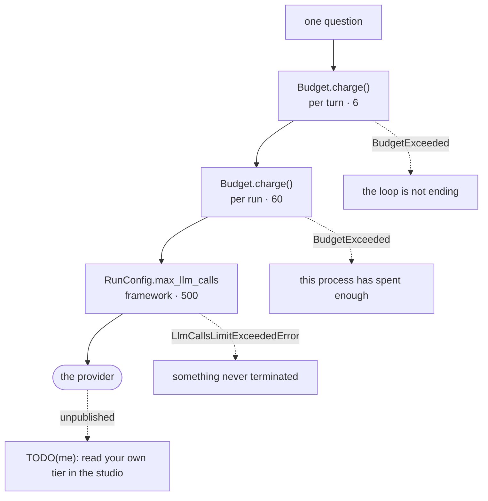

## One-line answer

Every hub since P01's first sitting has stated a request budget in a paragraph, and this is the file
where that paragraph becomes arithmetic: two ceilings answering two different questions — what one
question may cost, and what this whole process may spend — both of which **raise** rather than warn,
and both of which are checked **before** the counter moves, because charging first and checking after
is off by one in the direction that costs money.

## The idea

There are two ways to stop somebody over-tightening a bolt. The first is a dial on the wrench and a
number written on the job card: you watch the needle, and when it reaches the number you stop. The
second is a torque wrench that clicks and lets go. Both are called torque control. Only one of them
works at the end of a long shift, on the ninth bolt, when the fitter is thinking about something
else, because only one of them removes the need for anybody to be watching.

Everything in this curriculum up to now has been the dial. Every day's hub has carried a line saying
how many requests one question costs — one, or two, or *bounded by something you wrote* — and that
line has been a promise made in prose to a reader who might be paying attention. Today the promise
moves onto the toolwall as a tool that clicks.

And it turns out the shop needs two of them, because there are two different questions and they are
easy to run together. The first is: **what may one job cost?** A single question comes in, and the
system may go round the think-act-observe loop some number of times before it answers. That number is
a design statement. If a question wants more, the honest reading is not "this question was hard" —
it is "the loop is not ending", which is a different problem with a different fix.

The second question is: **what may this whole shift cost?** One job going round twenty times is a
runaway. Two hundred jobs each behaving perfectly is also a bill, and nothing about any individual
job looks wrong. This is the ceiling that protects an allowance nobody in the shop can see, and here
that is not a figure of speech: the provider **stopped publishing its free-tier limits**. Its
rate-limit page now says that limits depend on your tier and can be viewed in the studio, and that
specified limits are not guaranteed. There is no requests-per-minute number this document could print
without inventing one, and an invented ceiling is worse than a stated absence, because you would plan
against it. So the only ceiling this project can be sure of is the one this project imposes, and that
is what the run budget is.

Two words, both used above and both worth being exact about. A **turn** — already in the glossary
from day 4 — is one piece of a conversation together with who produced it; one question from a user
and the work done to answer it is what this file counts as a turn. A **request budget**, which is new
today, is a written-down ceiling on how many model calls a unit of work may make, enforced by code
rather than stated in a document, and counted across the whole cast rather than per agent — because a
three-agent turn is at least three requests, and a writer talking to a critic is unbounded until
somebody bounds it.

One thing this file deliberately is not: a rate limiter. Rate limiting is about requests per second,
it belongs at the provider boundary, and it needs a clock. This is about requests per unit of *work*,
which is a question about your own design and is answerable without one.

Finally, the framework has a bound of its own, and it is not a substitute for this. ADK's
`RunConfig.max_llm_calls` defaults to 500 and raises when a single run passes it. That is a runaway
ceiling, sized so that no legitimate run ever trips it. It is an excellent answer to *has this thing
stopped terminating* and no answer at all to *what may one question cost*.



Three ceilings, in the order a call meets them, and each of them answering a question the next one
cannot. The outermost is the provider's, and it is the one nobody can read.

> **Recap — the framework's bound is not your bound.** ADK does bound the loop:
> `RunConfig.max_llm_calls`, defaulted to **500**, overridable outside the repository by the
> `ADK_MAX_LLM_CALLS` environment variable, and enforced by raising `LlmCallsLimitExceededError`. A
> value of zero or less disables it, which reads like the opposite of what it does. 500 is a runaway
> ceiling; "what may one question cost?" is a different question and this project answers it itself.
> Self-contained version: `PRIMER.md` §5.
> Deep version, if you have the full plan:
> `days/01-ask-desk/day-07-functiontool-what-adk-does/parts/02-what-it-reads-that-you-did-not-mean-to-write/2.2-what-it-did-and-what-it-did-not.md`

## The mechanism

`projects/02-parts-counter/parts_counter/util/budget.py`, whole file. New in this project, taught in
full here, and imported by nothing above this folder:

```python
# parts_counter/util/budget.py
"""Count model calls, and refuse the one that would break the promise.

Every hub in this curriculum has stated a request budget since day 4, and until now that number
lived only in prose. This file is where it becomes arithmetic.

Two things are counted, and they are different questions:

  * **Per turn** — how many model calls one question may cost. This is the number the hub states,
    and it is the one a runaway loop breaks.
  * **Per run** — how many this process may make in total before it stops. This is the one that
    protects a quota you cannot see, because the provider stopped publishing its limits (see
    `PACKAGES.md`), so the only ceiling anybody can be sure of is the one you impose.

Both refuse by raising. A budget that logs a warning and carries on is a budget that has already
been spent by the time anybody reads the log.

The framework has a bound of its own — ADK's `RunConfig.max_llm_calls`, default 500 — and it is
not a substitute for this one. It stops an infinite loop; it does not answer "what may one
question cost?". Both are set, from the same constants, in `parts_counter/agent.py`.
"""

from __future__ import annotations

from dataclasses import dataclass, field


class BudgetExceeded(RuntimeError):
    """Raised when a call would exceed a limit this project set for itself."""


@dataclass
class Budget:
    """A counter with two ceilings and no opinions about time.

    Deliberately not a rate limiter. Rate limiting is about requests per second and belongs at the
    provider boundary; this is about requests per unit of *work*, which is a question about your
    own design and is answerable without a clock.
    """

    max_per_turn: int = 6
    max_per_run: int = 60
    spent_this_turn: int = 0
    spent_this_run: int = 0
    #: One entry per turn that has ended: how many calls it cost. Cheap, and it turns "the budget
    #: feels tight" into a number somebody can look at.
    history: list[int] = field(default_factory=list)

    def start_turn(self) -> None:
        """Close the previous turn and open a new one."""
        if self.spent_this_turn:
            self.history.append(self.spent_this_turn)
        self.spent_this_turn = 0

    def charge(self, calls: int = 1) -> None:
        """Record `calls` model calls, or refuse if either ceiling would be passed.

        The check happens **before** the counter moves, so a refused call is not also a spent one.
        Charging first and checking after is the bug that makes a budget off by one in the
        direction that costs money.
        """
        if self.spent_this_turn + calls > self.max_per_turn:
            raise BudgetExceeded(
                f"this turn has spent {self.spent_this_turn} model call(s) and the ceiling is "
                f"{self.max_per_turn}. A turn that wants more is a loop that is not ending, not a "
                f"question that is hard."
            )
        if self.spent_this_run + calls > self.max_per_run:
            raise BudgetExceeded(
                f"this run has spent {self.spent_this_run} model call(s) of {self.max_per_run}. "
                f"The provider no longer publishes its free-tier limits, so this ceiling is the "
                f"only one this project can be sure of."
            )
        self.spent_this_turn += calls
        self.spent_this_run += calls

    @property
    def turns(self) -> int:
        """Turns that have ended. The open turn is not counted until `start_turn` closes it."""
        return len(self.history)

    def report(self) -> str:
        """One line, for the end of a run. States the numbers rather than describing them."""
        worst = max(self.history, default=self.spent_this_turn)
        return (f"{self.spent_this_run} model call(s) across {self.turns} completed turn(s); "
                f"worst turn {worst} of {self.max_per_turn}; run ceiling {self.max_per_run}")
```

**Line by line:**

- `class BudgetExceeded(RuntimeError)` — a **raise**, not a warning, and its own type so a caller can
  catch exactly this and nothing else. The choice between raising and warning is the whole design of
  the file, so it is worth saying why once and properly. A warning is a message to a human who is
  reading. A budget exists precisely for the runs where nobody is reading — the overnight job, the
  loop that started behaving oddly at the fortieth question, the eval sweep. A budget that logs and
  carries on has already been spent by the time anybody reads the log, and the log is then a receipt
  rather than a control.
- `RuntimeError` as the base, not `Exception` and not a bare `class BudgetExceeded(Exception)`. It
  says *this is a condition that arose while running*, which is what a caller's `except` clauses are
  usually sorted by, and it keeps `except Exception` from being the only way to catch it.
- `@dataclass` rather than a hand-written `__init__` — five fields, no behaviour in construction, and
  a generated `__repr__` that prints all five. That `__repr__` is not cosmetic: when this object
  appears in a traceback, the reader sees both ceilings and both counters without adding a print.
- `max_per_turn: int = 6` — this project's answer to "what may one question cost?". Six, not five and
  not sixty, because this project's cast is one agent with four tools, and a question that needed a
  seventh round of think-act-observe against four tools is not a hard question. The number is a
  design statement, and putting it in a default rather than in a comment means it is enforced.
- `max_per_run: int = 60` — the second question. **This number is chosen by this project**, and the
  reason it is chosen rather than derived is in `PACKAGES.md`: the provider's rate-limit page
  publishes no requests-per-minute, tokens-per-minute or requests-per-day figure for any model, and
  directs you to the studio instead. There is no number to derive from, so there is a number to
  decide.
- Two counters, `spent_this_turn` and `spent_this_run`, rather than one counter and a subtraction.
  Two questions, two answers, and neither can be reconstructed from the other once a turn has closed.
- `history: list[int] = field(default_factory=list)` — and **not** `history: list[int] = []`, which
  Python refuses outright for a dataclass field. The refusal is protecting you from the bug: a bare
  list literal as a default is created once, at class definition, and shared by every instance, so
  two budgets in one process would end up counting each other's turns.
- `start_turn` appending only `if self.spent_this_turn` — a turn that spent nothing does not get a
  row. That is deliberate and it is a rough edge worth knowing: `budget.turns` counts *turns that
  cost something*, so a run that answered fifty questions out of a cache reports zero turns. The
  alternative, appending every turn including the zeroes, makes `worst turn` meaningless the moment a
  cache is added. Neither answer is free; this one is chosen and it is written down.
- `charge(self, calls: int = 1)` taking a count rather than being a bare increment. A single provider
  call is the common case and the default; a three-agent turn charging three at once is one call and
  one refusal, rather than three calls where the third is refused after the first two have been paid
  for.
- **`if self.spent_this_turn + calls > self.max_per_turn:` — the load-bearing line of the file.** The
  ceiling is tested against what the counter *would become*, and the counter has not moved yet. Write
  it the other way round — increment, then test — and the refusal happens after the money is spent.
  On a single ceiling of one, a charge-first budget ends the run recording two calls out of one, and
  every report and every alert downstream is then built on a number that is wrong by exactly the
  amount you were trying to prevent. `tests/test_kit.py` carries
  `test_a_refused_call_is_not_also_a_spent_one` for this line alone, and part 2.2 prints it.
- The turn check coming **before** the run check. Two ceilings mean two different sentences, and the
  reader needs the more specific one: "this loop is not ending" is actionable, "this process has spent
  enough" is not, and if a turn is running away it will hit both.
- Both messages naming **the number** as well as the situation. `the ceiling is 6` in the text means
  the person reading a log line does not have to open this file to know what was configured.
- The first message's second sentence — *a turn that wants more is a loop that is not ending, not a
  question that is hard* — is doing real work. It is the sentence that stops the next person raising
  the ceiling as the fix. The number is not the bug; a loop with no termination condition is.
- The second message naming the unpublished limits. The error explains why the ceiling is arbitrary,
  which is the only honest thing to say about a number that could not be derived, and it stops
  somebody treating 60 as a provider fact.
- `self.spent_this_turn += calls` and `self.spent_this_run += calls` **after** both checks, so the two
  counters can never disagree about whether a call happened. Incrementing between the checks is the
  subtle version of the same off-by-one.
- `turns` as a `@property` over `len(self.history)` — one definition of "how many turns", read from
  the list that is the evidence, so there is no separate counter to fall out of step with it.
- `max(self.history, default=self.spent_this_turn)` — `default=` is what stops `max()` raising
  `ValueError` on an empty sequence, and the fallback is the open turn rather than `0`, so a report
  taken mid-run says something true rather than something tidy.
- `report()` returning a string rather than printing one. The caller decides where it goes — stdout,
  the logger from part 2.2, a test assertion — and the function stays usable from all three.
- One honest note about the docstring: it says both bounds are set from the same constants in
  `parts_counter/agent.py`, and **that file does not exist yet**. `CODEMAP.md` owes it to day 17,
  which is the sitting where this project has a boundary for an agent to reach through. The docstring
  is describing the finished shape rather than today's, which is legal in a file this project will
  print again as a diff — and it is the kind of claim worth checking rather than believing, which is
  what the hub §5 rep asks you to do.

Both ceilings, refusing, with the counters read afterwards. No key, no network, no model:

```console
$ cd projects/02-parts-counter
$ uv run --frozen python -c "
from parts_counter.util.budget import Budget, BudgetExceeded
b = Budget(max_per_turn=2, max_per_run=5)
b.start_turn(); b.charge(); b.charge()
try:
    b.charge()
except BudgetExceeded as exc:
    print('turn  :', exc)
print('after refusal: spent_this_turn =', b.spent_this_turn, ' spent_this_run =', b.spent_this_run)
b.start_turn(); b.charge(); b.charge()
b.start_turn(); b.charge()
try:
    b.charge()
except BudgetExceeded as exc:
    print('run   :', exc)
print(b.report())
print('history:', b.history, 'turns:', b.turns)
"
turn  : this turn has spent 2 model call(s) and the ceiling is 2. A turn that wants more is a loop that is not ending, not a question that is hard.
after refusal: spent_this_turn = 2  spent_this_run = 2
run   : this run has spent 5 model call(s) of 5. The provider no longer publishes its free-tier limits, so this ceiling is the only one this project can be sure of.
5 model call(s) across 2 completed turn(s); worst turn 2 of 2; run ceiling 5
history: [2, 2] turns: 2
```

**Line by line:**

- The ceilings are passed in as 2 and 5 rather than left at 6 and 60, so the transcript is short. The
  defaults are the project's; the constructor arguments are how a test says *this scenario*.
- `after refusal: spent_this_turn = 2` — **the counter did not move.** Two calls were charged, a
  third was refused, and the budget says two. That single line is what the check-before-charge
  ordering buys, and it is worth staring at once.
- The two messages are different, and the second one is the interesting one: the run ceiling fired
  during a turn that was well inside its own limit. Nothing about that third turn looked wrong. That
  is exactly the case the per-turn number cannot catch.
- `worst turn 2 of 2` is read off `history`, not tracked separately. The third turn is not in
  `history` because `start_turn` was never called again to close it — which is the rough edge in the
  bullet above, visible in a real run rather than described.
- `turns: 2` with five calls spent. The open turn is not counted until it is closed, and the report
  says "completed turn(s)" rather than "turns" for exactly that reason.

Now the ordering, on its own, because the argument in the bullets deserves evidence. A charge-first
budget is written out inside the command — it is not part of this project, and it is labelled so in
its own docstring — and run beside the real one against the same single-call ceiling:

```console
$ uv run --frozen python -c "
from dataclasses import dataclass

@dataclass
class ChargeFirst:
    '''The wrong order, written out here so the two can be compared. Not in this project.'''
    max_per_turn: int = 1
    spent: int = 0
    def charge(self, calls: int = 1) -> None:
        self.spent += calls
        if self.spent > self.max_per_turn:
            raise RuntimeError('over budget')

from parts_counter.util.budget import Budget, BudgetExceeded
wrong = ChargeFirst(max_per_turn=1)
wrong.charge()
try:
    wrong.charge()
except RuntimeError:
    pass
print('charge-first : spent =', wrong.spent, 'of 1')
right = Budget(max_per_turn=1, max_per_run=99)
right.charge()
try:
    right.charge()
except BudgetExceeded:
    pass
print('check-first  : spent =', right.spent_this_turn, 'of 1')
"
charge-first : spent = 2 of 1
check-first  : spent = 1 of 1
```

**Line by line:**

- `charge-first : spent = 2 of 1`. Both versions refused the second call. Both raised. The screen at
  the moment of failure would look identical. The difference is entirely in what the object says
  afterwards, and the wrong one says it spent twice its ceiling.
- The error is off by one **in the direction that costs money**, and that direction is not an
  accident of this example: the overshoot is always the size of the call you were trying to prevent,
  so the bigger the charge, the bigger the lie. A three-agent turn charging three at once would report
  three over.
- This is not a rounding error in a report. Every downstream consumer — the run ceiling, the alert
  threshold, the number you quote in a review — is derived from this counter, so an over-count here
  makes a project stop earlier than it should and a report claim spending that never happened.

And the assertion that keeps it that way, run on its own so the name is visible:

```console
$ uv run --frozen python -m pytest tests/test_kit.py::test_a_refused_call_is_not_also_a_spent_one -q
.                                                                        [100%]
1 passed in 0.05s
```

**Line by line:**

- One test, named after the property rather than after the method. `test_charge` would have told a
  future reader nothing about which behaviour they had broken; this name tells them the exact
  sentence that is no longer true.
- It is green today, which is worth nothing on its own. Part 2.2 is where a test in this file is made
  to go red on purpose, and the reason that part exists is that a check nobody has watched fail is a
  check nobody has tested.

*Observed on this machine on 2026-09-10 — uv 0.12.3, CPython 3.12.12, pytest 9.1.1, google-adk 2.8.0.
No model call was made by any command in this part.*

## When it breaks

The run ceiling is the one that surprises people, because nothing individually looked wrong. Somebody
left an eval sweep running against a synthetic set, came back, and found this at the bottom of the
output:

```console
BudgetExceeded: this run has spent 60 model call(s) of 60. The provider no longer publishes its free-tier limits, so this ceiling is the only one this project can be sure of.
```

Every turn had been inside its own budget. No loop had run away. The process had simply answered
enough questions, and the second ceiling did the job the first one structurally cannot. The wrong fix
is to raise the number until the sweep finishes; the right one is to decide whether a sweep should be
sharing a budget with the interactive path at all, and to give it its own `Budget` with its own
ceiling and its own report at the end.

## In production

**What a senior writes instead.** Not a counter passed by hand through every call site. In ADK the
same job is done by a callback or a plugin that fires before every model call, so the accounting
cannot be skipped by a code path somebody added in a hurry — and the ceiling is per tenant or per
API key, held in a store rather than in a process, because two replicas each counting to sixty is a
budget of one hundred and twenty. They also count **tokens** and not only calls, since one call with
a large context costs far more than one call with a small one, and they emit the counter as a metric
so that the budget is visible before it is hit rather than only when it fires. This file is the
smallest honest version of that, and P04 is where the callback version is built.

**What degrades at scale.** The number is **500** — the framework's default `max_llm_calls`, which is
the only bound in play if this file does not exist. A writer-and-critic pair that has not agreed to
stop will happily spend all 500 on one question, and the run that does it looks, from outside,
exactly like a run that is working hard. Multiply by a cast of three and one badly worded stopping
condition, and a single request becomes several hundred, none of which is individually anomalous.

**The review comment.** "The budget increments and then checks, so a refused call is counted as a
spent one. Flip the two lines and add a test that asserts the counter after a refusal — the bug is
one call in the wrong direction per refusal, and it is the direction we bill on. Also, this warns
where it should raise: nothing downstream reads the warning, so the ceiling currently costs us the
CPU to compute it and nothing else."

**The interview question.** "Your agent has a per-question call budget and it is enforced in the loop.
You add a second agent that the first one can delegate to. Describe every place the count can now be
lost, say whether the budget belongs to the request or to the process, and tell me what changes the
first time you run two replicas behind a load balancer."

## Check yourself

- **Run:** from `projects/02-parts-counter`, build a `Budget(max_per_turn=1, max_per_run=99)`, charge
  it twice, and let the second one raise — expect a `BudgetExceeded` traceback whose message names the
  ceiling. Then run the same thing again with the second charge inside a `try`, and print
  `spent_this_turn`; expect `1`, not `2`.
- **Say out loud:** name the question the per-turn ceiling answers, the question the per-run ceiling
  answers, and the question `RunConfig.max_llm_calls` answers — three sentences, no overlap — and then
  say which of the three would have caught an eval sweep that quietly answered two hundred questions
  overnight.

---

**Next:** [Redaction at the writer](2.2-redaction-at-the-writer.md)
