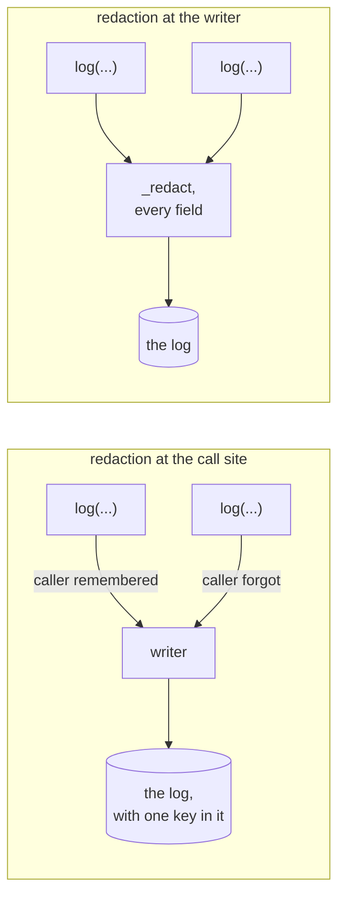

## One-line answer

Secrets are removed from a log line **at the writer**, on every field of every record, rather than at
the call sites — because a logger that trusts every caller to remember not to log a key is a logger
that will log a key — and this part proves it by taking the rule out, watching two tests go red with
the secret sitting in the assertion, and putting it back.

## The idea

Every workshop has a waste-oil drum, and every workshop has a poster above the sink saying *do not
pour oil down the drain*. The poster is not what keeps the oil out of the drain. What keeps the oil
out of the drain is the interceptor buried under the floor, between the gully and the sewer, which
catches oil whether or not anybody read the poster, whether or not the person at the sink is new,
tired, or in a hurry with a tray of parts in both hands. The poster is advice. The trap is
engineering. When the inspector comes, they do not ask whether the poster is up.

A log line is the same shape of problem, and it is worth being blunt about why. Over a project's life
there will be dozens of places that write something to the log, and every one of them is written by
somebody who is thinking about the thing they are debugging rather than about credentials. Somebody
adds `log("provider.call", config=settings)` at two in the morning because they cannot see what is
being sent, and `settings` happens to hold an API key three levels down. Nobody was careless in any
way that would show up in review. The line reads perfectly.

So the rule this project takes is: **the caller is allowed to be careless, and the writer is not.**
Redaction lives inside the one function that writes, it runs over every field of every record, and it
recurses into nested dictionaries — so the only way to leak a key is to give the field a name that
does not look like a credential, which is a much smaller and much more reviewable surface than *every
call site, forever*.

Two smaller decisions ride along with it, and both are about the version of the log you read months
later rather than the one you watch today.

The first is what a redacted value is replaced with. It is a fixed string — the same six characters,
whatever was there. Not the value's length, not a hash, not the first and last two characters. It is
tempting to keep the length, because it helps you tell an empty key from a real one at a glance, and
that is exactly the argument against it: **a length is information about a secret.** So is a prefix,
and so is a stable hash, which turns your log into an oracle that tells an attacker whether two
systems hold the same credential. If the log needs to distinguish *set* from *unset*, that is a
separate boolean field with a name of its own, decided deliberately.

The second is the timestamp. It carries an explicit UTC offset rather than being a naive local
reading of the machine's clock. A log line whose timezone depends on which machine wrote it cannot be
ordered against a line from another machine, and the failure is quiet: the lines interleave in a
plausible order that is simply wrong, and the incident timeline you build from them is wrong in the
same way. You will see this today without arranging it — the transcript below is stamped with the
previous calendar date, because the machine writing it is far enough east that the two disagree.

One term, new today. **Structured logging** is writing one machine-readable object per line — here
one JSON object — rather than a sentence assembled for a human. **Redaction** is removing a value
from a record before it is written, by the rule that decides what counts as sensitive. The two go
together, and the reason is not tidiness: prose logging is readable exactly once, by the person who
wrote it, on the day they wrote it. One object per line can be filtered, counted and diffed months
later without a parser anybody has to maintain.



The left-hand shape needs every caller to be right, forever. The right-hand shape needs one function
to be right, and it has tests.

## The mechanism

`projects/02-parts-counter/parts_counter/util/logging.py`, whole file. New in this project, taught in
full here:

```python
# parts_counter/util/logging.py
"""One line per event, in a shape a machine can read, with the values a secret would sit in
removed before they are written.

Two decisions, both of which are about what happens months later.

**JSON lines, not prose.** One object per line, so a run's log can be filtered, counted and diffed
without a parser anybody has to maintain. Prose logging is readable exactly once — by the person
who wrote it, on the day they wrote it.

**Values are redacted at the writer, not at the call site.** A logger that trusts every caller to
remember not to log a key is a logger that will log a key. So the redaction lives here, it runs on
every field of every record, and the call sites are free to be careless — which they will be.

This is the whole logging story for this project. There is no log level, no handler configuration
and no rotation: those are real needs and they arrive with a real deployment, and adding them now
would be scaffolding nobody has a use for yet.
"""

from __future__ import annotations

import json
import sys
from datetime import datetime, timezone
from typing import Any, TextIO

#: Field names whose values never reach the log, whatever they contain. Matched on substring and
#: case-insensitively, because the field will be called `api_key` in one place and `GOOGLE_API_KEY`
#: in the next.
SECRET_NAMES = ("key", "token", "secret", "password", "authorization", "credential")

#: What a redacted value is replaced with. A fixed string rather than the value's length, because
#: a length is information about a secret.
REDACTED = "<redacted>"


def _redact(key: str, value: Any) -> Any:
    """Replace a value whose field name suggests it is a credential."""
    if any(marker in key.lower() for marker in SECRET_NAMES):
        return REDACTED
    if isinstance(value, dict):
        return {k: _redact(k, v) for k, v in value.items()}
    return value


def log(event: str, *, stream: TextIO | None = None, **fields: Any) -> dict[str, Any]:
    """Write one JSON object and return it, so a caller can assert on what was logged.

    Returning the record is what makes this testable without capturing stdout, and a logger nobody
    can write a test against is a logger whose redaction nobody has ever checked.
    """
    record = {
        # Explicit UTC with an offset, never a naive local timestamp. A log line whose timezone
        # depends on the machine that wrote it cannot be ordered against one from another machine.
        "at": datetime.now(timezone.utc).isoformat(timespec="milliseconds"),
        "event": event,
        **{key: _redact(key, value) for key, value in fields.items()},
    }
    print(json.dumps(record, default=str), file=stream or sys.stderr)
    return record
```

**Line by line:**

- `SECRET_NAMES` as a **tuple of substrings**, matched case-insensitively, rather than a set of exact
  field names. The same secret arrives as `api_key` in one call, `GOOGLE_API_KEY` in the next and
  `apiKey` in a third; an exact-match list would have to hold all three and would miss the fourth
  spelling somebody invents next month. Substring matching over-redacts — a field called `keyboard`
  would be redacted too — and that is the correct direction to be wrong in.
- Six entries, and they are the *categories* rather than the names: key, token, secret, password,
  authorization, credential. `authorization` is in the list because HTTP header dumps are one of the
  commonest ways a bearer token reaches a log, and the header is not called any of the other five.
- `REDACTED = "<redacted>"` as a module constant, not a literal typed inside `_redact`. Tests import
  it and assert against it, so the string and the assertion cannot drift; and it is one edit if the
  shape ever has to change.
- The value being **fixed**, not the length. A length is information about a secret: it separates an
  empty string from a real key, a short token from a long one, and one provider's key format from
  another's. The same argument rules out a prefix and rules out a stable hash, which would let anyone
  reading two logs decide whether two systems hold the same credential without ever seeing it.
- `_redact` with a leading underscore — a private helper. The module's interface is `log`,
  `SECRET_NAMES` and `REDACTED`; making the redactor public would invite a call site to redact its
  own arguments before calling, which is the call-site pattern this file exists to replace.
- `any(marker in key.lower() for marker in SECRET_NAMES)` — the field **name** decides, never the
  value. Deciding on the value means guessing whether a string looks like a credential, which is
  wrong in both directions: it misses a key that looks like a word and it redacts a part number that
  happens to look random.
- `if isinstance(value, dict): return {k: _redact(k, v) ...}` — the recursion, and it is the case
  that actually happens. Nobody writes `log("call", api_key=...)`; somebody writes
  `log("call", config=settings)` and the key is one level down. Without this line the outer field is
  called `config`, which matches nothing, and the whole settings object goes to the log intact.
- The recursion passes the **inner** key, `k`, so nesting does not launder a name: `config` does not
  match, `config["api_key"]` does. The obvious mistake here is recursing with the outer key, which
  would redact everything under a field called `secrets` and nothing under a field called `config`.
- Only `dict` is recursed into. A list of dicts is not, and that is a known limit rather than an
  oversight — it is written here so the next person meets it as a decision. Adding lists is three
  lines and a test; adding arbitrary objects is a different project.
- `def log(event: str, *, stream: TextIO | None = None, **fields: Any)` — `event` is positional so
  every line has one, and everything after the `*` is keyword-only so a caller cannot accidentally
  pass a value into `stream` by position.
- `stream` existing at all is what makes the file testable. A test passes an `io.StringIO`, and can
  then assert on the exact bytes that were written — which is how you check that a secret is absent
  from the *output* and not merely absent from the returned dict.
- `"at"` first, then `"event"`, then the caller's fields. Insertion order is preserved in the JSON,
  so every line starts the same way and a human scanning a file has two fixed columns before the
  variable part begins.
- `datetime.now(timezone.utc)` — aware, and explicitly UTC. `datetime.now()` returns a naive local
  time that renders without an offset, and two machines in two regions then produce lines that sort
  into a plausible and wrong order. `datetime.utcnow()` is the trap in between: it gives you the
  right instant with no timezone attached, so it renders as if it were local.
- `.isoformat(timespec="milliseconds")` — a fixed number of fractional digits, so every timestamp is
  the same width and lines sort lexicographically. The default varies between six digits and none
  depending on whether the microseconds happened to be zero, and a field that is usually one width
  and occasionally another breaks the tools that read it by column.
- `**{key: _redact(key, value) for key, value in fields.items()}` — **every** field goes through the
  redactor, with no exemption and no fast path. The moment there is an "unless" here, the rule is
  advice again.
- `json.dumps(record, default=str)` — `default=str` is the difference between a log call and an
  exception. Something unserialisable will eventually be passed in — a `Path`, a `datetime`, an
  exception object — and without it the logger raises inside the code that was trying to report a
  problem, which is the worst possible place to fail.
- `file=stream or sys.stderr` — **stderr**, not stdout. The program's output and the program's
  diagnostics are two streams so that one can be redirected without the other, and a command whose
  answer is piped into something else does not have log lines mixed into the pipe.
- `return record` — the line that makes redaction checkable. A logger nobody can write a test against
  is a logger whose redaction nobody has ever checked, and "we redact secrets" then becomes a claim
  in a document rather than a property of a program.

Working, with a synthetic key that is not a credential and never was:

```console
$ cd projects/02-parts-counter
$ uv run --frozen python -c "
from parts_counter.util.logging import log
log('stock.adjusted', part_no='BLT-0310', delta=2, GOOGLE_API_KEY='AIzaSyFAKE-not-a-real-key', config={'api_key': 'AIzaSyFAKE-not-a-real-key', 'region': 'eu'})
"
{"at": "2026-09-09T19:03:01.328+00:00", "event": "stock.adjusted", "part_no": "BLT-0310", "delta": 2, "GOOGLE_API_KEY": "<redacted>", "config": {"api_key": "<redacted>", "region": "eu"}}
```

**Line by line:**

- `"GOOGLE_API_KEY": "<redacted>"` — the top-level case, and the caller did nothing to ask for it.
- `"config": {"api_key": "<redacted>", "region": "eu"}` — the nested case, which is the one that
  actually happens, and `region` survives intact. Redaction is per field, not per subtree: burying a
  key inside a dictionary does not hide it, and putting a harmless value beside one does not lose it.
- `"part_no": "BLT-0310"` and `"delta": 2` pass through untouched, with `2` staying a JSON number
  rather than becoming a string. The record is data, so a later `jq` or `grep` can do arithmetic on
  it.
- **Read the timestamp against today's date.** This was written on 2026-09-10 by the local clock and
  the line says `2026-09-09T19:03`. Both are correct: the machine is far enough east of UTC that the
  local evening is the previous UTC day. That `+00:00` is what lets you find out which; a naive local
  stamp would have said `2026-09-10T00:33` with nothing attached, and merging it with a line from a
  machine in another region would have produced a timeline that reads fine and is wrong.
- One line, one object, on stderr. Nothing was configured, no handler was installed, and there is no
  logging framework in this project's dependencies.

The assertions that hold it in place. `projects/02-parts-counter/tests/test_kit.py`, whole file — the
kit's own tests, and every one of them can go red:

```python
# tests/test_kit.py
"""What the kit promises, asserted. These run in `python run.py check` and can all go red."""

from __future__ import annotations

import io
import json

import pytest

from parts_counter.util import models
from parts_counter.util.budget import Budget, BudgetExceeded
from parts_counter.util.logging import REDACTED, log


def test_registry_accepts_only_a_pinned_id() -> None:
    assert models.require_pinned(models.ANSWERING) == models.ANSWERING


def test_registry_refuses_an_alias() -> None:
    with pytest.raises(models.UnpinnedModel, match="alias, not a pin"):
        models.require_pinned("gemini-flash-latest")


def test_registry_refuses_an_unregistered_id() -> None:
    with pytest.raises(models.UnpinnedModel, match="not in this project's registry"):
        models.require_pinned("gemini-3.7-flash")


def test_budget_refuses_the_call_that_would_break_the_turn() -> None:
    budget = Budget(max_per_turn=2, max_per_run=99)
    budget.charge()
    budget.charge()
    with pytest.raises(BudgetExceeded, match="ceiling is 2"):
        budget.charge()


def test_a_refused_call_is_not_also_a_spent_one() -> None:
    """The check happens before the counter moves. Off-by-one here costs money."""
    budget = Budget(max_per_turn=1, max_per_run=99)
    budget.charge()
    with pytest.raises(BudgetExceeded):
        budget.charge()
    assert budget.spent_this_turn == 1


def test_budget_refuses_on_the_run_ceiling_too() -> None:
    budget = Budget(max_per_turn=99, max_per_run=2)
    budget.charge(2)
    with pytest.raises(BudgetExceeded, match="only one this project can be sure of"):
        budget.charge()


def test_logging_redacts_by_field_name_not_by_caller_care() -> None:
    stream = io.StringIO()
    record = log("probe", stream=stream, GOOGLE_API_KEY="abc123", part_no="BRK-0142")
    assert record["GOOGLE_API_KEY"] == REDACTED
    assert record["part_no"] == "BRK-0142"
    assert "abc123" not in stream.getvalue()


def test_logging_redacts_nested_values() -> None:
    stream = io.StringIO()
    record = log("probe", stream=stream, config={"api_key": "abc123", "region": "eu"})
    assert record["config"]["api_key"] == REDACTED
    assert record["config"]["region"] == "eu"


def test_every_line_is_one_json_object() -> None:
    stream = io.StringIO()
    log("one", stream=stream, a=1)
    log("two", stream=stream, b=2)
    lines = [line for line in stream.getvalue().splitlines() if line]
    assert len(lines) == 2
    assert [json.loads(line)["event"] for line in lines] == ["one", "two"]
```

**Line by line:**

- Nine tests, no fixtures, no `conftest.py`, no mocking. Everything the kit does is a pure function or
  a small object, which is why it can be asserted on directly — and a kit that needed a mock to be
  tested would be a kit with a dependency it should not have.
- Every test name is a **sentence about the behaviour**, not the name of the method under test.
  `test_a_refused_call_is_not_also_a_spent_one` tells whoever breaks it exactly which claim they
  invalidated; `test_charge_2` would have told them to go and read the source.
- `pytest.raises(..., match="alias, not a pin")` — `match` is a regular expression tested against the
  string of the exception, so the test asserts on *which* refusal happened. Without it both registry
  tests pass on any `UnpinnedModel`, and the whole argument from part 1.2 about two wrong values
  needing two different sentences goes unchecked.
- `match="ceiling is 2"` pins the number **into the message**, so a change that silently stopped
  interpolating the ceiling would be caught. It is a small assertion protecting the property that a
  log line is readable without opening the source.
- `test_a_refused_call_is_not_also_a_spent_one` is the one with a docstring, because it is the one
  whose value is not obvious from the assertion. The last line, `assert budget.spent_this_turn == 1`,
  is what fails if anybody reorders the check and the increment in `charge`.
- `budget.charge(2)` in the run-ceiling test — one call that costs two, which is how a multi-agent
  turn charges, and it reaches the run ceiling exactly rather than passing it. The refusal is then
  about the *next* call, which is the boundary worth testing.
- `stream = io.StringIO()` in every logging test. That is the injected stream from `log`'s signature
  earning its place: the test reads exactly what was written without capturing stdout, without a
  pytest fixture, and without the test's own output getting mixed in.
- `assert "abc123" not in stream.getvalue()` — the important assertion in the file, and it is
  deliberately about the **written text** and not the returned dict. A redactor that cleaned the
  return value and wrote the original would pass the two assertions above it and fail this one.
- `test_logging_redacts_nested_values` asserting both halves: the key is redacted **and** `region` is
  still `"eu"`. A redactor that replaced the whole `config` dictionary would pass a test that only
  checked the first.
- `test_every_line_is_one_json_object` parses each line with `json.loads` rather than checking for
  braces. It is the assertion that "structured" means something: two calls, two lines, each one a
  complete object, in order. A logger that wrapped long records across lines would break every
  downstream tool and pass every other test in this file.

And the driver that runs them. `projects/02-parts-counter/run.py`, whole file — this project's own,
depending on nothing above this folder:

```python
# run.py
"""This project's own driver. It depends on nothing above this folder.

    python run.py check          the gate: config, pins, the registry, and the tests
    python run.py parts <query>  find parts, straight through the tools
    python run.py race           the concurrent-write demonstration from day 2
"""

from __future__ import annotations

import subprocess
import sys
import threading
import time
import tomllib
from pathlib import Path

from parts_counter.util import keys, models

HERE = Path(__file__).parent


def check_keys() -> list[str]:
    """Every name `.env.example` declares must be wired. Wired is all this can prove."""
    problems = []
    names = keys.names_this_project_reads()
    if not names:
        return [".env.example declares no key names: the committed file is the list of names"]
    for name in names:
        try:
            keys.require(name)
        except keys.MissingKey as exc:
            problems.append(str(exc))
    return problems


def check_interpreter() -> list[str]:
    """The interpreter actually running must be the one `.python-version` pins."""
    pin_file = HERE / ".python-version"
    if not pin_file.exists():
        return [".python-version is missing: requires-python is a floor, not a pin"]
    pinned = pin_file.read_text(encoding="utf-8").strip()
    running = ".".join(str(n) for n in sys.version_info[:3])
    if running != pinned:
        return [f".python-version pins {pinned}; this interpreter is {running}"]
    return []


def check_pins_are_pins() -> list[str]:
    """A dependency written with `>=` is a floor. Two machines can honour it differently."""
    data = tomllib.loads((HERE / "pyproject.toml").read_text(encoding="utf-8"))
    declared = list(data["project"]["dependencies"])
    declared += data.get("dependency-groups", {}).get("dev", [])
    return [f"{d!r} is a floor, not a pin: one machine gets a version another never saw"
            for d in declared if "==" not in d]


def check_lock_is_obeyed() -> list[str]:
    """`uv lock --check` proves the lockfile still answers pyproject, and writes nothing."""
    result = subprocess.run(["uv", "lock", "--check"], cwd=HERE, capture_output=True, text=True)
    if result.returncode != 0:
        lines = [ln.strip() for ln in result.stderr.splitlines() if ln.startswith("error:")]
        return [f"uv lock --check exited {result.returncode}: "
                f"{lines[0] if lines else 'uv printed no error line'}"]
    return []


def check_model_is_registered() -> list[str]:
    """The model every call will name must be an exact ID this project wrote down."""
    try:
        models.require_pinned(models.ANSWERING)
    except models.UnpinnedModel as exc:
        return [str(exc)]
    return []


def check_tests_pass() -> list[str]:
    """The kit's own tests. This is the check that can go red for a reason worth knowing."""
    result = subprocess.run([sys.executable, "-m", "pytest", "tests", "-q"],
                            cwd=HERE, capture_output=True, text=True)
    if result.returncode != 0:
        tail = [ln for ln in result.stdout.splitlines() if ln.strip()][-1:]
        return [f"pytest exited {result.returncode}: {tail[0] if tail else 'no output'}"]
    return []


CHECKS = {
    "keys": check_keys,
    "interpreter": check_interpreter,
    "pins": check_pins_are_pins,
    "lock": check_lock_is_obeyed,
    "model": check_model_is_registered,
    "tests": check_tests_pass,
}


def check() -> int:
    failures = 0
    for name, run_check in CHECKS.items():
        problems = run_check()
        failures += len(problems)
        for problem in problems:
            print(f"RED    {name}: {problem}")
        if not problems:
            print(f"green  {name}")
    print(f"\n{failures} problem(s)")
    return 1 if failures else 0


def parts(query: str) -> int:
    """Find parts. Straight through the tools, with no model in the way."""
    import json

    from parts_counter import tools

    print(json.dumps(tools.find_part(query), indent=2))
    return 0


def race(part_no: str = "SPK-0055", each: int = 10) -> int:
    """Two threads issuing stock at once, against a store with no boundary in front of it.

    This is day 2's demonstration and it is deliberately runnable. The numbers differ every time,
    which is the point: a bug that produces a different wrong answer on each run is one nobody can
    reproduce from a bug report.
    """
    from parts_counter import store

    start = store.get(part_no)["on_hand"]
    errors: list[str] = []

    def issue() -> None:
        for _ in range(each):
            try:
                store.adjust(part_no, -1)
            except Exception as exc:  # noqa: BLE001 - the point is that anything can happen
                errors.append(type(exc).__name__)
            time.sleep(0.001)

    left, right = threading.Thread(target=issue), threading.Thread(target=issue)
    left.start(); right.start(); left.join(); right.join()

    end = store.get(part_no)["on_hand"]
    print(f"start on hand      : {start}")
    print(f"issued by two staff: {each * 2}")
    print(f"expected on hand   : {start - each * 2}")
    print(f"actual on hand     : {end}")
    print(f"parts unaccounted  : {end - (start - each * 2)}")
    print(f"reads that crashed : {errors}")
    store.adjust(part_no, start - end)
    print(f"restored to        : {store.get(part_no)['on_hand']}")
    return 0


def main(argv: list[str]) -> int:
    match argv[1:]:
        case ["check"]:
            return check()
        case ["parts", query]:
            return parts(query)
        case ["race"]:
            return race()
        case _:
            print(__doc__, file=sys.stderr)
            return 2


if __name__ == "__main__":
    sys.exit(main(sys.argv))
```

**Line by line — recap depth for the shape, full depth for what is new.** This driver's shape is P00
Foundry day 3's, printed again here because this project's documents carry every line this project
needs. One row per decision that was taken there, each naming the failure it prevents:

| Line | What it does, and the failure it prevents |
| --- | --- |
| Every `check_*` returns `list[str]` | A list of problems, empty when there are none. A check can report more than one, the caller can count without asking each check to count, and nobody has to remember whether `True` meant passed. |
| No check raises | A raising check stops every check after it, so the first failure hides the rest and you fix them one run at a time. Collecting and continuing means one run tells you everything. |
| `check_interpreter` comparing `sys.version_info` | The interpreter **actually executing this line**, not what `uv python find` says should be running. A check observes the state; it does not re-ask the question the state came from. |
| `check_pins_are_pins` reading `pyproject.toml` with `tomllib` | Standard library since 3.11, so the gate needs nothing installed to run. `"==" not in d` is crude and honest about it: it catches the bare floor `uv add` writes, which is the case that happens. |
| `uv lock --check`, not `uv sync --locked` | Both detect drift; only one writes nothing. A check that repairs what it inspects reports on a repository that no longer exists — and on Windows `sync` fails outright on the interpreter's own open files. |
| `subprocess.run([...])` with a **list**, never `shell=True` | The list form does not go through a shell, so nothing can be word-split or glob-expanded and a path with a space cannot become two arguments. |
| The `CHECKS` dict | Adding a check is one line and the loop never changes. This is the line day 11 actually edits: `"tests"` is the sixth entry, and P00 had five. |
| `return 1 if failures else 0` in `check` | The verdict is computed and **returned**, not exited. A function that exits cannot be tested and cannot be composed into a larger driver. |
| `case _: ... return 2` | Two exit values are two different answers: `1` means the checks ran and failed, `2` means they never ran. A pipeline that treats them alike reports a typo as a code failure. |
| `sys.exit(main(sys.argv))` | The one line that turns the returned integer into the process's exit status. Without it the script still runs, still prints `RED`, and still exits `0` — green everywhere a machine is looking. |

> **Recap — the exit status is the verdict.** A check has two audiences and only one can be fooled. A
> person reads the terminal; a commit hook, a pipeline step and a `done` command read one number, the
> process's exit status. Zero means success and everything printed is decoration — so a check that
> prints `RED`, counts the problems and exits `0` is green everywhere it matters, and it looks *more*
> convincing than a working one. There is a second way to build a check that cannot refuse and it
> needs no bug: invoking it through a tool that repairs what is being checked, which is why every
> command in this project carries `uv run --frozen`. Self-contained version: `PRIMER.md` §2.
> Deep version, if you have the full plan:
> `days/00-foundry/day-03-keys-pinning-refusing-check/parts/02-the-pin-and-the-refusal/2.2-the-check-that-could-not-refuse.md`

**`check_tests_pass` is new here, so it is walked in full:**

- It exists at all because P00's driver checked only *configuration* — keys, interpreter, pins, lock.
  Every one of those asks whether the project is wired correctly, and not one of them asks whether the
  code does what it says. This project has code that makes promises, so the gate grows a check that can
  go red for a reason worth knowing rather than only for a reason worth fixing before you start.
- `sys.executable` rather than the string `"python"`. `sys.executable` is the absolute path of the
  interpreter running this line, so the tests run under the same interpreter the `interpreter` check
  just validated. The bare name would be resolved by the search order and could land on a different
  Python entirely — which is the trap P00 day 1 spends a whole sitting on.
- `-m pytest` rather than the `pytest` console script. The module form is guaranteed to use the pytest
  installed in *this* interpreter's environment; the script form depends on whatever is first on
  `PATH`, which on Windows is frequently a different environment's.
- `cwd=HERE` — the subprocess runs from the project root regardless of where the shell was standing,
  so `tests` resolves and so does `pyproject.toml`'s pytest configuration if one is ever added.
- `capture_output=True, text=True` — pytest's output is captured rather than streamed, because the
  driver is composing a one-line verdict per check and interleaved subprocess output would break the
  `green`/`RED` column that makes the report readable.
- `if result.returncode != 0` — the subprocess's **exit status** decides, not a search of its output
  for the word "failed". That is the same argument as the recap table's last row, applied one level
  down: pytest reports its verdict in a number, and reading its prose instead would be a check that
  can be fooled by a test whose name contains the word.
- `tail = [ln for ln in result.stdout.splitlines() if ln.strip()][-1:]` — the last non-blank line of
  pytest's output, which is its summary line: `2 failed, 7 passed in 0.30s`. One line is the right
  amount for a gate that runs six checks; the full traceback belongs to whoever then runs pytest
  directly, and the next line of this part tells them to.
- The `[-1:]` slice rather than `[-1]`, and the `if tail else 'no output'` behind it. A list slice of
  an empty list is an empty list; an index into one raises `IndexError`. A check that crashes while
  reporting a failure is a check that turns a red into a traceback, and the reader then debugs the
  gate instead of the code.
- `"tests": check_tests_pass` last in `CHECKS`, so the cheap local checks report first. If the
  interpreter is wrong or the lock has drifted, you see that before waiting on a test run that was
  going to be meaningless anyway.

The gate, green, with everything this day puts in place:

```console
$ uv run --frozen python run.py check
green  keys
green  interpreter
green  pins
green  lock
green  model
green  tests

0 problem(s)
$ echo $?
0
```

**Line by line:**

- Six green where P00 had four and P01 had five. `model` arrived with P01's registry; `tests` is
  today's, and it is the only one of the six that is about behaviour rather than about wiring.
- `0 problem(s)` and exit `0` agree — which is a pairing you should stop trusting until you have
  watched them disagree, and P00 day 3 is where that was arranged.
- Nothing here contacted a provider. All six checks are local by design, which is why this gate is
  green on a machine that has no working key, and why days 11 and 12 make **zero** model calls.

And the tests behind that last line, run directly:

```console
$ uv run --frozen python -m pytest tests -q
.........                                                                [100%]
9 passed in 0.15s
```

**Line by line:**

- Nine dots, nine tests, one per promise the kit makes. Three about the registry, three about the
  budget, three about the logger.
- `-q` is what makes this two lines instead of thirty, and it is the form `check_tests_pass` runs, so
  the summary line the driver quotes is the last line here.

### The failure: take the trap out of the drain

The rule under test is *redaction lives at the writer*. Break it in the smallest possible way — remove
one entry from `SECRET_NAMES`, which is the single most plausible edit somebody would make while
tidying a list they thought was over-broad:

```diff
  # parts_counter/util/logging.py
- SECRET_NAMES = ("key", "token", "secret", "password", "authorization", "credential")
+ SECRET_NAMES = ("token", "secret", "password", "authorization", "credential")
```

Nothing else changes. `_redact` still runs on every field. `log` still writes JSON. The only
difference is that the writer no longer knows that a field with `key` in its name holds a credential:

```console
$ uv run --frozen python -m pytest tests -q
......FF.                                                                [100%]
================================== FAILURES ===================================
____________ test_logging_redacts_by_field_name_not_by_caller_care ____________

    def test_logging_redacts_by_field_name_not_by_caller_care() -> None:
        stream = io.StringIO()
        record = log("probe", stream=stream, GOOGLE_API_KEY="abc123", part_no="BRK-0142")
>       assert record["GOOGLE_API_KEY"] == REDACTED
E       AssertionError: assert 'abc123' == '<redacted>'
E
E         - <redacted>
E         + abc123

tests\test_kit.py:57: AssertionError
_____________________ test_logging_redacts_nested_values ______________________

    def test_logging_redacts_nested_values() -> None:
        stream = io.StringIO()
        record = log("probe", stream=stream, config={"api_key": "abc123", "region": "eu"})
>       assert record["config"]["api_key"] == REDACTED
E       AssertionError: assert 'abc123' == '<redacted>'
E
E         - <redacted>
E         + abc123

tests\test_kit.py:65: AssertionError
=========================== short test summary info ===========================
FAILED tests/test_kit.py::test_logging_redacts_by_field_name_not_by_caller_care
FAILED tests/test_kit.py::test_logging_redacts_nested_values - AssertionError...
2 failed, 7 passed in 0.34s
```

**Line by line:**

- `......FF.` — two of the nine, and *which* two is the whole demonstration. The two field names that
  broke are `GOOGLE_API_KEY` and `api_key`. Neither test was changed. Neither call site was changed.
  One entry left a tuple and a credential started reaching the log.
- `AssertionError: assert 'abc123' == '<redacted>'` — **the secret is in the failure output**, in
  plain text, twice per test. That is a real property of testing redaction and it is why the value in
  these tests is `abc123` and not anything that has ever been a credential. A test suite that
  asserted against a real key would print it into every CI log the day it failed.
- The nested test failing too is the more important half. `config` does not match any marker; only the
  inner `api_key` did, and removing `key` removed the only thing standing between a settings object
  and the log. This is the exact shape of the leak described at the top of this part.
- `2 failed, 7 passed` — the budget and registry tests are untouched. The blast radius of the edit is
  visible in the count, which is what makes a suite of small named tests worth more than one big one.

The gate agrees, and reports it as one line:

```console
$ uv run --frozen python run.py check
green  keys
green  interpreter
green  pins
green  lock
green  model
RED    tests: pytest exited 1: 2 failed, 7 passed in 0.30s

1 problem(s)
$ echo $?
1
```

**Line by line:**

- `RED    tests: pytest exited 1: 2 failed, 7 passed in 0.30s` — the summary line `check_tests_pass`
  lifted off the end of pytest's output, and the exit status pytest actually returned. That is one
  line of context and a pointer; whoever sees it runs pytest directly for the rest.
- The other five checks are still green, because none of them raises and none of them stops the loop.
  One run tells you that the configuration is fine and the behaviour is not, which is a genuinely
  different bug report from "something is wrong".
- `1 problem(s)` and `echo $?` printing `1`. The screen and the verdict agree, and they agree because
  of `sys.exit(main(sys.argv))` at the bottom of the file — the line that was P00 day 3's deliberate
  failure, still doing its job three projects later.

Put the entry back — `git checkout -- parts_counter/util/logging.py`, or retype the tuple — and the
suite returns to nine green with no other change:

```console
$ uv run --frozen python -m pytest tests -q
.........                                                                [100%]
9 passed in 0.09s
```

**Line by line:**

- Byte-identical to the earlier green run except the duration. The only edit between red and green
  was one word in a tuple, which is the point: the protection is small, it is in one place, and it is
  checkable.
- Run this before moving on. A break you did not undo is a red gate tomorrow, blamed on tomorrow's
  work.

*Observed on this machine on 2026-09-10 — uv 0.12.3, CPython 3.12.12, pytest 9.1.1, google-adk 2.8.0.
The break was made, run and reverted; `git status --porcelain projects/` is empty afterwards.*

## When it breaks

The version that reaches production does not fail a test, because there is no test. Somebody adds one
diagnostic line while chasing a provider error — `log("provider.call", config=settings)` — and it
works, and it ships, and the leak is invisible until an audit greps the log archive for `AIza` and
finds several thousand hits. The error text in that story is the one above, and the reason it is
worth writing down is that it is the *good* outcome:

```console
E       AssertionError: assert 'abc123' == '<redacted>'
```

That assertion is what stands between the tidying edit and the audit. Someone shipped a logger whose
redaction lived at the call sites, on a Friday; by the following week there were four new call sites,
one of them written by somebody who had never read the rule, and nothing anywhere went red. The
smallest fix is the one in this file: move the rule into the writer, add the two assertions, and make
one of them read the *written stream* rather than the returned object.

## In production

**What a senior writes instead.** `structlog`, or the standard library's `logging` with a JSON
formatter, and the redaction as a **processor** or a `logging.Filter` mounted on the handler — which
is the same architecture as this file with a framework's plumbing under it: one place, applied to
every record, impossible to bypass from a call site. They also add what this file deliberately omits:
levels, a correlation or request id on every line so that one request's lines can be pulled out of a
million, sampling for the hot paths, and a retention policy — because a log that keeps everything for
ever is a database of your incidents that nobody is guarding. And they treat the deny-list as a
backstop rather than the control: the primary defence is that secrets live in a settings object that
does not serialise them at all.

**What degrades at scale.** The number is **six** — the length of `SECRET_NAMES`, which is a
deny-list, and a deny-list is only ever as good as the last name somebody thought of. The seventh
field name is invented next month and matches nothing. Put a figure on the consequence: a single
leaked line in a hot path is not one leak, it is one per request, so a service handling ten requests
a second writes roughly **864,000** copies of the same credential into a day of logs, across every
backup and every downstream index that log was shipped to. Rotating the key is then the easy part;
finding every place the log went is the part that takes a week.

**The review comment.** "This redacts at the call site. That works today and it stops working the
first time somebody adds a log line without reading this file — please move it into the writer so
callers cannot get it wrong, and add a test that asserts the secret is absent from the written
stream, not just from the returned dict. Also, `<redacted:%d>` is leaking the length; use a fixed
string."

**The interview question.** "A credential turns up in your production logs. Walk me through the
response — not just the rotation, but how you find out how long it was there, how many systems the log
was shipped to, and what you would change so that the next person who adds a debug line cannot do this
again. Then tell me why redacting on the value rather than on the field name is the wrong instinct."

## Check yourself

- **Run:** `TODO(me)`: with the project green, remove `"key"` from `SECRET_NAMES` in
  `parts_counter/util/logging.py`, run `uv run --frozen python -m pytest tests -q` and then
  `uv run --frozen python run.py check` followed by `echo $?`. Read which two tests fail and note that
  the secret is printed in the assertion output. Restore the entry and confirm nine green and exit
  `0`.
- **Say out loud:** why the nested test failing matters more than the top-level one, and name a field
  name that would carry a credential past all six entries in `SECRET_NAMES` — then say what you would
  add to this project so that the next such name is caught by something other than somebody
  remembering.

---

**Back to the hub:** [LESSON.md](../../LESSON.md)
