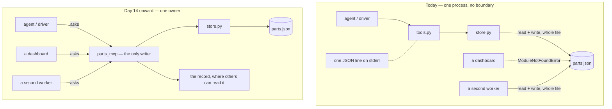

## One-line answer

Putting one owner in front of the data buys five things this project cannot otherwise have — one
writer, an audit trail anything can read, reuse without importing your code, a blast radius smaller
than the whole filesystem, and somewhere for policy to live — and it costs a process to run, a
protocol to speak, a failure mode when it is down and latency on every call, all four of which this
project pays on purpose.

## The idea

Every stockroom that has ever solved this has solved it the same way, and it is never by asking
people to be more careful. It is a hatch in the wall, a book on the counter beside it, and one person
whose job is both. You do not walk in any more. You come to the hatch and say what you need, and the
storeman fetches it, writes the line in the book, and hands it over. Two people at the hatch at the
same moment is not a problem, because the storeman serves one and then the other, and the book has
one line per thing that happened in the order it happened.

Notice what the hatch actually changed, because it is not "people became careful". Nobody's
behaviour improved. What changed is that **there is now exactly one pair of hands that touches the
shelf**, and one place where what happened is written down, and one person who can be asked *who
took the last belt kit* and can answer. Three of Friday's problems disappeared not because anybody
found the bug, but because the room stopped having a shape in which the bug was possible.

And notice what it cost, because pretending it was free is how you end up with a hatch on a cupboard
that one person uses. Somebody has to staff it. There is a queue at half past eight when everyone
needs something at once. When the storeman is off sick the shop does not stop, but it slows, and it
slows in a way that never used to happen because everybody used to just walk in. Every request now
takes longer than reaching for a shelf yourself, every single time, for ever.

That is the argument this whole day has been building, and now it can be stated in one sentence
rather than felt. A **data boundary** is a process that owns the data and is the only thing that
touches it; everything else asks it. The rest of this part is the five things you get, each tied to
something you have actually watched happen, and then the four things you pay — because an argument
that only lists the wins is a sales pitch, and you would be right not to trust it.

## The mechanism

There is no code in this part. Nothing is built today, and saying that plainly is more useful than
inventing a fragment of tomorrow's server to have something to print. What there is, is a shape —
the one you have, and the one the next days move to:



Read the top box as the four failures of this day drawn in one picture: two arrows reach the same
file with no coordination between them, the dashed arrow is the thing that cannot get there at all,
and the record hangs off the side attached to nothing. Read the bottom one as a single claim — **all
writes go through one box** — and note that every one of the five wins below is a consequence of
that single structural change rather than five separate features.

### The five things

| What you get | The thing you watched | Why the shape gives it |
| --- | --- | --- |
| **One writer** | 2.1: twenty issued, ten unaccounted for, and reads crashing on an empty file | Requests arrive at one process, which serves them one at a time. There is no interleaving to lose an update in, and no reader ever sees the file mid-write because no reader ever sees the file. |
| **An audit trail** | 1.2: one JSON line on this process's standard error, carrying no identity, gone when the terminal scrolls | The owner is the only writer, so it is the one place every change passes through, and it can write the record somewhere durable that a second process can read. *Who asked* becomes answerable because the request carried it. |
| **Reuse** | "When it breaks", below: `ModuleNotFoundError: No module named 'parts_counter'` | Anything that can speak the protocol can ask, in any language, from any process. Today the only way in is to import your Python, which means inheriting your dependencies, your pins and your bugs. |
| **A smaller blast radius** | 1.1: the store opens a path built from `__file__` — and so could open any other path | Every tool in this process runs with the whole process's filesystem rights. A tool that takes a path is a tool that can reach anything the process can reach. Behind a boundary the reachable surface is the set of operations the owner exposes. |
| **A place to put policy** | 1.2: the entire defence against an unwanted write is a sentence in a docstring | Who may write, how much, what gets refused, what needs approval — none of that has anywhere to live in a plain function that anyone in the process can call. It has an obvious home in the one process every write goes through. |

Three of those need a sentence more, because the short version undersells them.

**Blast radius** is the one people discover last and regret first. It is the answer to *if this goes
wrong, how much can it touch?* Today the answer is: everything the process can open. Not the
inventory — the process. `store.py` builds its path from `__file__`, which is careful and correct,
and it is careful by convention rather than by construction: nothing stops a tool added next month
from taking a filename as an argument, and a tool that takes a filename, handed to a model that can
be talked into things, is a tool that can read anything on the disk. That is not a hypothetical
worth waving at — **P28 is a whole project about attacking exactly this on purpose**, with a
deliberately hostile boundary, and it is much easier to follow having first seen the version where
there is nothing between the tool and the filesystem at all.

**Reuse** sounds like the soft one on the list and is usually the one that forces the decision in
real work. The question is never "would it be nice if a dashboard could see the stock?" It is: the
dashboard exists, it is written by another team in another language, and it needs the number. Today
there are exactly two ways to give it to them — import this package into their process, or let them
open `parts.json` themselves and become a second writer. The first makes their deployment depend on
your pins. The second is part 2.1 with more participants.

**A place to put policy** is the one that decides how the next two years go. Every rule anybody will
ever want — this agent may read but not write, adjustments over fifty need approval, nothing may be
issued against a part that does not exist, every write is recorded with who asked — is a rule about
requests. In this shape there are no requests, only function calls that any code in the process can
make, so there is nowhere to put a rule that is not "everybody remembers to call the right function".

### The other side, honestly

A boundary is not free, and each of these is a real cost paid on every day the system runs.

- **A process to run.** Something has to start it, restart it when it dies, and be configured to know
  where it is. That is a second thing in the deployment description, a second thing in the compose
  file, and a second thing that can be misconfigured — and it is why P02's ship day is a D2 tier
  rather than the D1 that P01 got away with.
- **A protocol to speak.** Both ends now have to agree on how a request is framed, what an error
  looks like, and what happens to a call that arrives twice. That agreement has to be learned,
  written down and versioned. It is the subject of most of the rest of this project, and it is a real
  cost even when the protocol is a good one.
- **A failure mode when it is down.** A function call cannot be unavailable. A request can, and now
  every caller needs an answer to *what do I do when the owner does not respond* — which is a
  question with no good default and several bad ones, the worst being "pretend it succeeded".
- **Latency on every call.** A function call costs nanoseconds. A request to another process costs
  more, always, on every single call, for the life of the system. Nothing you do makes it as cheap as
  what you had.

Two honest concessions to go with them. The first: for a single-process program with one writer,
**this trade is not worth making**, and a boundary added to such a program is ceremony. The shape in
part 1.1 is the right shape for that program, which is why it was written that way and defended
rather than apologised for. The second: several of the specific failures in part 2.1 have cheaper
fixes than a boundary — a lock for the threads, an atomic replace for the torn read, SQLite for both
— and each of those is a better answer to *that* failure taken alone. The boundary is not the
cheapest fix for any single item on the list. It is the only one that answers all five at once, and
the only one that is still the answer when the second process, the second team and the second
language arrive.

### What the next days do, and what today does not

Today builds nothing. There is no server in this repository, no protocol, no client and no new file:
the `prints` list on this part is empty and that is correct, not an omission. What today produced is
a reason, and the reason is the thing that is missing when a boundary shows up in a codebase because
a framework suggested one.

- **Day 13** is the stateless core — what a request has to carry when the thing answering it
  remembers nothing between calls, and the reframe from a phone call you stay on to a web request
  that stands alone.
- **Day 14** is the server skeleton and its first tool: the first day this project has a second
  process in it.
- **Days 15 to 17** are lifecycle, transports, and the client side — the day the agent calls a tool
  that no longer lives in its own process.

One thing this day deliberately does not tell you: which revision of the MCP specification any of
that is written against. It has not been looked up, and a revision date quoted from memory is exactly
the kind of fact this curriculum refuses to invent. `PACKAGES.md` in this project carries a
`TODO(me)` naming the page to open, and it is owed before day 13 prints anything.

## When it breaks

Here is the reuse argument as an actual error rather than an assertion. This is a second program —
the dashboard, the nightly report, anything at all — trying to reach the inventory from one directory
above the project, which is where every other program on the machine lives:

```traceback
Traceback (most recent call last):
  File "<string>", line 1, in <module>
ModuleNotFoundError: No module named 'parts_counter'
```

That is what "the data is not reachable" looks like when somebody actually tries. There is no
endpoint to call and no protocol to speak, so the only door is a Python import, and the import works
only from inside this project's own folder with this project's own environment active. The person
who hits this has three options and all of them are bad: vendor a copy of your package and inherit
your pins, run their code inside your process, or open `parts.json` themselves — which is the
cheapest, which is what actually happens, and which turns them into the second writer from part 2.1.
The smallest honest fix is not an import path. It is a door.

## In production

**What a senior writes instead.** They do not reach for a boundary because a diagram looks nicer with
one. They ask two questions — *how many writers will there be?* and *who else needs this data?* — and
if the answers are "one" and "nobody", they keep the function call and write down the assumption
where the next person will find it. When the answers change, the boundary is the move, and they make
it before the second writer ships rather than after the first stock take goes wrong. What they never
do is leave the shape in part 1.1 in place while adding a second worker to it.

**What degrades at scale.** The blast-radius number, measured on this machine: the tools in this
project need **one** file, and the process they run in can open **10,442** of them under this
repository root alone — and nothing stops it walking higher. That ratio is the containment story
today, and it does not improve with care; it improves only when something other than the process's
own filesystem rights decides what a tool may reach. Set against it, the cost side has a number too:
every tool call becomes a request instead of a function call, and no amount of engineering makes a
request as cheap as a call.

**The review comment.** "I am fine with the store as it is for the version we have today, and I do
not want a boundary added because the architecture diagram has one. What I want in the pull request
description is the answer to two questions: how many processes will write this file, and who else
needs to read it. If the answers are more than one and anybody, then this needs an owner before we
add the second worker — not after, because after means we find out from a stock count."

**The interview question.** "Talk me through when you would put a service in front of a data store
and when you would not. Give me the concrete failure that decides it, tell me what the boundary costs
you on every request for the rest of the system's life, and describe a case where you argued against
adding one."

## Check yourself

- **Run:** `cd projects/02-parts-counter && uv run --frozen python run.py check` — expect six green
  and `0 problem(s)`. Nothing today changed the project, and confirming that is the point: this day
  is an argument, and an argument that quietly edited the code would be a different kind of document.
- **Say out loud:** name the five things a boundary buys without looking, and for each one name the
  transcript in today's documents that made you want it. Then name the four costs, and say which of
  them you think will annoy you most on day 17.

---

**Back to the hub:** [LESSON.md](../../LESSON.md)
