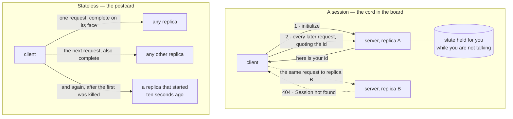

## One-line answer

A session is a server remembering you between requests, and it is never free: it forces every later
request back to the same machine, it makes something be held for you while you are not talking, and
it means that machine cannot be replaced while you are still mid-conversation — which is why the web
gave sessions up, and why the current MCP specification revision, `2026-07-28`, deleted them from the
protocol outright.

## The idea

Somebody puts a call through for you. You lift the handset, a voice says *number please*, and then
there is a small physical act at the other end: a cord is taken from a shelf of cords, one end pushed
into the jack your line comes up on and the other into the jack of the person you asked for. Now the
two of you are joined by a piece of copper. Everything about the call is in that cord. That you were
introduced is in it. That the call is still open is in it. Who you are talking to is in it. Not one
word of it is written down anywhere.

Which means three things are true, and every one of them is a bill that arrives later.

The first is that **you have to come back to the same board.** Your cord is plugged in at one
exchange, on one shelf. Ring in on a different exchange and your call is simply not there — not
delayed, not slow, *not there* — because nothing about it ever existed anywhere but in that one
plugged cord. The second is that **somebody is holding something for you while you are not
talking.** The cord occupies its jack whether you are mid-sentence or have gone to fetch a pen. The
shelf has a finite number of jacks, and every silent call is one of them, so somebody eventually has
to decide how long a quiet call may sit before it is pulled. The third is the one that hurts:
**you cannot change the board while the calls are in it.** Nobody wheels a new switchboard in at
lunchtime. To replace it you wait for every cord to come out, or you pull them out yourself and cut
off every conversation running through them.

Now hold a postcard instead. Everything the postcard needs is written on its face: where it is going,
who it is from, and what it says. It does not refer to a previous card. It does not need the person
holding it to have been present for anything earlier. Hand it to anybody at all and they can act on
it, because there is nothing to know that is not on it. That is the whole of the difference, and
every consequence below falls out of it.

The word for the plugged cord is a **session**: state that a server keeps about *you*, between one
request and the next, so that later requests can be shorter. It is a genuinely good trade in a room
with one switchboard. It stops being one the moment there are two, and it never stops being one
afterwards.

> **Careful — this is a different session from day 9's.** Day 9's
> [Session](../../../../01-ask-desk/day-09-sessions-errors-surface/parts/01-the-place-the-thread-lives/1.1-a-session-is-a-place-not-a-variable.md)
> is an ADK object: one stored conversation, addressed by `(app_name, user_id, session_id)`, living
> in a session service that your code asks by name. Today's is one layer down and belongs to the
> **protocol**: a connection-scoped identity that the transport mints, that the client must quote on
> every subsequent request, and that has nothing to do with conversations at all. The first is
> something this project chooses to store. The second is something the wire imposes. Confusing them
> is the commonest way to misread the rest of this phase — an agent can perfectly well keep a stored
> conversation while talking to a boundary that has no protocol session whatsoever, and by day 17
> that is exactly what this project does.

The web already had this argument and finished it, and the reasons are worth saying out loud rather
than treating as fashion. Early web applications kept a session in the memory of the process that
served you, and it worked beautifully until there were two processes. Then every one of the three
bills arrived at once. You needed the load balancer to send you back to the same machine, which meant
the balancer now had to remember things too. You needed the machine to hold your session while you
read the page, which meant memory that grew with the number of people who had ever visited and a
policy for throwing it away. And you could not deploy, because deploying meant restarting the process
that was holding everybody's cords.

The answer the web settled on was not cleverer sessions. It was **moving the state off the server**:
into the request itself, as something signed that the request carries and any machine can verify, or
into a store that every machine can reach and none of them owns. What was left behind in the server
was nothing at all — and a server that holds nothing is a server you can run two of, kill one of, and
deploy over the top of without anybody noticing.

MCP has now made the same move, and this is the part that matters: **the reframe in this day's title
is not this curriculum's opinion.** It is what the protocol did, in its own words, on the record, in
the revision that is current as this is written.

## The mechanism

There is no code in this part. What there is, is a shape — and then the specification saying, in its
own words, which of the two shapes it now is.



Read the top box as the three bills drawn once each: the dashed arrow is *you have to come back to
the same board*, the cylinder is *something is held for you while you are away*, and the fact that
replica A has an unbroken line to the cylinder is why replica A cannot be restarted. Read the bottom
box as one claim — **nothing in the picture points at a particular replica** — and notice that every
advantage the boundary from day 12 was supposed to buy you, from a second copy to a rolling deploy,
is a consequence of that single absence.

### What the specification says it is now

The current revision is `2026-07-28`. Its own front page describes the base protocol as three
bullets, and here they are verbatim, from `https://modelcontextprotocol.io/specification/2026-07-28`,
fetched 2026-09-10:

```text
* JSON-RPC message format
* Stateless, self-contained requests
* Per-request capability negotiation
```

The middle line is the postcard, stated as a property of the protocol rather than as a deployment
style you may adopt if you feel like it. The third line is the part that most people miss on a first
reading: *per-request* capability negotiation means the conversation about what each side can do also
stopped being something you have once and refer back to.

And the changelog for that revision, `https://modelcontextprotocol.io/specification/2026-07-28/changelog`,
says what was removed to get there — again verbatim, fetched the same day:

```text
Make MCP stateless: remove the `initialize`/`notifications/initialized` handshake. Every request now
carries its protocol version and client capabilities in `_meta` […] Version mismatches return
UnsupportedProtocolVersionError
```

```text
Remove protocol-level sessions and the `Mcp-Session-Id` header from the Streamable HTTP transport.
List endpoints (`tools/list`, `resources/list`, `prompts/list`) no longer vary per-connection.
```

Three sentences of a changelog, and they delete the cord, the board and the operator. There is no
introduction to perform, so there is nothing to be introduced *to*; there is no identifier to quote
back, so there is nothing that could be quoted to the wrong replica; and the last clause of the
second one closes the last hiding place — if the tool list cannot differ per connection, then a
connection is not a thing that can hold an opinion about anything.

### The three bills, and what each one is called in practice

| The bill, in the exchange | What it is called | What it costs you, concretely |
| --- | --- | --- |
| You must come back to the same board | **session affinity**, sticky routing | The thing in front of your replicas has to remember which one served you. That is state in the router, added to remove state from nowhere. |
| Something is held while you are silent | **per-session memory and an eviction policy** | Somebody has to answer *how many at once* and *how long may one be idle*. This SDK answers `max_sessions=10000` and `session_idle_timeout=1800` seconds, and those are its numbers, not yours. |
| The board cannot change under a live call | **no rolling deploy, no scale-down, no restart** | Every open session is a reason not to replace a running process. A deploy either waits for all of them or ends all of them. |

The third row is the one to carry into day 18, because it is what "stateless container" in this
project's D2 gate actually means. A container that can be killed between two calls without anybody
losing anything is not a nicer container. It is a *different protocol*.

## When it breaks

Here is bill number one as an actual response rather than an argument. This is a real request to a
server running with sessions on, quoting a session identifier the server does not have — which is
exactly what a client sees when the load balancer sent it to the other replica, or when the replica
it was talking to has restarted since:

```console
$ curl -s -w "\nHTTP %{http_code}\n" -X POST http://127.0.0.1:8091/mcp \
   -H 'Content-Type: application/json' \
   -H 'Accept: application/json, text/event-stream' \
   -H 'mcp-session-id: 00000000000000000000000000000000' \
   -d '{"jsonrpc":"2.0","id":2,"method":"tools/call","params":{"name":"stock_level","arguments":{"part_no":"BRK-0143"}}}'
{"jsonrpc":"2.0","id":"server-error","error":{"code":-32600,"message":"Session not found"}}
HTTP 404
```

`Session not found` with a `404` is what a perfectly healthy system says to a perfectly valid request
at three in the morning, on the night somebody scaled the service from one replica to two and went
home. Nothing is broken. The tool exists, the argument is right, the part number is real, and the
server is well. The client is simply holding a cord that is plugged into the other board. The
smallest fix at that hour is to pin the traffic back to one replica and un-scale; the actual fix is
not to have a cord, which is the whole of the next part.

## In production

**What a senior writes instead.** They do not begin by asking whether a session would be convenient.
They ask *what has to be true for a second copy of this to be startable*, and they ask it on the day
the first copy is written, because the answer is cheap then and structural later. If anything the
server keeps between two requests cannot be reconstructed from the request itself or fetched from a
store both copies can reach, they name that thing out loud in the pull request and treat it as a
decision rather than as an implementation detail — because it is the decision that fixes how the
system is deployed for the rest of its life.

**What degrades at scale.** Put a number on the second bill from this SDK's own defaults, read from
the `FastMCP` constructor on this machine today: `max_sessions=10000` and `session_idle_timeout=1800`
seconds. That means one stateful server process is holding, at the ceiling, ten thousand pieces of
per-client state that nothing else can see, each of which is discarded once it has been quiet for
1800 seconds — and every one of those discards is a `404` for somebody who thought they were still
connected. The stateless server holds zero, has no ceiling to reach, and has no timeout because there
is nothing to time out.

**The review comment.** "Before this merges I want one sentence in the description: what does this
process keep between two requests from the same client? If the answer is *nothing*, say so and we are
done. If the answer is anything else, then the answer to *can we run two of these* is no, and that
needs to be a decision we took rather than something we find out during the next deploy."

**The interview question.** "Explain why the web moved away from server-held sessions, and name the
three specific operational costs it moved away from. Then tell me what it moved the state *to* in
each case, and what that move cost in return — because it was not free either."

## Check yourself

- **Run:** nothing yet — this part builds nothing on purpose. Instead, open
  `https://modelcontextprotocol.io/specification/2026-07-28` and find the three-bullet base-protocol
  list for yourself, so that the middle bullet is something you have read on the record rather than
  something a document told you.
- **Say out loud:** name the three costs of a session without looking, and for each one name the
  operational thing it forbids. Then say which of the three you think would be discovered first in a
  real system, and which would be discovered last and most expensively.

---

**Next:** [One flag, two protocols](1.2-one-flag-two-protocols.md)
