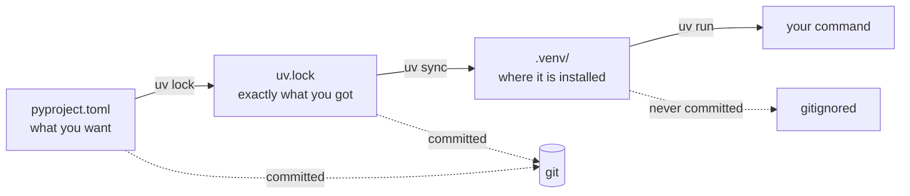

## One-line answer

`uv` turns three files — `pyproject.toml` for what you want, `uv.lock` for exactly what you got,
and `.venv/` for where it is installed — into one command, `uv run`, that always runs your code
inside the environment those files describe.

## The story

Back at the rented house. You have signed the handover sheet, and now you are buying what the
house still needs. You write a shopping list on the back of an envelope: *a kettle, a table lamp,
curtains for the bedroom*. That list is about wants. It does not say which kettle.

You come home with the things and the receipts. Now there is a second piece of paper, and it is a
different kind of paper: *this* kettle, this model, this price, bought on this date, from this
shop. If the kettle fails, the receipt is what you show. If a friend asks "what kettle did you
get, it's great", the receipt is what you read from. If you ever have to set up a second house
exactly like this one, the receipts are the list you shop from, not the envelope.

And there is a third thing: the cupboard where everything actually lives. You do not carry the
kettle around with you. It sits in the kitchen, plugged in, and when you want tea you walk to it.

The envelope, the receipts, the cupboard. Three different objects. A person who confuses them
ends up trying to boil water with a shopping list.

## The idea in plain language

A Python project needs other people's code — *libraries* — and it needs a place to keep them
where they cannot collide with the libraries of a different project on the same machine. Three
files handle this, and `uv` is the tool that keeps them consistent.

**`pyproject.toml`** is the envelope. It is a plain text file at the repository root that names
the project, says which Python it needs (the `requires-python` line from
[the previous part](1.1-the-python-pin.md)), and lists the libraries the project *wants*, with
loose version rules like "anything from 2.x". You edit this file on purpose, by hand or through
`uv add`.

**`uv.lock`** is the stack of receipts. It records the *exact* version of every library that the
loose rules resolved to, including the libraries your libraries needed — the whole tree. You never
edit it by hand; the tool writes it. The official documentation is explicit on two points:
*"uv.lock is a human-readable TOML file but is managed by uv and should not be edited manually"*,
and *"This file should be checked into version control, allowing for consistent and reproducible
installations across machines."* The receipts get committed. The envelope alone does not let a
second machine reproduce the first.

**`.venv/`** is the cupboard. It is a folder holding a private copy of the interpreter plus every
installed library, so that this project's installs never touch any other project's. This is
called a **virtual environment**. It is *not* committed — it is large, it is specific to your
machine, and it can be rebuilt from the lockfile in seconds. The tool drops its own `.gitignore`
inside it so that git never sees it.

Three verbs tie them together. **`uv lock`** reads the envelope and writes the receipts.
**`uv sync`** reads the receipts and fills the cupboard — installing exactly what the lockfile
names and, by default, removing anything that is not in it. **`uv run <command>`** does both
first and then runs your command inside the environment, so you never have to "activate" anything
or remember which Python you are on.

## Why Prahari needs it

Day 1 wires `python granth.py check` to run `uv run ruff check .`, `uv run mypy .` and
`uv run pytest -q` — three commands that only make sense inside an environment that has those
tools installed. Day 28 introduces recorded model responses; a test suite that installs a
different version of the HTTP client than the one the recording was made with produces a
different request and misses the cassette. Day 112 builds a container image from `uv.lock`, and
if the lockfile is not committed there is nothing for the image to be built from. Every
`uv run` in the next 136 days rests on the three files this part creates.

## The mechanism

At the root of this repository — the folder that holds `granth.py` — run:

```powershell
uv init --vcs none --name prahari .
uv sync
uv run python -c "import sys; print(sys.version); print(sys.executable)"
```

**Line by line:**

- `uv init` — creates the project files. The documentation lists what a default `init` creates:
  `.python-version`, `README.md`, `pyproject.toml`, and `src/<project_name>/` with an
  `__init__.py`. Files that already exist are left alone, which is why the existing `README.md`
  survives.
- `--vcs none` — this repository is *already* a git repository (day 0 did not create it; the
  plan's scaffolding did). Without this flag `uv init` would try to initialise version control,
  and asking a tool to initialise something that exists is asking for a surprise.
- `--name prahari` — the project name, which becomes the package folder `src/prahari/`. Without
  it, the name is taken from the folder, which here is `agentic-projects` — a folder name, not a
  project name.
- `.` — initialise *here*, not in a new subfolder.
- `uv sync` — creates `.venv/`, resolves the (currently empty) dependency list, writes `uv.lock`,
  and installs the project itself into the environment. On this machine it printed
  `Using CPython 3.12.13` and `Creating virtual environment at: .venv` — the first line is the
  pin from the previous part being honoured.
- `uv run python -c "..."` — runs Python *inside* `.venv/`. The two printed lines are the proof:
  the version is `3.12.13`, and the executable path ends in `.venv\Scripts\python.exe`, not in
  any system folder. That is the whole point of `uv run`: whichever Python your shell would have
  found, this one is the project's.

The `pyproject.toml` that `uv init` wrote on the development machine, with the `authors` line
removed because the tool copies it from your git identity and it is yours to keep or delete:

```toml
[project]
name = "prahari"
version = "0.1.0"
description = "Add your description here"
readme = "README.md"
requires-python = ">=3.12"
dependencies = []

[project.scripts]
prahari = "prahari:main"

[build-system]
requires = ["uv_build>=0.12.3,<0.13.0"]
build-backend = "uv_build"
```

The `[build-system]` block pins the *build backend* to the `uv` version that wrote it — read
[the next part](1.3-recording-what-you-have.md) before you decide that number is wrong. The
`[project.scripts]` block makes `uv run prahari` call `main()` in `src/prahari/__init__.py`;
day 1 replaces that placeholder with an empty package the gate can check.

The three files and the three verbs, as a picture:



## When it breaks

The error you will see the moment you run the whole-repository gate today, because day 1 has not
installed the toolchain yet:

```text
error: Failed to spawn: `ruff`
  Caused by: program not found
```

This is `uv run` doing its job honestly. It synced the environment, found no `ruff` in it, and
refused to fall back to some other `ruff` that might be on your machine. The fix is day 1's
subject, not a workaround today: the tool is added to the project, the lockfile records it, and
`uv run ruff` finds it in `.venv/`.

The second failure is the one that costs an afternoon on a synced folder. This repository lives
under a cloud-synced directory, and a virtual environment is thousands of small files that the
sync client will try to upload. On Windows the tool's default link mode is `hardlink`: files in
`.venv/` are hard links into the tool's cache under `AppData`, and a hard link cannot cross
from one filesystem to another. If `uv sync` prints a warning that mentions hardlinks, set the
environment variable `UV_LINK_MODE=copy` and re-run, so that copying is the choice rather than
the surprise. If the sync client starts uploading `.venv/`, exclude
the folder from syncing rather than fighting it. The `--link-mode` entry in the tool's CLI
reference (checked today) lists `clone`, `copy`, `hardlink` and `symlink`, and discourages
`symlink` because clearing the cache would then break every installed package.

## In production

A professional commits `pyproject.toml` and `uv.lock` and never `.venv/`, and treats a diff in
`uv.lock` as a change to review like any other: a lockfile diff that touches thirty packages when
you asked for one is the moment to ask what pulled the other twenty-nine in.

At scale, the lockfile is what makes a deployment *reproducible*: CI runs `uv sync --locked`,
which refuses to proceed if the lockfile and `pyproject.toml` disagree, so a developer who edited
the envelope and forgot to regenerate the receipts is caught by the build rather than by
production. A container image built from the same lockfile on the same pin contains the same
bytes as the laptop that tested it, and "the same bytes" is the only version of "it worked
locally" that a reviewer accepts.

The failure that only shows under real traffic is the *transitive upgrade*: nobody changed the
envelope, but a library two levels down released a version with a subtle behaviour change, and a
project without a committed lockfile picked it up on the next install. Half the incidents that
begin "but we didn't change anything" end at a missing lockfile.

The review comment on the teaching version: *"`uv.lock` is in `.gitignore`. Why? Without it, the
second developer to clone this resolves a different tree, and the two of you spend the sprint
debugging each other's machines."*

The interview question: *"What is the difference between a dependency specification and a
lockfile, and which one do you commit?"* — followed, if you answer well, by *"and when do you
deliberately regenerate the lockfile?"*

## Check yourself

- **Run:** `uv run python -c "import sys; print(sys.executable)"` — expect a path ending in
  `.venv\Scripts\python.exe` under this repository. Then run `git status --short` and confirm
  `uv.lock` is listed as new and `.venv/` is not listed at all.
- **Say out loud:** which of the three files would you hand to a colleague so they can build the
  identical environment, and why is it not `pyproject.toml`?

---

**Next:** [Recording what you actually have — the pin ledger](1.3-recording-what-you-have.md)
