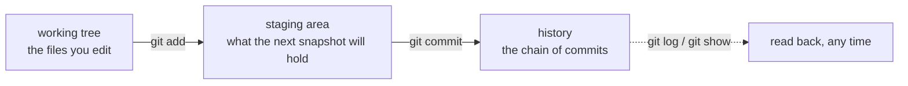

## One-line answer

A commit is a signed, dated snapshot of the whole repository that can never be silently changed,
and this project makes exactly one per day because a history you can trust is the only memory a
137-day curriculum has.

## The story

You keep a notebook for the rented house. Every time something changes — a tap replaced, a wall
painted, a new lock fitted — you write a dated line: what changed, who did it, why. It is a
habit, not a ceremony, and most weeks it is one line.

Then the owner calls. "The bathroom tap is leaking. Did you change anything in there?" You open
the notebook. *14 March: bathroom tap replaced, plumber from the corner shop, old one dripping.*
You did not have to remember. You did not have to guess. You read a line you wrote when the fact
was fresh, and the argument was over before it started.

Now imagine the notebook with pages torn out, or lines written over in a different pen. It is
worse than no notebook, because you would still trust it. The value of the notebook is not that
it is full. It is that nothing in it has ever been quietly changed.

## The idea in plain language

**git** is a program that keeps that notebook for a folder of files. The folder it watches is
called a **repository**, and the hidden `.git/` directory inside it is where the notebook's
pages are kept. This repository already exists — the plan's scaffolding created it — so today is
about learning to write in it, not about creating it.

Three words carry the whole mechanism.

The **working tree** is the folder as you see it: the files you edit. The **staging area** is a
holding place where you put the changes you intend to record — you choose, file by file, what
goes into the next snapshot, so a snapshot can be *about* one thing even if you touched three.
A **commit** is the snapshot itself: the staged files, the name and email of whoever made it, the
date, and a message saying why. Each commit also records which commit came before it, so the
commits form a chain, and each one is named by a fingerprint of its whole content. Change a
single byte in an old commit and its fingerprint changes, which changes every commit after it —
which is why nothing in the chain can be altered quietly. That property is the reason the
plan's Principle 2 says *the repository is the memory*.

**One day, one commit** is this project's rule for how often to write in the notebook. Each day
of the curriculum ends in exactly one commit whose message names the day and what it closed. The
result is a history where `git log` reads as a table of contents, where "what did day 40 change?"
is one command, and where nothing done in the day is half-recorded.

## Why Prahari needs it

Every ledger in `docs/` is append-only, and append-only is only enforceable if the history of
the file is itself append-only — git is what makes "never edit a ledger row" a checkable claim
rather than a request. `python granth.py done N` ends every day by committing, with a message it
builds from the day's hub, and it refuses to run on a day with no ledger row: the ledger is the
record and the commit is the seal on it. Day 112 builds a container image from a commit; phase 16
extracts the platform and proves the extraction by comparing the eval report before and after,
which means being able to name and rebuild the exact commit "before" was. None of that works on
a history with gaps.

## The mechanism

First, make sure git knows who is writing. A commit without a name and email is refused
outright — the exact refusal is in *When it breaks*.

```powershell
git config user.name
git config user.email
```

**Line by line:**

- `git config user.name` — prints the name that will be stamped on every commit you make in this
  repository, or nothing if none is set. `git config` with one argument *reads*; with two it
  *writes*. If it prints nothing, set it: `git config user.name "<your name>"`, and the same for
  `user.email`. Setting it without `--global` stores it in this repository's `.git/config`, so
  a different repository can use a different identity; with `--global` it becomes the default
  for every repository on the machine.

Then the daily loop, which you will run by hand today and which `python granth.py done N` runs for
you from day 1 onward:

```powershell
git status --short
git add -A
git commit -m "day 00: The machine and the repository"
git log --oneline --stat -1
```

**Line by line:**

- `git status --short` — one line per file that differs from the last commit. `??` means git has
  never seen the file; ` M` means modified; `A ` means staged as new. Read this *before* adding
  anything, because it is the moment you notice a file that should not be there.
- `git add -A` — stage every change in the working tree: new, modified and deleted files alike.
  This is the whole-day version of "put it in the holding place". On a normal day it is right,
  because the day's rule is that the whole day is one snapshot. It is also the command that
  would stage a secrets file if the ignore rules of [part 3.1](../03-secrets/3.1-the-secrets-rule.md)
  were missing — which is why that part exists.
- `git commit -m "..."` — take the snapshot of what is staged, stamp it with your identity and
  the date, and attach the message. The message format `day NN: <title>` is the one
  `python granth.py done` generates; using it by hand today keeps the log uniform from the first
  entry. Only *staged* changes are in the snapshot; a file you edited but did not add stays out.
- `git log --oneline --stat -1` — show the most recent commit: its short fingerprint, its
  message, and one line per file it touched with a count of added and removed lines. This is
  the day's receipt. The `--stat` view is also why a day folder carries a slug and not just a
  number: `days/day-00-machine-and-repository/` in a stat is legible, `days/day-00/` is not.

The three places a change can be, and the two commands that move it:



## When it breaks

Committing before git knows who you are. The machine and user names in the last line have been
replaced with placeholders; everything else is verbatim:

```text
Author identity unknown

*** Please tell me who you are.

Run

  git config --global user.email "you@example.com"
  git config --global user.name "Your Name"

to set your account's default identity.
Omit --global to set the identity only in this repository.

fatal: unable to auto-detect email address (got '<user>@<machine>.(none)')
```

The commit did not happen. Set the two values and run the commit again — nothing was lost,
because the staging area still holds what you added.

Committing with nothing staged. Here `README.md` had been edited but not added:

```text
On branch main
Changes not staged for commit:
  (use "git add <file>..." to update what will be committed)
  (use "git restore <file>..." to discard changes in working directory)
	modified:   README.md

no changes added to commit (use "git add" and/or "git commit -a")
```

Not an error in the traceback sense — git exits non-zero and explains. The tell is *Changes not
staged*: the working tree moved, the staging area did not, and a commit only ever records the
staging area.

## In production

A professional writes small commits with messages that say *why*, not *what* — the diff already
says what. On a team, the commit is the unit of review, of blame and of rollback, so a commit
that mixes two unrelated changes cannot be reverted without reverting both. This project's
one-day-one-commit rule is a teaching simplification of that discipline: the "unit" is a day
because a day is already one subject by the plan's design.

At scale, the history *is* the audit trail. When a production incident is traced to a behaviour
change, `git log` on the relevant file is the first tool, and `git bisect` — which walks the
history to find the exact commit that introduced a failure — only works if every commit is a
state that runs. A history with "WIP" commits that do not build is a history bisect cannot walk.

The failure that only shows under real traffic is the rewritten history: someone amends or
force-pushes over a commit that another machine already built from, and now two deployments
disagree about what "version X" means. Rewriting shared history is the notebook with a torn-out
page, and most teams forbid it on the main branch for exactly the reason this part opened with.

The review comment on the teaching version: *"This commit message says 'fixes'. Fixes what? In
six months this is the only sentence anyone will read before deciding whether to revert it."*

The interview question: *"What is the difference between the staging area and the working tree,
and why does git have both?"* — the second half is the one that separates people who use git
from people who understand it.

## Check yourself

- **Run:** `git log --oneline -5` — expect the scaffolding commits and nothing from today yet;
  today's commit is the last thing the day does. Then `git status --short` — every file listed is
  something today's commit will contain. Read the list and confirm nothing on it is a secret.
- **Say out loud:** why can a commit in the middle of the chain not be changed without everyone
  noticing?

---

**Next:** [The pre-commit hook — a check that runs before anything lands](2.2-the-pre-commit-hook.md)
