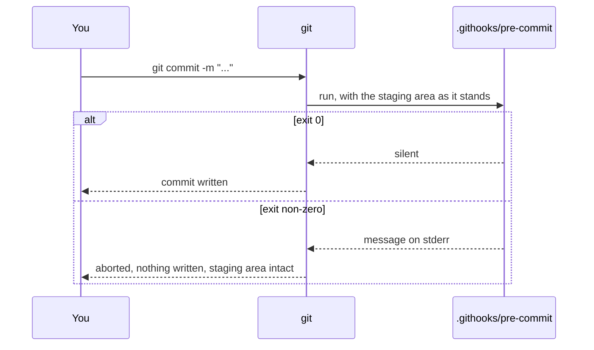

## One-line answer

A pre-commit hook is a script git runs before every commit, and if the script exits non-zero
the commit is refused — which makes it the one place a rule can be enforced *before* it enters
history instead of cleaned up afterwards.

## The story

The rented house has a new front door. It has a small habit: it will not lock if a window is
still open. You pull the door shut, turn the key, and nothing happens — the bolt does not move.
You go back in, find the kitchen window ajar, close it, and now the key turns.

The first week this is annoying. You are late; you just want to leave. By the second week you
have stopped noticing, because you have also stopped leaving windows open. And on the one evening
you *did* leave one open, the door caught it, and you did not come home to a flooded kitchen.

The door does not fix the window. It refuses to let you leave until you do. That refusal, at the
exact moment before the mistake becomes permanent, is worth more than any number of reminders
taped to the fridge.

## The idea in plain language

git has a set of moments — just before a commit, just after, just before a push — where it will
pause and run a program of your choosing. Such a program is called a **hook**. The one that runs
just before a commit is written is the **pre-commit hook**. The official documentation states
the contract in two sentences: it *"is invoked before obtaining the proposed commit log message
and making a commit"*, and *"exiting with a non-zero status from this script causes the git
commit command to abort before creating a commit."*

So the hook is a door that will not lock. It looks at what is about to be committed — the staging
area from [the previous part](2.1-git-as-memory.md) — and either says nothing and lets the commit
through, or prints why and refuses. Nothing is written to history in the refused case. The
staged changes are still staged; the working tree is untouched; you fix the thing and commit
again.

Two facts about *where* the hook lives decide whether it works for anyone but you. By default,
hooks live in `.git/hooks/` — and `.git/` is never committed, so a hook placed there exists only
on your machine and vanishes for every fresh clone. The way round it is a git setting called
`core.hooksPath`, which points git at a folder *inside* the repository — this project uses
`.githooks/` — so the hook is versioned like any other file. The setting itself, though, is not
versioned: it is one line in `.git/config`, and every clone has to set it once. The last part of
this day is built on what happens when that line is missing.

One more fact from the same page: *"Hooks that don't have the executable bit set are ignored."*
On Windows the filesystem has no executable bit in the POSIX sense, and Git for Windows runs the
script through its own shell regardless — the hook worked on this machine from PowerShell — but a
clone on macOS or Linux will silently ignore a hook whose mode is not executable. The fix is
`git update-index --chmod=+x .githooks/pre-commit`, which records the executable mode in git's
index so that it travels with the file.

## Why Prahari needs it

The phase 0 gate has two halves: the toolchain is green on an empty package, and *a planted
secret cannot be committed*. The second half is this part plus the two after it. Without a hook,
"cannot be committed" would mean "we asked everyone not to", and a rule with no enforcement is a
hope. Day 101 (secrets — the vault, rotation, the log that must never see them) builds the
production version of the same rule inside the running system; this part is the version that
guards the repository. Day 110 wires CI, and the same checks run there as a second door — but
CI catches a secret *after* it has been pushed, which is after the damage. The hook is the only
check that runs before the mistake is permanent.

## The mechanism

The hook is a shell script. Git for Windows runs it with its own POSIX shell, so it is written
for `sh` even on a PowerShell machine — the *caller* is git, not you. This version enforces the
secrets rule the next section defines; read it now as a hook, and again in
[part 3.1](../03-secrets/3.1-the-secrets-rule.md) as a rule.

```sh
#!/bin/sh
# pre-commit — refuse any commit that would carry a secret into history.
# Two checks. Either one failing aborts the commit (non-zero exit).

# 1. A file named .env, or .env.<anything> except .env.example, must never be staged.
for path in $(git diff --cached --name-only --diff-filter=ACMR); do
  case "$(basename "$path")" in
    .env.example) ;;
    .env|.env.*)
      echo "pre-commit: refusing '$path' — a secrets file never enters git." >&2
      exit 1
      ;;
  esac
done

# 2. No staged line may give a key-shaped variable a non-empty value.
if git diff --cached --unified=0 | grep -nE '^\+[A-Za-z_]*(API_KEY|SECRET|TOKEN)[A-Za-z_]*[[:space:]]*=[[:space:]]*["'"'"']?[^"'"'"'[:space:]]+'; then
  echo "pre-commit: a staged line assigns a value to a key. Put it in .env and stage .env.example instead." >&2
  exit 1
fi

exit 0
```

**Line by line:**

- `#!/bin/sh` — the first line names the interpreter. `sh`, not `bash`, because every git
  installation ships a POSIX `sh` and not every machine has `bash`; the script uses nothing
  beyond POSIX.
- `git diff --cached --name-only --diff-filter=ACMR` — the list of file paths in the staging
  area. `--cached` means *staged, not working tree*: the hook judges what is about to be
  committed, not what is on disk. `--name-only` gives paths without content. `--diff-filter=ACMR`
  keeps Added, Copied, Modified and Renamed files and drops Deleted ones — deleting a secrets
  file is the one thing we never want to refuse.
- `for path in $(...)` — loop over those paths. Unquoted word-splitting is acceptable here
  because this repository has no paths with spaces; a general-purpose hook would use
  `-z` and `read -d ''`, and the *In production* section says why this one does not.
- `case "$(basename "$path")" in` — decide by the file's *name*, not its folder, so a `.env`
  three folders deep is caught the same as one at the root.
- `.env.example) ;;` — the one exception, matched *first* so that the next pattern never sees
  it. Order matters in `case`: the first matching branch wins.
- `.env|.env.*)` — the two shapes a secrets file takes in this project: exactly `.env`, or
  `.env.` followed by anything (`.env.local`, `.env.production`).
- `echo "..." >&2` then `exit 1` — say why on standard error, where git will show it, and exit
  non-zero. `exit 1` is the whole enforcement: any non-zero status aborts the commit.
- `git diff --cached --unified=0` — the staged *content* this time, as a diff with zero lines
  of context so that only added and removed lines appear. Added lines start with `+`.
- `grep -nE '^\+...'` — search added lines (`^\+`) for a variable whose name contains
  `API_KEY`, `SECRET` or `TOKEN`, followed by `=` and then at least one character that is not
  whitespace or a quote. The `-n` prints the line number so the reader sees where; `-E` turns on
  the extended pattern syntax. The odd `["'"'"']?` is how a single quote is written inside a
  single-quoted `sh` string: close the quote, add `"'"`, reopen it.
- The `[^"'[:space:]]+` at the end is the important character class: it requires a *value*.
  `GROQ_API_KEY=` with nothing after it — the shape of every line in `.env.example` — does not
  match, so the example file passes. `GROQ_API_KEY=anything` does match.
- `exit 0` — the door locks. Explicit, so a reader never has to wonder what the fall-through
  status is.

Installing it is two commands, run once per clone:

```powershell
git config core.hooksPath .githooks
git update-index --chmod=+x .githooks/pre-commit
```

**Line by line:**

- `git config core.hooksPath .githooks` — tell *this clone* to look for hooks in `.githooks/`
  instead of `.git/hooks/`. The documentation for hooks names this setting as the way to change
  the hooks directory. It is written to `.git/config`, which is not committed — the trap the
  final part of the day is about.
- `git update-index --chmod=+x .githooks/pre-commit` — mark the file executable *in git's
  index*, so that the executable mode is committed with the file. On Windows the mode on disk
  is meaningless and git would otherwise record the file as non-executable; a clone on another
  operating system would then ignore the hook without a word.

The moment the hook runs, in the sequence of a commit:



## When it breaks

The hook refusing a staged secrets file, run from PowerShell on the development machine:

```text
pre-commit: refusing '.env' — a secrets file never enters git.
```

That single line and a non-zero exit is the whole failure. `git log` shows no new commit;
`git status` shows `.env` still staged. The fix is `git reset HEAD .env`, which unstages it, and
then asking how it got staged in the first place — the answer is in the next part.

The hook refusing a key pasted into source code:

```text
7:+GROQ_API_KEY = "gsk-planted-1234"
pre-commit: a staged line assigns a value to a key. Put it in .env and stage .env.example instead.
```

The first line is `grep -n` showing the matched line with its number in the diff. The second is
the hook's message. Both appear because the `if` runs `grep` for its exit status and lets its
output through, which is deliberate: the reader sees *what* was caught, not just *that* something
was.

## In production

A professional does not hand-write this hook for long. Teams use a hook manager that installs a
committed configuration into every clone and runs a list of checks — formatters, linters, a
dedicated secret scanner — and the scanner does what this script cannot: it knows the exact
prefixes and lengths of real providers' keys, scores strings by entropy so that a random-looking
forty-character token is caught even when its variable is called `x`, and keeps a baseline of
known false positives so that the check stays quiet enough that nobody disables it. This
project's hook is the mechanism written by hand first (Principle 3) so that the manager, when it
arrives, is a convenience and not a mystery.

At scale, the hook is the *first* door, never the only one. It runs on the developer's machine,
which the developer controls: `git commit --no-verify` skips it, an unset `core.hooksPath`
disables it, and a fresh clone has neither. The same checks therefore run again in CI on every
push, where nobody can skip them, and a repository that relies on the client-side hook alone has
a policy that depends on every contributor's laptop being configured. Day 110 is where the second
door is fitted.

The failure that only shows with real traffic is the *slow hook*. A check that scans every file
in the repository on every commit, rather than the staged diff, gets slower as the repository
grows until someone adds `--no-verify` to their muscle memory — and then the door is open for
everyone who copies their habit. Every check in this hook reads `--cached` output for exactly
this reason.

The review comment on the teaching version: *"The path loop breaks on a filename with a space,
and the regex misses lowercase names like `api_key`. Fine for a first pass — add a `TODO` naming
both, so the next person does not think they were considered and rejected."* Both are named in
the hub's traps.

The interview question: *"Where should a secret-in-commit check run — the developer's machine,
CI, or the server — and what does each location miss?"* The answer that gets the job names all
three and what each cannot see.

## Check yourself

- **Run:** `git config core.hooksPath` — expect `.githooks`. If it prints nothing, the hook is
  not wired and every commit will pass, silently. Then `git ls-files -s .githooks/pre-commit` —
  expect a mode of `100755`; `100644` means the executable bit was not recorded.
- **Say out loud:** why does the hook read `git diff --cached` and not the files on disk, and
  what would go wrong if it read the disk?

---

**Next:** [The secrets rule — `.env`, `.gitignore`, and the one file that is allowed through](../03-secrets/3.1-the-secrets-rule.md)
