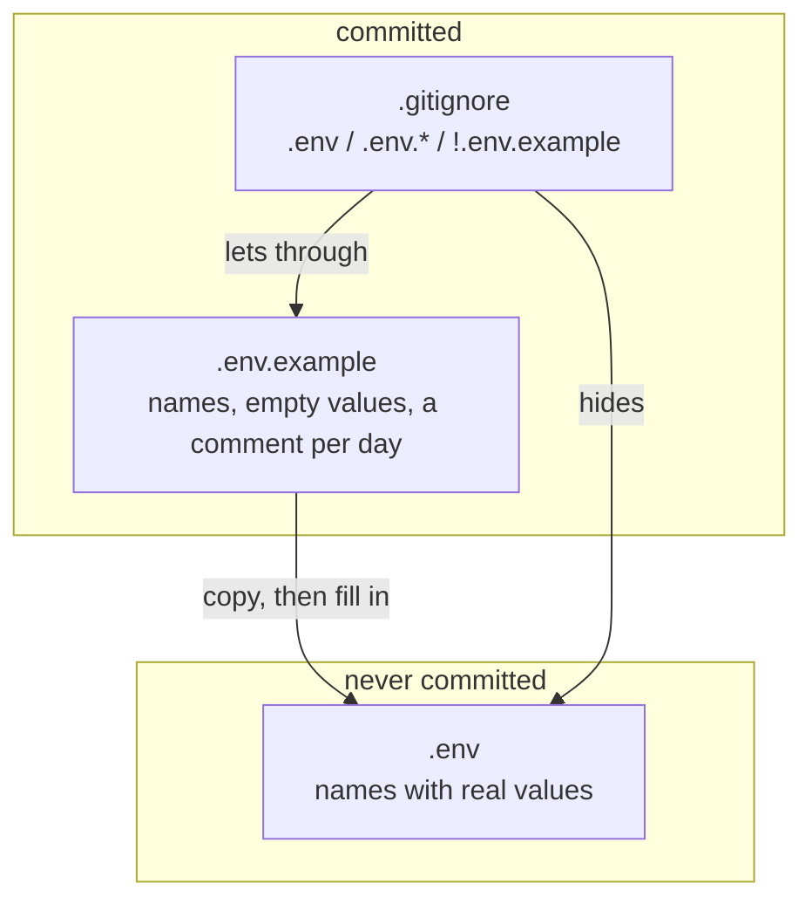

## One-line answer

Every secret this project ever uses lives in one gitignored file, `.env`, at the root; the
committed file `.env.example` carries the same variable names with empty values; and nothing
that reads a secret ever reads it from anywhere else.

## The story

The rented house has a drawer in the hallway. It is where the keys go: the front door, the back
door, the letterbox, the spare for the neighbour. The rule of the house is short. Keys live in
the drawer. Not on the kitchen table, not in a coat pocket, not under the mat.

The reason is not that the table is dangerous. It is that the table is where everything else
goes — post, shopping, a friend's phone — and a key on the table is a key that gets picked up
with the post and carried out of the house by someone who did not mean to take it. The drawer is
safe because it holds only keys, and everyone knows that anything in it is not to be moved.

Taped inside the drawer is a card listing which key is which: *front door, back door, letterbox,
neighbour's spare*. The card has no keys on it. You could photograph it and post it online and
nobody could open anything. But when a key is missing, the card is how you know which one.

## The idea in plain language

A **secret** is any string that grants access: an API key that lets you call a model provider,
a password, a signing token. The plan's §4 lists three the project will need — one each for
Groq, Gemini and OpenRouter — and every one of them is a string that, if it leaks, lets a
stranger spend your daily request quota and, on a paid account, your money.

The **secrets rule** has three clauses.

Secrets live in one file, **`.env`**, at the repository root. It is a plain text file, one
`NAME=value` per line. It is the drawer: it holds keys and nothing else, and everyone knows that
anything in it is not to be moved.

`.env` is **gitignored**. A file called `.gitignore` at the repository root lists patterns of
files that git must pretend do not exist: it will not list them as untracked, will not stage them
with `git add -A`, and will refuse a plain `git add` of them. The scaffolding wrote this
repository's `.gitignore` before day 0, and its first lines are the ones that matter today:
`.env`, then `.env.*`, then `!.env.example`.

That third line is the card taped inside the drawer. **`.env.example`** *is* committed. It has
the same variable names as `.env`, with nothing after the `=`, and a comment on each saying which
day introduced it. A reader cloning this repository copies it to `.env`, fills in their own
values, and knows from the comments what each one is for. The `!` in front of the pattern is a
**negation**: the documentation says it *"negates the pattern; any matching file excluded by a
previous pattern will become included again."* Without it, `.env.*` would swallow the example too,
and the drawer would have no card.

The third clause is about reading. Whatever loads `.env` into the running program does so
*explicitly*, at one named place, on day 24 when the first request is made — never by a library
that scans the environment quietly at import time. A secret that arrives by a route nobody wrote
down is a secret nobody can rotate.

## Why Prahari needs it

Day 24 makes the first model call and needs a real key; without a `.env` to read it from, the
key ends up in a shell history or, worse, pasted into the script. Day 28 records provider
responses into cassettes that are committed — the recorder must strip the `Authorization` header,
and it can only know what to strip if there is exactly one place the key comes from. Day 101
builds secret rotation and the log that must never see them, and rotation is only possible when
every consumer reads the same variable from the same file. Day 129 onward runs two tenants,
Prahari and Sahayak, side by side; the plan's §4 says a key that reaches a log, a cassette or a
commit is a failure day's subject, and the rule that keeps it out of the commit is this one.

## The mechanism

Three commands make the rule visible. Run them at the repository root.

```powershell
Copy-Item .env.example .env
git check-ignore -v .env .env.example .venv/pyvenv.cfg
git status --short
```

**Line by line:**

- `Copy-Item .env.example .env` — make your drawer from the card. Under a POSIX shell,
  `cp .env.example .env`. Open the new file and fill in the values you have; leave the rest
  empty until the day that needs them. It will never be committed, so nothing you put in it
  leaves this machine.
- `git check-ignore -v <paths>` — ask git, for each path, *which rule ignores this, if any*.
  `-v` prints the answer as `<file>:<line>:<pattern>	<path>`. This is the command that turns
  "I think `.env` is ignored" into a line you can read. The `.venv/pyvenv.cfg` path is there to
  show a second rule firing for a different reason.
- `git status --short` — the untracked-and-modified list from
  [part 2.1](../02-repository/2.1-git-as-memory.md). `.env` must not appear on it. If it does,
  it is not ignored, and the next part shows what happens when you add it anyway.

On the development machine, with a `.env` present, the middle command printed:

```text
.gitignore:1:.env	.env
.gitignore:3:!.env.example	.env.example
.gitignore:4:.venv/	.venv/pyvenv.cfg
```

Read the three lines against the rule. Line 1 of `.gitignore` ignores `.env`. Line 3 — the
negation — is the rule that decides `.env.example`, and because it begins with `!` the file is
*not* ignored; `check-ignore -v` shows the negating pattern so you can see the exception working.
Line 4 ignores everything under `.venv/`, the environment from
[part 1.2](../01-machine/1.2-uv-project-and-lockfile.md). (The line numbers in this repository's
`.gitignore` differ from the throwaway one this was run in, because the real file has comments;
the patterns and the verdicts are the same.)

How the three files relate, and which side of git each sits on:



## When it breaks

Adding the ignored file directly:

```text
The following paths are ignored by one of your .gitignore files:
.env
hint: Use -f if you really want to add them.
hint: Disable this message with "git config set advice.addIgnoredFile false"
```

git refused, and the exit status was `1`. Read the first hint carefully, because it is the hole
the next part walks through: `-f` overrides the ignore file. The ignore rule is a fence, not a
wall. It stops the accident — `git add -A` on a day when `.env` exists — and it does not stop a
person who insists.

The second failure is the one the documentation warns about and nobody expects: *"Files already
tracked by Git are not affected"* by `.gitignore`. If `.env` was ever committed, adding it to
`.gitignore` afterwards changes nothing — every later edit to it will show as modified and will
be staged by `git add -A`. The fix is `git rm --cached .env`, which removes the file from the
index without deleting it from disk, followed by a commit; and the fix does *not* remove the
old contents from history, which is the last part's subject.

## In production

A professional keeps `.env` for the laptop and nothing else. In a deployed system the values
arrive from a secrets manager or from the container platform's environment, injected at start,
and the code that reads them is the same code that reads `.env` locally — one loader, one list
of names, two sources. The `.env.example` file is what makes that possible: it is the contract
for "these are the names the program will ask for", and a deployment whose environment is
missing one of them fails at start with the name of the missing variable rather than at the first
request with a `401`.

At scale, the failure is not the leaked `.env`; it is the *copied* one. A developer copies
`.env` into a second project "just to test", the second project has a looser ignore file, and
the key ships in a commit that nobody connected to the first project. The rule that keys live in
one drawer is only as good as the number of drawers, which is why the production version of this
rule — day 101 — is a vault with one address rather than a file with one name.

The failure that only shows under real traffic is the key in the log. A request fails, someone
logs the whole request object to debug it, and the `Authorization` header is now in a log file
that is retained for ninety days and shipped to a third party. Day 106 (structured logs — what to
log, what never to) exists because this happens to every team once. The rule today — one file,
one loader — is what makes "never log this variable" a list you can actually write.

The review comment on the teaching version: *"`.env.example` has `GROQ_API_KEY=your-key-here`.
That is a value. The hook from part 2.2 will refuse it, and so will any secret scanner. Leave
it empty and put the instruction in the comment."* This one was caught on the development
machine, and its refusal is pasted in the next part.

The interview question: *"A key leaked into a public repository. Walk me through the next ten
steps."* — and the answer that gets the job starts with *rotate the key* and not with *delete the
file*, for the reason the next part demonstrates.

## Check yourself

- **Run:** `git check-ignore -v .env` — expect a line ending in `.env` that names the `.env`
  pattern in `.gitignore`. Then `git check-ignore -v .env.example` — expect the line to name the
  `!.env.example` pattern, showing the negation is what decided it.
- **Say out loud:** why is `.env.example` committed when `.env` is not, and what would go wrong
  if it carried placeholder values instead of empty ones?

---

**Next:** [Plant a secret and watch the commit refused — then find the hole](3.2-planting-a-secret.md)
