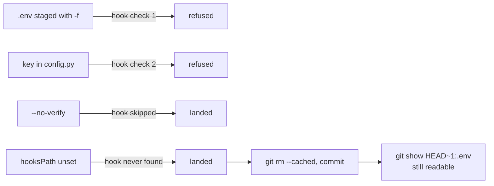

## One-line answer

A guard you have never watched refuse anything is a guard you are trusting on faith — so today
you commit a fake secret on purpose, read the refusal, then bypass the guard two ways and read
the secret back out of history, so that you never again mistake the hook for a vault.

## The story

The front door that will not lock while a window is open — you have lived with it for a week and
you trust it. But do you? You have never actually tested it. You have only noticed that it has
not failed yet.

So one afternoon you open the kitchen window on purpose, walk to the front door, and turn the
key. The bolt does not move. Good. Now you try the thing a hurried person would try: you lean on
the door and turn the key harder. Still nothing. Now you try what a *clever* hurried person
would try — you go out the back door instead. It locks fine. The window is still open.

You have learned two things that no amount of trusting would have taught you. The front door
works exactly as promised. And the promise was only ever about the front door.

## The idea in plain language

Principle 9 says every day ends with a check that can go red, and adds that a check that cannot
fail has verified nothing. The pre-commit hook from
[part 2.2](../02-repository/2.2-the-pre-commit-hook.md) is a check. Today it has never gone red.
Until it has, you do not know whether it works, whether it is wired, or whether it is even
running — a hook that is silently skipped looks exactly like a hook that found nothing wrong.

A **deliberate failure** is the act of making a check go red on purpose, reading what it says,
and confirming it says what you expected. It is the only honest way to test a guard, and this
curriculum does it at least once on every day (the plan's §11.7).

The second half of the part is harder to like. Having proved the door works, you go looking for
the other doors. git offers two: `--no-verify`, a flag that skips the hook by design, and an
unset `core.hooksPath`, which is the state every fresh clone starts in. Both let the secret land.
Then you do the thing everyone does after a leak — delete the file and commit the deletion — and
discover that the secret is still there, one command away, in the commit that added it. A commit
cannot be silently changed; that was the whole point of
[part 2.1](../02-repository/2.1-git-as-memory.md), and here it cuts the other way.

The lesson is not that the hook is useless. It is that the hook is a *seatbelt*: it turns an
accident into a refusal. It was never a vault, and a leaked key is handled by **rotation** —
issuing a new key and revoking the old one at the provider — not by deleting a file. That is day
101's subject; today's job is to make sure you believe it.

## Why Prahari needs it

The phase 0 gate says a planted secret *cannot be committed*, and the only way to know that is
to plant one. Every later failure day — day 41's poisoned alert, day 96's injection done on
purpose, day 115's chaos day — has the same shape as this part: build the guard, break it on
purpose, read the real message, and only then trust it. Day 28's cassettes are committed files
that once contained a live `Authorization` header before the recorder stripped it; the habit of
asking "what is actually in this commit?" starts here. And when day 101 says *rotate first*,
it will land on a reader who has already run `git show` against a deleted secret and seen it
come back.

## The mechanism

All of this is run in the real repository, at its root, with the hook wired as part 2.2 left it.
The planted values are fakes. Nothing here touches a provider.

**Step one — plant, and watch the front door refuse.**

```powershell
"GROQ_API_KEY=planted-secret-value-do-not-commit" | Set-Content -Encoding utf8 .env
git add -f .env
git commit -m "oops"
git reset HEAD .env
```

**Line by line:**

- `"..." | Set-Content -Encoding utf8 .env` — write one line into `.env`. The value is a
  sentence, not a key shape, so that even if every guard failed nothing real would leak. The
  `-Encoding utf8` matters on Windows PowerShell 5.1, whose default encoding for text files is not
  UTF-8. Under a POSIX shell: `printf 'GROQ_API_KEY=planted-secret-value-do-not-commit\n' > .env`.
- `git add -f .env` — `-f` forces past the ignore rule from
  [part 3.1](3.1-the-secrets-rule.md). This is the first fence being climbed on purpose; without
  `-f` the add itself is refused, and the hook never gets to run.
- `git commit -m "oops"` — the door. Expected: the hook prints its refusal and the command exits
  `1`. The exact text is in *When it breaks*.
- `git reset HEAD .env` — unstage the planted file so the next step starts clean. `.env` stays
  on disk; only the staging area changes.

**Step two — plant in code, and watch the second check refuse.**

```powershell
'GROQ_API_KEY = "gsk-planted-1234"' | Set-Content -Encoding utf8 src\prahari\config.py
git add src\prahari\config.py
git commit -m "oops2"
```

**Line by line:**

- `'GROQ_API_KEY = "gsk-planted-1234"' | Set-Content ...` — a key pasted into a Python file,
  which is how real leaks usually look: not a `.env` in the wrong place but a constant someone
  meant to move later. Single quotes outside, double inside, so PowerShell passes the double
  quotes through.
- `git add src\prahari\config.py` — a normal add; nothing about this path is ignored, so the
  ignore file cannot help. Only the hook's second check stands between this and history.
- `git commit -m "oops2"` — expected: `grep` prints the offending line with its number, the hook
  prints its message, exit `1`.

**Step three — go out the back door, twice.**

```powershell
git commit --no-verify -m "oops2 bypassed"
git log --oneline -1
git reset --hard HEAD~1
git config --unset core.hooksPath
git add -f .env
git commit -m "landed"
git config core.hooksPath .githooks
```

**Line by line:**

- `git commit --no-verify -m "..."` — the flag the documentation names as the bypass: *"can be
  bypassed with the --no-verify option."* The hook does not run. The commit is written. Nothing
  warns you.
- `git log --oneline -1` — confirm it landed: one new line with the message `oops2 bypassed`.
- `git reset --hard HEAD~1` — throw that commit away and restore the working tree to the commit
  before it. `--hard` discards uncommitted changes too, so `config.py` disappears — which is
  what you want here, and is the reason this flag is dangerous on a day you did not plan for it.
- `git config --unset core.hooksPath` — remove the one line that told git where the hook is.
  This is precisely the state of a fresh clone: `.githooks/pre-commit` is present in the tree
  and git has no idea it exists.
- `git add -f .env` then `git commit -m "landed"` — the same planted file that was refused in
  step one. This time: no message, exit `0`, a commit containing the secret.
- `git config core.hooksPath .githooks` — wire the hook back before you forget.

**Step four — "delete" it, and read it back.**

```powershell
git rm --cached .env
git commit -m "remove .env"
git status --short
git log --oneline -3
git show HEAD~1:.env
```

**Line by line:**

- `git rm --cached .env` — remove `.env` from the index but leave it on disk. This is the
  correct fix for a file that was tracked and should not have been, from
  [part 3.1](3.1-the-secrets-rule.md)'s *When it breaks*.
- `git commit -m "remove .env"` — the deletion is now a commit. `git status` is clean; the
  working tree looks innocent; `.env` is ignored again.
- `git log --oneline -3` — three commits: the removal, `landed`, and the one before. The one
  called `landed` still exists, and it still holds the file.
- `git show HEAD~1:.env` — print the file `.env` *as it was in the commit before this one*. It
  prints the planted line. The secret was never removed from anything; a new commit was added
  that no longer lists it. Every clone, every backup, every CI cache that fetched `landed` has
  the value.

When you are done, put the repository back: `git reset --hard HEAD~2` removes both commits
(there is nothing in them you want), and check `git log --oneline -3` shows only the commits
that were there before this part. Because `landed` tracked `.env`, the reset also deletes it
from disk — that happened on the development machine — so copy `.env.example` to `.env` again
and refill it. Then confirm `git config core.hooksPath` prints `.githooks`.

The whole sequence as one picture — where each attempt was stopped, and where nothing stood:



## When it breaks

Step one, from PowerShell on the development machine:

```text
pre-commit: refusing '.env' — a secrets file never enters git.
```

Exit `1`, no commit. Step two:

```text
7:+GROQ_API_KEY = "gsk-planted-1234"
pre-commit: a staged line assigns a value to a key. Put it in .env and stage .env.example instead.
```

Exit `1`, no commit. Both are the hook working. The same check also refused a placeholder value
in the example file, which is the trap [part 3.1](3.1-the-secrets-rule.md) named:

```text
7:+GROQ_API_KEY=your-key-here
pre-commit: a staged line assigns a value to a key. Put it in .env and stage .env.example instead.
```

Step three produced no error at all, which is the failure. `--no-verify` gave:

```text
482a346 oops2 bypassed
5c4a0d2 day 00: scaffold
```

and the unset `core.hooksPath` gave a commit whose `--stat` was:

```text
 .env | 1 +
 1 file changed, 1 insertion(+)
```

Step four, after the removal commit, `git status --short` printed nothing, and:

```text
46f8ad0 remove .env
b4d5a5a landed
5c4a0d2 day 00: scaffold
```

```text
GROQ_API_KEY=planted-secret-value-do-not-commit
```

That last line is `git show b4d5a5a:.env` — the deleted secret, read back verbatim from a
repository whose working tree contains no trace of it.

The smallest fix, in the order that matters: **rotate the key at the provider** (a fake one
today, so there is nothing to rotate — say the step out loud anyway); wire `core.hooksPath` in
every clone and put that command in the setup instructions, which this day's hub §3 does;
and only then decide, with whoever else holds a copy of the history, whether rewriting it is
worth the disruption. A rewritten history does not un-leak a key that has already been fetched.

## In production

A professional treats a secret in any commit — pushed or not, deleted or not — as compromised
from the moment it was written, and rotates first. The order is not negotiable, because every
other step takes longer than a scanner takes to find a key in a public push. The realistic
production response is: rotate, then find every place the old key was used and confirm the new
one works, then clean history if the team agrees, then write down what happened.

At scale, the two bypasses this part demonstrated are why client-side hooks are never the only
control. Hosted git platforms run **push protection** — a server-side scan that refuses a push
containing a recognised key shape — and CI runs the same scan on every branch. Those doors cannot
be `--no-verify`'d. This project fits the second one on day 110; the first is a setting on the
hosting side and is out of scope, but a reviewer will ask whether it is on.

The failure that only shows under real traffic is the *false negative that looked like silence*.
A team's hook stops running — a machine reimaged, `core.hooksPath` never re-set — and for months
every commit sails through. Nobody notices, because a hook that finds nothing and a hook that
does not run produce the same output: nothing. The only defence is a check that must go red on a
schedule, which is exactly what this part is, and the reason the hub's §5 says how to make it
go red on purpose.

The review comment on the teaching version: *"You committed the removal of `.env` and called it
fixed. Which key was in it, and has it been rotated? If not, the fix is not started."*

The interview question: *"Someone on your team committed an API key and then deleted it in the
next commit. What is the state of that key right now?"* The answer is *compromised*, in one
word, and the follow-up is what you do in the next five commands.

## Check yourself

- **Run:** the four steps above, in order, in the real repository. Expect two refusals, two
  silent landings, one readable secret, and — after the final `git reset --hard HEAD~2` — a
  `git log` identical to the one before you started and `git config core.hooksPath` printing
  `.githooks`.
- **Say out loud:** name the two ways the planted secret got past the hook, and say why deleting
  the file afterwards did not make it safe.

---

**Next:** back to the hub — [LESSON.md](../../LESSON.md), §4 for the build brief and §11 for the
ledger rows.
