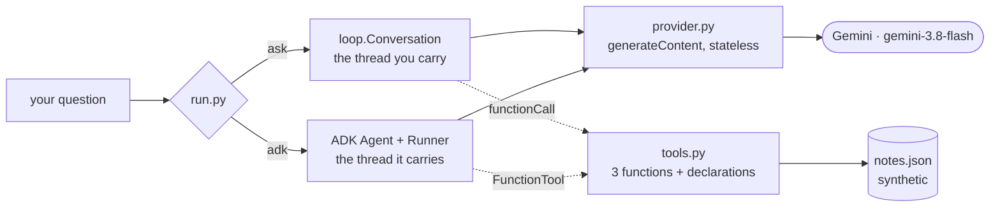

# Ask Desk

An internal IT ask desk that answers questions from a synthetic knowledge base — built twice, by
hand and then with Google ADK, so the framework version is understood rather than copied.

## What this system does

You ask it a question. It searches a small knowledge base, reads the notes it finds, checks a
service's status if that is relevant, and answers from what it found — or says plainly that the
notes do not cover it. It never guesses.

## What you need installed

`uv`, and a free Google AI Studio API key. Nothing else — no database, no Docker, no cloud project.
Full steps in `SETUP.md`.

## The commands

```bash
uv run --frozen python run.py check                     # the gate: config, pins, and the evalset
uv run --frozen python run.py plan "Is the VPN down?"   # the request, without sending it
uv run --frozen python run.py events [--stream]         # every event one question produces
uv run --frozen python run.py session                   # what a second question in a session sees
uv run --frozen python run.py eval                      # the evalset; non-zero when a case fails
uv run --frozen python run.py serve                     # the D1 API on :8080
uv run --frozen python run.py ask  "Is the VPN down?"   # the hand-rolled desk
uv run --frozen python run.py adk  "Is the VPN down?"   # the same desk, as an ADK agent
```

Only the last two need a working API key.

## The architecture



Both paths reach the same three tools and the same synthetic data. The difference is who holds the
conversation, and that difference is the whole curriculum of days 1 to 4.

## Where the teaching is

`days/01-ask-desk/day-04-.../LESSON.md` onwards, in the authoring repository. Each day's hub links
its parts. If you have only this folder, `PRIMER.md` carries everything borrowed from elsewhere.

## What is deliberately not built 🅿️

- **No MCP boundary.** The tools read `notes.json` directly. That is a problem, and P02 is about it.
- **No second agent.** One agent is a function; two is an architecture, and that is P03.
- **No retry or backoff.** A 429 fails the run honestly rather than being smoothed over. Honest
  backoff is P05.
- **No Interactions API.** This project uses the stateless `generateContent` endpoint on purpose;
  `PROJECT.md` says why.
