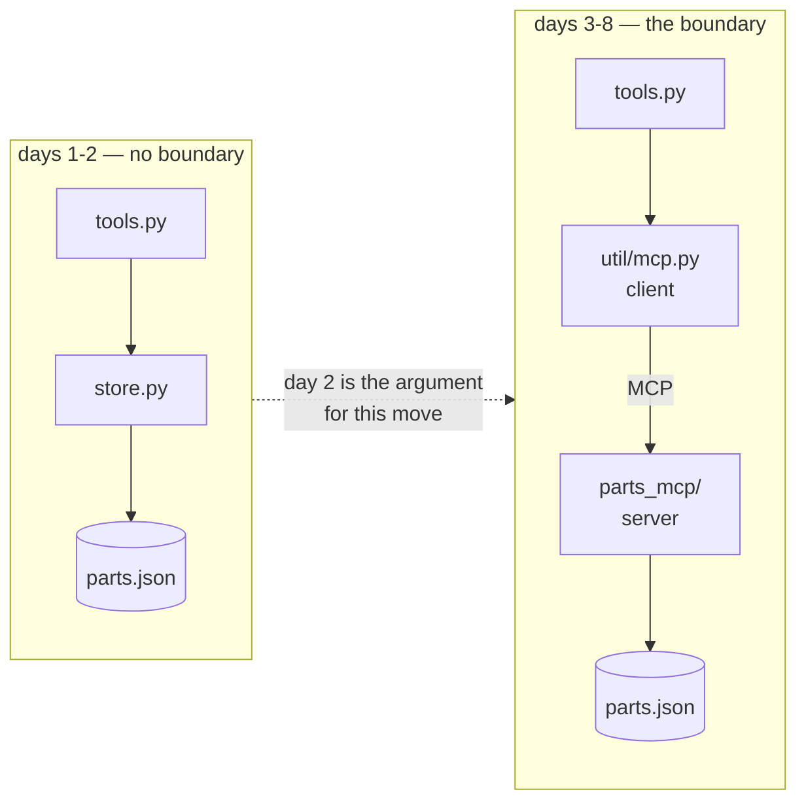

# Parts Counter

A workshop parts counter — find a part, read its stock, say which bin it is in, change the count —
built to argue for a data boundary rather than to assume one.

## What this system does

You ask it about a part. It finds it, tells you how many are on hand and whether that is below the
reorder point, and says which bin to walk to. It can also change the count, which is the operation
that makes the rest of this project necessary.

## What you need installed

`uv`, and a free Google AI Studio API key. Nothing else. Full steps in `SETUP.md`.

## The commands

```bash
uv run --frozen python run.py check          # the gate: config, pins, registry, tests
uv run --frozen python run.py parts filter   # find parts, straight through the tools
uv run --frozen python run.py race           # the same two writers, now against the boundary's store
uv run --frozen python run.py mcp            # the boundary server, on stdio
uv run --frozen python run.py mcp --http     # the same server, on Streamable HTTP at :8090/mcp
uv run --frozen python run.py probe          # list and call its tools across a real process line
```

## The architecture



The left-hand shape works. Day 2 is about what it costs: `run.py race` issued twenty parts from two
threads, lost count of some of them, and crashed a reader on a half-written file. The same command
now runs against `parts_mcp/store.py` and loses nothing — one owner, one lock, one atomic rename —
and both failures are pinned down as tests in `tests/test_boundary.py`.

## Where the teaching is

`days/02-parts-counter/day-11-.../LESSON.md` onwards, in the authoring repository. If you have only
this folder, `PRIMER.md` carries everything borrowed from elsewhere.

## What is deliberately not built 🅿️

- **No retry or backoff.** A 429 fails the run honestly rather than being smoothed over. Honest
  backoff is P05, and a retry loop written before you have watched a quota run out hides the thing
  it should surface.
- **No second agent.** One agent is a function; two is an architecture, and that is P03.
- **No boundary on days 1 and 2.** That absence is the subject, not an oversight; days 3 to 7 build
  it.
- **`mcp` is pinned to 1.x on purpose.** `google-adk` 2.8.0 declares `mcp>=1.24,<2`, and 2.x renames
  `FastMCP` to `MCPServer`. `PACKAGES.md` records what the move will involve.
